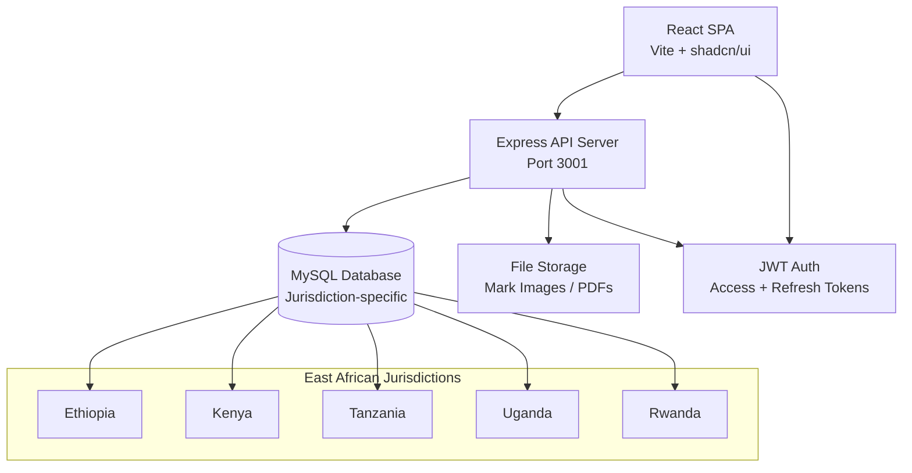

<div align="center">

# EAIP TPMS

**East African Intellectual Property Trademark Management System**

A full-stack trademark portfolio management platform for East African IP offices, supporting Ethiopia, Kenya, Tanzania, Uganda, and Rwanda.

<p>
  
  
  
  
  
  
  
  
</p>

</div>

---

## ✨ Key Highlights

| Feature | Benefit |
|---------|---------|
| **Multi-Jurisdiction** | Ethiopia, Kenya, Tanzania, Uganda, Rwanda — jurisdiction-specific rules, fees, and deadlines |
| **End-to-End Workflow** | From trademark filing through formal/substantive examination to registration and renewal |
| **Automated Billing** | Invoice generation, payment tracking, multi-currency support (USD, EUR, GBP, ETB, KES) |
| **Smart Deadlines** | Auto-generated deadlines per jurisdiction with overdue tracking and dashboard alerts |

---

## 📸 Screenshots

<div align="center">
  
  
  
  
  
  
</div>

---

## 🏗 Architecture



**Request lifecycle:** Client → JWT auth middleware → Route handler → Service layer → Repository → MySQL → Response

---

## 🚀 Quick Start

### Prerequisites

- **Node.js** v18+ • **npm** v9+ • **MySQL** 8.0+

### 1. Clone & install

```bash
git clone <repo-url>
cd EAIP-TPMS
npm install
cd server && npm install && cd ..
cd client && npm install && cd ..
```

### 2. Configure environment

**`server/.env`**
```env
PORT=3001
DB_HOST=localhost
DB_PORT=3306
DB_USER=root
DB_PASSWORD=your_password
DB_NAME=eaip_tpms
JWT_SECRET=your-jwt-secret
JWT_REFRESH_SECRET=your-refresh-secret
SMTP_HOST=smtp.example.com
SMTP_PORT=587
SMTP_USER=your-email@example.com
SMTP_PASS=your-email-password
EMAIL_FROM="EAIP TPMS" <no-reply@eaip.com>
CLIENT_URL=http://localhost:5173
```

**`client/.env`**
```env
VITE_API_URL=http://localhost:3001/api
```

### 3. Database

```bash
mysql -u root -p -e "CREATE DATABASE eaip_tpms CHARACTER SET utf8mb4 COLLATE utf8mb4_unicode_ci;"
```

### 4. Run

```bash
# Terminal 1 — API server
cd server && npm run dev

# Terminal 2 — Client dev server
cd client && npm run dev
```

Server → `http://localhost:3001` • Client → `http://localhost:5173`

---

## 📁 Project Structure

```
EAIP-TPMS/
├── client/                          # React frontend
│   ├── src/
│   │   ├── api/                    # API client modules (axios)
│   │   ├── components/             # Reusable UI components
│   │   │   └── ui/                # shadcn/ui primitives
│   │   ├── hooks/                  # Custom hooks (useSwr, useFormAutomation)
│   │   ├── pages/                  # Page components
│   │   ├── store/                  # Zustand state stores
│   │   ├── utils/                  # Formatters, PDF generation, mark image
│   │   ├── app/                    # Router + app shell configuration
│   │   └── main.tsx                # Entry point
│   └── public/                     # Static assets (flags, fonts, PDF templates)
│
├── server/                          # Express API
│   ├── src/
│   │   ├── database/               # DB connection pool + types
│   │   ├── middleware/              # Auth, error handler, soft delete, CSRF
│   │   ├── repositories/           # Data access layer (raw MySQL queries)
│   │   ├── routes/                 # REST endpoint handlers
│   │   ├── services/               # Business logic (lifecycle, fees, financials)
│   │   ├── utils/                  # Mailer, Telegram bot, TOTP, constants
│   │   └── server.ts               # Express app setup
│   ├── templates/                  # PDF form templates
│   └── uploads/                    # File uploads (gitignored)
│
├── scripts/                         # Dev & deployment utilities
└── TM_MIGRATION_FILES/              # Legacy data migration (gitignored)
```

---

## 📖 Documentation

| Resource | Description |
|----------|-------------|
| [Architecture Overview](docs/ARCHITECTURE.md) | System architecture and design decisions |
| [API Endpoints](docs/api_endpoints.md) | Complete REST API reference |
| [App Pages](docs/APP_PAGES.md) | All frontend routes and pages |
| [Feature Flows](docs/feature_flows/) | Detailed flow diagrams for each feature |
| [Sitemap](docs/SITEMAP.md) | Full application sitemap |

---

## 🔐 Authentication

The system uses JWT-based authentication with **access tokens** (15 min) and **refresh tokens** (7 days). Admin accounts require SUPER_ADMIN approval before first login.

> **Role hierarchy:** SUPER_ADMIN > ADMIN > USER

### Auth flows

| Flow | Description |
|------|-------------|
| Registration | Email + password → OTP verification → (Admin: pending approval) → Login |
| Login | Email/password → JWT pair → Protected API access |
| Password Reset | Forgot password → OTP email → New password |
| 2FA | TOTP-based two-factor authentication setup |

[Detailed auth flows →](docs/feature_flows/authentication/)

---

## 📋 Core Features

<details>
<summary><b>Client Management</b> — Search, merge, bulk operations, soft delete</summary>

| Capability | Details |
|------------|---------|
| Types | Individual, Company, Partnership |
| Fields | Name (EN + local), nationality, address, contact |
| Operations | Create, edit, search, filter, merge duplicates, bulk delete |
| Trash | Soft delete → Restore or permanent purge |
| API | `GET /clients` • `POST /clients` • `PATCH /clients/:id` • `DELETE /clients` • `POST /clients/merge` |

[Full flow →](docs/feature_flows/client-management/)
</details>

<details>
<summary><b>Trademark Cases</b> — Full lifecycle from filing to renewal</summary>

| Capability | Details |
|------------|---------|
| Mark Types | Word, Figurative/Logo, Mixed, 3D Dimension |
| Classification | Nice Classes 1–45 with custom descriptions |
| Statuses | DRAFT → FILED → FORMAL_EXAM → SUBSTANTIVE_EXAM → PUBLISHED → REGISTERED → RENEWAL |
| Operations | Create (multi-step form), edit, advance stage, bulk delete |
| Attachments | Mark image upload, priority claims, agent info |
| API | `GET /cases` • `POST /cases` • `PATCH /cases/:id/flow-stage` • `DELETE /cases/bulk-delete` |

[Full flow →](docs/feature_flows/trademark-application/)
</details>

<details>
<summary><b>Billing & Invoicing</b> — Multi-currency, auto-generation, payment tracking</summary>

| Capability | Details |
|------------|---------|
| Categories | Official fee, Professional fee, Filing, Examination, Publication, Registration |
| Statuses | DRAFT → ISSUED → PARTIALLY_PAID → PAID → OVERDUE |
| Currencies | USD, EUR, GBP, ETB, KES |
| Auto-invoice | Generate invoices automatically on stage transitions |
| PDF Export | Professional invoice PDF with all details |
| API | `GET /financials/invoices` • `POST /financials/invoices` • `POST /financials/payments` |

[Full flow →](docs/feature_flows/billing-invoice/)
</details>

<details>
<summary><b>Deadlines</b> — Jurisdiction-aware automated tracking</summary>

| Types | Description |
|-------|-------------|
| INTAKE_REVIEW | 7 days post-filing |
| FORMAL_EXAM | 30 days (jurisdiction-specific) |
| OPPOSITION_WINDOW | 60–90 days depending on country |
| RENEWAL | 7–10 years depending on country |
| OFFICE_ACTION_RESPONSE, CERTIFICATE_REQUEST | Per-jurisdiction rules |

[Full flow →](docs/feature_flows/deadline-tracking/)
</details>

<details>
<summary><b>Case Flow Stages</b> — Automated workflow progression</summary>

```
DATA_COLLECTION → FILED → FORMAL_EXAM → SUBSTANTIVE_EXAM → PUBLISHED → REGISTERED → RENEWAL
```

Each transition:
- Updates case status
- Creates next deadline
- Generates invoices (if configured)
- Records audit trail entry

[Full flow →](docs/feature_flows/case-stage/)
</details>

<details>
<summary><b>Oppositions</b> — Third-party opposition tracking</summary>

| Statuses | PENDING → RESPONDED → RESOLVED / WITHDRAWN |
|----------|-------------------------------------------|
| Outcomes | WON, LOST, WITHDRAWN |
| Deadlines | Auto-created based on jurisdiction opposition period |
| API | `GET /oppositions` • `POST /oppositions` |
</details>

<details>
<summary><b>Fee Schedules</b> — Configurable jurisdiction-based pricing</summary>

```typescript
interface FeeSchedule {
  jurisdiction: string;    // ET, KE, TZ, UG, RW
  baseFee: number;         // Base filing fee
  extraClassFee: number;   // Per additional Nice class
  currency: string;        // USD, ETB, KES, etc.
  effectiveFrom: Date;     // Schedule start
  expiresAt: Date;         // Schedule end
}
```

**Example:** 3-class filing in Ethiopia: `baseFee ($100) + 2 extra classes ($40) = $140 USD`
</details>

<details>
<summary><b>PDF Document Generation</b> — EIPA application forms</summary>

| PDF Field | Source |
|-----------|--------|
| applicant_name_english | Client.name |
| applicant_name_amharic | Client.local_name |
| mark_name | Case.mark_name |
| mark_type_word / figurative | Case.mark_type |
| priority_country | Case.priority_country |
| nice_classes | NiceClassMapping[].classNo |

Generation: Form input → Server validates → pdf-lib maps fields → Download URL
</details>

<details>
<summary><b>Trash & Soft Delete</b> — Centralized recovery</summary>

All major entities support soft delete (`deleted_at` timestamp):
- **Tabbed interface:** Trademarks, Clients, Invoices, Deadlines
- **Restore:** Recover items with one click
- **Purge:** Permanently delete from trash
- **View:** Open deleted items in read-only mode (`?fromTrash=true`)
</details>

<details>
<summary><b>Admin Approval Workflow</b> — Secure admin onboarding</summary>

```
Register as ADMIN → Verify email (OTP) → SUPER_ADMIN reviews → Approve/Reject → Login enabled
```

- Rejection tracking (max 3 attempts)
- Automatic approval for SUPER_ADMIN registrations
- Approval/rejection email notifications
- `PATCH /auth/approve/:userId` • `PATCH /auth/reject/:userId`

[Full flow →](docs/feature_flows/admin-user-approval/)
</details>

---

## 📊 Dashboard & Analytics

| Metric | Source |
|--------|--------|
| Total clients, cases, pending tasks | Overview cards |
| Case status distribution | Visual breakdown by stage |
| Upcoming deadlines | Priority list with days remaining (overdue highlighted) |
| Revenue overview | Outstanding vs paid amounts |
| Recent activity | Latest case updates timeline |

**API:** `GET /dashboard/stats`

---

## 🧪 Development

```bash
# Type-check both client and server
npm run typecheck

# Lint
npm run lint

# Run server tests
cd server && npm test

# Audit project structure
npm run audit:structure
```

---

## 🚢 Deployment

The project deploys via GitHub Actions to **A2 Hosting**:

1. Push to `main` triggers the [deploy workflow](.github/workflows/deploy.yml)
2. Frontend built with `npm run build` → FTP to `/eastafricanip.com/`
3. Backend compiled with `tsc` → FTP to `/eastafricanip.com/api/`

**Required secrets:** `FTP_SERVER`, `FTP_USERNAME`, `FTP_PASSWORD`, `FTP_PORT`

Production server requires its own `.env` with database credentials, JWT secrets, and SMTP configuration.

---

<div align="center">

**Built for East African IP professionals**

</div>
