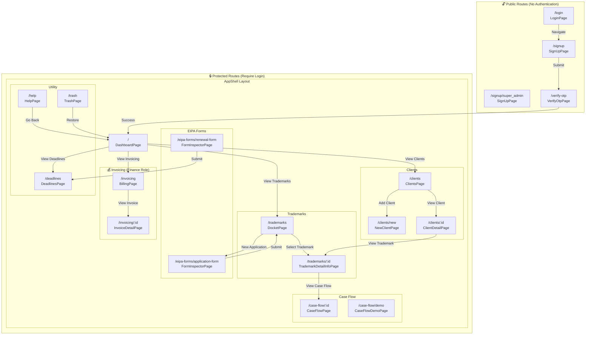

# All Pages Overview

This document provides a complete overview of all pages in the TPMS (Trademark Portfolio Management System) application, including the navigation flow and relationships between pages.

---

## Page List

### Authentication Pages (Public - No Login Required)

| Route | Page Component | Description |
|-------|---------------|-------------|
| `/login` | LoginPage | User login page |
| `/signup` | SignUpPage | New user registration |
| `/signup/super_admin` | SignUpPage | Super admin registration |
| `/verify-otp` | VerifyOtpPage | OTP verification after signup |

### Protected Pages (Require Authentication)

| Route | Page Component | Description |
|-------|---------------|-------------|
| `/` | DashboardPage | Main dashboard with overview stats |
| `/trademarks` | DocketPage | List of all trademarks (docket) |
| `/trademarks/:id` | TrademarkDetailInfoPage | Trademark details view |
| `/trademarks/:id/detail` | TrademarkDetailInfoPage | Trademark details (alternate route) |
| `/deadlines` | DeadlinesPage | Upcoming deadlines and timeline |
| `/eipa-forms/application-form` | FormInspectorPage | EIPA application form |
| `/eipa-forms/renewal-form` | FormInspectorPage | EIPA renewal form |
| `/clients` | ClientsPage | List of all clients |
| `/clients/new` | NewClientPage | Create new client |
| `/clients/:id` | ClientDetailPage | Client details and associated trademarks |
| `/case-flow/:id` | CaseFlowPage | Case workflow/case lifecycle view |
| `/case-flow/demo` | CaseFlowDemoPage | Demo/visual case flow |
| `/invoicing` | BillingPage | Invoice/billing ledger (finance) |
| `/invoicing/:id` | InvoiceDetailPage | Invoice details |
| `/trash` | TrashPage | Soft-deleted items (trash) |
| `/help` | HelpPage | Help/documentation page |

---

## Navigation Flow Diagram



---

## Detailed Navigation Actions

### Authentication Flow

| From | Action | To |
|------|--------|-----|
| LoginPage | Click "Sign up" | SignUpPage |
| LoginPage | Submit credentials | DashboardPage (if success) |
| SignUpPage | Submit registration | VerifyOtpPage |
| SignUpPage | Click "Login" | LoginPage |
| VerifyOtpPage | Verify OTP success | DashboardPage |

### Dashboard Navigation

| From | Action | To |
|------|--------|-----|
| DashboardPage | Click "View All" on Trademarks | DocketPage |
| DashboardPage | Click "View All" on Clients | ClientsPage |
| DashboardPage | Click "View All" on Deadlines | DeadlinesPage |
| DashboardPage | Click "View Invoices" | BillingPage |

### Trademark Flow

| From | Action | To |
|------|--------|-----|
| DocketPage | Click "New Application" | FormInspectorPage (application-form) |
| DocketPage | Click trademark row | TrademarkDetailInfoPage |
| TrademarkDetailInfoPage | Click "Case Flow" | CaseFlowPage |
| TrademarkDetailInfoPage | Click "Edit" | FormInspectorPage |

### Client Flow

| From | Action | To |
|------|--------|-----|
| ClientsPage | Click "Add Client" | NewClientPage |
| ClientsPage | Click client row | ClientDetailPage |
| ClientDetailPage | View trademark | TrademarkDetailInfoPage |
| ClientDetailPage | Click "Add Trademark" | FormInspectorPage |

### Invoicing Flow (Finance Role Required)

| From | Action | To |
|------|--------|-----|
| BillingPage | Click invoice row | InvoiceDetailPage |
| BillingPage | Click "Create Invoice" | Create Invoice Modal |
| InvoiceDetailPage | Click "Record Payment" | Payment Modal |

### EIPA Forms Flow

| From | Action | To |
|------|--------|-----|
| FormInspectorPage | Submit form | Navigate to appropriate page based on form type |

---

## Route Hierarchy

```
/
├── /login (public)
├── /signup (public)
├── /signup/super_admin (public)
├── /verify-otp (public)
│
└── (Protected Routes)
    ├── / (DashboardPage)
    ├── /trademarks (DocketPage)
    │   └── /trademarks/:id (TrademarkDetailInfoPage)
    ├── /deadlines (DeadlinesPage)
    ├── /eipa-forms/application-form (FormInspectorPage)
    ├── /eipa-forms/renewal-form (FormInspectorPage)
    ├── /clients (ClientsPage)
    │   ├── /clients/new (NewClientPage)
    │   └── /clients/:id (ClientDetailPage)
    ├── /case-flow/:id (CaseFlowPage)
    ├── /case-flow/demo (CaseFlowDemoPage)
    ├── /invoicing (BillingPage)
    │   └── /invoicing/:id (InvoiceDetailPage)
    ├── /trash (TrashPage)
    └── /help (HelpPage)
```

---

## Role-Based Access

| Page | Required Role |
|------|---------------|
| BillingPage | Finance access (via `canAccessFinance`) |
| InvoiceDetailPage | Finance access |
| All other protected pages | Any authenticated user |

---

## Notes

- The AppShell component wraps all protected routes and provides the main navigation layout
- FormInspectorPage uses a query parameter or route to determine which form to display (application-form vs renewal-form)
- CaseFlowDemoPage is a demo/visualization page that doesn't require a specific case ID