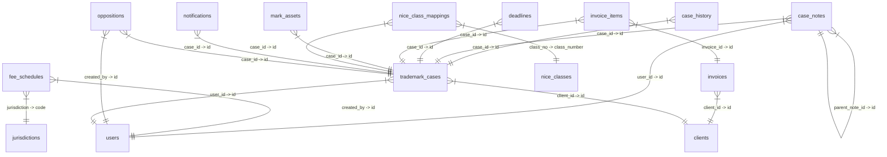

# Database Schema and Data Export

## ER Diagram



## Table: case_history

### Schema

```sql
CREATE TABLE `case_history` (
  `id` char(36) NOT NULL,
  `case_id` char(36) NOT NULL,
  `user_id` char(36) DEFAULT NULL,
  `action` varchar(100) NOT NULL,
  `old_data` longtext CHARACTER SET utf8mb4 COLLATE utf8mb4_bin DEFAULT NULL CHECK (json_valid(`old_data`)),
  `new_data` longtext CHARACTER SET utf8mb4 COLLATE utf8mb4_bin DEFAULT NULL CHECK (json_valid(`new_data`)),
  `created_at` timestamp NOT NULL DEFAULT current_timestamp(),
  `deleted_at` timestamp NULL DEFAULT NULL,
  PRIMARY KEY (`id`),
  KEY `case_id` (`case_id`),
  CONSTRAINT `case_history_ibfk_1` FOREIGN KEY (`case_id`) REFERENCES `trademark_cases` (`id`) ON DELETE CASCADE
) ENGINE=InnoDB DEFAULT CHARSET=utf8mb4 COLLATE=utf8mb4_unicode_ci;
```

### Data

| id | case_id | user_id | action | old_data | new_data | created_at | deleted_at |
| --- | --- | --- | --- | --- | --- | --- | --- |
| 0ba82331-184b-49ec-beb8-769ae089e88e | 8f902e8e-a662-4e5d-8385-2c1df3c342ee | 76bdc2a3-270f-4321-a75b-708f826da333 | STAGE_CHANGE: DATA_COLLECTION -> READY_TO_FILE | {\"flow_stage\":\"DATA_COLLECTION\"} | {\"flow_stage\":\"READY_TO_FILE\",\"deadlines\":{\"flow_stage\":\"READY_TO_FILE\",\"status\":\"DRAFT\"}} | 2026-03-02 19:07:29 | *NULL* |
| 0e0b6919-9101-4af3-b9fe-169a73819d1e | 46c49ae7-a480-469f-8d44-f741f667117c | 76bdc2a3-270f-4321-a75b-708f826da333 | STAGE_CHANGE: DATA_COLLECTION -> READY_TO_FILE | {\"flow_stage\":\"DATA_COLLECTION\"} | {\"flow_stage\":\"READY_TO_FILE\",\"deadlines\":{\"flow_stage\":\"READY_TO_FILE\",\"status\":\"DRAFT\"}} | 2026-03-02 19:16:12 | *NULL* |
| 0ee40206-ad3b-49e3-957a-0771871c2544 | 46c49ae7-a480-469f-8d44-f741f667117c | 76bdc2a3-270f-4321-a75b-708f826da333 | STAGE_CHANGE: SUBSTANTIVE_EXAM -> AMENDMENT_PENDING | {\"flow_stage\":\"SUBSTANTIVE_EXAM\"} | {\"flow_stage\":\"AMENDMENT_PENDING\",\"deadlines\":{\"flow_stage\":\"AMENDMENT_PENDING\",\"next_action_date\":\"2026-05-30T23:00:00.000Z\",\"status\":\"SUBSTANTIVE_EXAM\"}} | 2026-03-02 19:18:35 | *NULL* |
| 107550ef-14d9-4d3b-a551-f9ac9f5c3848 | 4d1acbc3-e608-4445-b260-bdff0b2c49b5 | *NULL* | STATUS_CHANGE: FORMAL_EXAM -> FILED | {\"status\":\"FORMAL_EXAM\"} | {\"status\":\"FILED\"} | 2026-02-21 18:50:15 | *NULL* |
| 14025f2b-2c24-45f8-a852-ba0beb944d91 | b5f60e59-881e-4711-a023-f1f2051c11e4 | *NULL* | STATUS_CHANGE: FORMAL_EXAM -> PUBLISHED | {\"status\":\"FORMAL_EXAM\"} | {\"status\":\"PUBLISHED\"} | 2026-02-21 17:58:52 | *NULL* |
| 1af4f71a-f5d0-4320-9dd9-6eb4374ee006 | 12cd7859-20dc-4948-a28b-d21708aa2b44 | 76bdc2a3-270f-4321-a75b-708f826da333 | STAGE_CHANGE: DATA_COLLECTION -> READY_TO_FILE | {\"flow_stage\":\"DATA_COLLECTION\"} | {\"flow_stage\":\"READY_TO_FILE\",\"deadlines\":{\"flow_stage\":\"READY_TO_FILE\",\"status\":\"DRAFT\"},\"notes\":\"Fikadu Asfaw Note\"} | 2026-02-21 14:36:28 | *NULL* |
| 1faaa203-088f-4d08-936c-6a3f0e6c043e | 4d1acbc3-e608-4445-b260-bdff0b2c49b5 | 76bdc2a3-270f-4321-a75b-708f826da333 | STAGE_CHANGE: AMENDMENT_PENDING -> PUBLISHED | {\"flow_stage\":\"AMENDMENT_PENDING\"} | {\"flow_stage\":\"PUBLISHED\",\"deadlines\":{\"flow_stage\":\"PUBLISHED\",\"next_action_date\":\"2026-04-30T23:00:00.000Z\",\"status\":\"PUBLISHED\"}} | 2026-03-02 19:10:40 | *NULL* |
| 22023b7b-ba2f-41fb-ac87-ec23766f2c11 | 46c49ae7-a480-469f-8d44-f741f667117c | *NULL* | STATUS_CHANGE: DRAFT -> PUBLISHED | {\"status\":\"DRAFT\"} | {\"status\":\"PUBLISHED\"} | 2026-03-02 18:49:31 | *NULL* |
| 36021670-a6de-4f77-bf0c-7d471f94406d | 4d1acbc3-e608-4445-b260-bdff0b2c49b5 | 76bdc2a3-270f-4321-a75b-708f826da333 | STAGE_CHANGE: FORMAL_EXAM -> SUBSTANTIVE_EXAM | {\"flow_stage\":\"FORMAL_EXAM\"} | {\"flow_stage\":\"SUBSTANTIVE_EXAM\",\"deadlines\":{\"flow_stage\":\"SUBSTANTIVE_EXAM\",\"next_action_date\":\"2026-06-29T23:00:00.000Z\",\"status\":\"SUBSTANTIVE_EXAM\"}} | 2026-03-02 19:09:43 | *NULL* |
| 39076e96-5661-4c31-9775-915e51b460bc | 46c49ae7-a480-469f-8d44-f741f667117c | 76bdc2a3-270f-4321-a75b-708f826da333 | STAGE_CHANGE: RENEWAL_ON_TIME -> RENEWAL_PENALTY | {\"flow_stage\":\"RENEWAL_ON_TIME\"} | {\"flow_stage\":\"RENEWAL_PENALTY\",\"deadlines\":{\"flow_stage\":\"RENEWAL_PENALTY\",\"next_action_date\":\"2026-08-28T23:00:00.000Z\"}} | 2026-03-02 19:28:53 | *NULL* |
| 399e343d-4aed-45b9-9d7e-c3859b529aac | b5f60e59-881e-4711-a023-f1f2051c11e4 | *NULL* | STATUS_CHANGE: DRAFT -> FILED | {\"status\":\"DRAFT\"} | {\"status\":\"FILED\"} | 2026-02-21 17:56:58 | *NULL* |
| 39bdce11-6c34-4623-a004-7d0c4b1d602f | 12cd7859-20dc-4948-a28b-d21708aa2b44 | 76bdc2a3-270f-4321-a75b-708f826da333 | STAGE_CHANGE: FILED -> FORMAL_EXAM | {\"flow_stage\":\"FILED\"} | {\"flow_stage\":\"FORMAL_EXAM\",\"deadlines\":{\"flow_stage\":\"FORMAL_EXAM\",\"next_action_date\":\"2026-03-29T23:00:00.000Z\",\"status\":\"FORMAL_EXAM\"},\"notes\":\"Filing Date\"} | 2026-02-21 18:17:17 | *NULL* |
| 3e0f5324-37d2-4b0e-b0cb-80ee2a9d761e | b5f60e59-881e-4711-a023-f1f2051c11e4 | *NULL* | STATUS_CHANGE: FILED -> FORMAL_EXAM | {\"status\":\"FILED\"} | {\"status\":\"FORMAL_EXAM\"} | 2026-02-21 17:58:36 | *NULL* |
| 4aee8f65-95eb-4563-9be9-60d837038eac | 4d1acbc3-e608-4445-b260-bdff0b2c49b5 | 76bdc2a3-270f-4321-a75b-708f826da333 | STAGE_CHANGE: READY_TO_FILE -> FILED | {\"flow_stage\":\"READY_TO_FILE\"} | {\"flow_stage\":\"FILED\",\"deadlines\":{\"flow_stage\":\"FILED\",\"filing_number\":\"ET/TM/2026/1278\",\"filing_date\":\"2026-02-21T00:00:00.000Z\",\"next_action_date\":\"2026-03-23T00:00:00.000Z\",\"status\":\"FILED\"}} | 2026-02-21 18:49:12 | *NULL* |
| 577bcb66-70e7-4db7-ba8e-e0656af0eb5d | b5f60e59-881e-4711-a023-f1f2051c11e4 | 76bdc2a3-270f-4321-a75b-708f826da333 | STAGE_CHANGE: DATA_COLLECTION -> READY_TO_FILE | {\"flow_stage\":\"DATA_COLLECTION\"} | {\"flow_stage\":\"READY_TO_FILE\",\"deadlines\":{\"flow_stage\":\"READY_TO_FILE\",\"status\":\"DRAFT\"}} | 2026-03-02 19:08:52 | *NULL* |
| 5ff15d1a-a4c8-4acc-bada-fdc17951e3f1 | 46c49ae7-a480-469f-8d44-f741f667117c | 76bdc2a3-270f-4321-a75b-708f826da333 | STAGE_CHANGE: PUBLISHED -> CERTIFICATE_REQUEST | {\"flow_stage\":\"PUBLISHED\"} | {\"flow_stage\":\"CERTIFICATE_REQUEST\",\"deadlines\":{\"flow_stage\":\"CERTIFICATE_REQUEST\",\"next_action_date\":\"2026-03-31T23:00:00.000Z\"}} | 2026-03-02 19:19:11 | *NULL* |
| 7b6548ad-3fe4-459f-b45c-b67807f7bc97 | 4d1acbc3-e608-4445-b260-bdff0b2c49b5 | 76bdc2a3-270f-4321-a75b-708f826da333 | STAGE_CHANGE: PUBLISHED -> CERTIFICATE_REQUEST | {\"flow_stage\":\"PUBLISHED\"} | {\"flow_stage\":\"CERTIFICATE_REQUEST\",\"deadlines\":{\"flow_stage\":\"CERTIFICATE_REQUEST\",\"next_action_date\":\"2026-03-31T23:00:00.000Z\"}} | 2026-03-02 19:10:45 | *NULL* |
| 863a33e5-ba74-4158-b1c5-0fec600b5d2c | 4d1acbc3-e608-4445-b260-bdff0b2c49b5 | 76bdc2a3-270f-4321-a75b-708f826da333 | STAGE_CHANGE: SUBSTANTIVE_EXAM -> AMENDMENT_PENDING | {\"flow_stage\":\"SUBSTANTIVE_EXAM\"} | {\"flow_stage\":\"AMENDMENT_PENDING\",\"deadlines\":{\"flow_stage\":\"AMENDMENT_PENDING\",\"next_action_date\":\"2026-05-30T23:00:00.000Z\",\"status\":\"SUBSTANTIVE_EXAM\"}} | 2026-03-02 19:10:30 | *NULL* |
| 925e8dde-ed52-4b31-8537-d765564e3a98 | 12cd7859-20dc-4948-a28b-d21708aa2b44 | 76bdc2a3-270f-4321-a75b-708f826da333 | STAGE_CHANGE: FORMAL_EXAM -> SUBSTANTIVE_EXAM | {\"flow_stage\":\"FORMAL_EXAM\"} | {\"flow_stage\":\"SUBSTANTIVE_EXAM\",\"deadlines\":{\"flow_stage\":\"SUBSTANTIVE_EXAM\",\"next_action_date\":\"2026-07-11T00:00:00.000Z\",\"status\":\"SUBSTANTIVE_EXAM\"},\"notes\":\"March 13 is the day.\"} | 2026-02-21 18:30:30 | *NULL* |
| aba43936-9a29-4349-8cc0-e39d7d254a40 | 46c49ae7-a480-469f-8d44-f741f667117c | 76bdc2a3-270f-4321-a75b-708f826da333 | STAGE_CHANGE: AMENDMENT_PENDING -> PUBLISHED | {\"flow_stage\":\"AMENDMENT_PENDING\"} | {\"flow_stage\":\"PUBLISHED\",\"deadlines\":{\"flow_stage\":\"PUBLISHED\",\"next_action_date\":\"2026-04-30T23:00:00.000Z\",\"status\":\"PUBLISHED\"}} | 2026-03-02 19:18:58 | *NULL* |
| b98468c6-8ab5-408d-b722-b641912e21e4 | 46c49ae7-a480-469f-8d44-f741f667117c | 76bdc2a3-270f-4321-a75b-708f826da333 | STAGE_CHANGE: FORMAL_EXAM -> SUBSTANTIVE_EXAM | {\"flow_stage\":\"FORMAL_EXAM\"} | {\"flow_stage\":\"SUBSTANTIVE_EXAM\",\"deadlines\":{\"flow_stage\":\"SUBSTANTIVE_EXAM\",\"next_action_date\":\"2026-06-29T23:00:00.000Z\",\"status\":\"SUBSTANTIVE_EXAM\"}} | 2026-03-02 19:18:27 | *NULL* |
| bf3f5f41-9410-4103-b61b-a31bb27022be | 46c49ae7-a480-469f-8d44-f741f667117c | 76bdc2a3-270f-4321-a75b-708f826da333 | STAGE_CHANGE: READY_TO_FILE -> FILED | {\"flow_stage\":\"READY_TO_FILE\"} | {\"flow_stage\":\"FILED\",\"deadlines\":{\"flow_stage\":\"FILED\",\"filing_number\":\"FTM/02/2026\",\"filing_date\":\"2026-03-02T00:00:00.000Z\",\"next_action_date\":\"2026-03-31T23:00:00.000Z\",\"status\":\"FILED\"}} | 2026-03-02 19:17:17 | *NULL* |
| c3ac9c2f-48af-46aa-a562-26b15d98a7a2 | 46c49ae7-a480-469f-8d44-f741f667117c | 76bdc2a3-270f-4321-a75b-708f826da333 | STAGE_CHANGE: CERTIFICATE_ISSUED -> REGISTERED | {\"flow_stage\":\"CERTIFICATE_ISSUED\"} | {\"flow_stage\":\"REGISTERED\",\"deadlines\":{\"flow_stage\":\"REGISTERED\",\"registration_dt\":\"2026-03-02T00:00:00.000Z\",\"expiry_date\":\"2033-03-02T00:00:00.000Z\",\"status\":\"REGISTERED\"}} | 2026-03-02 19:27:09 | *NULL* |
| cc0a960d-cc78-4fae-bdce-67c8362ba6de | 4d1acbc3-e608-4445-b260-bdff0b2c49b5 | 76bdc2a3-270f-4321-a75b-708f826da333 | STAGE_CHANGE: DATA_COLLECTION -> READY_TO_FILE | {\"flow_stage\":\"DATA_COLLECTION\"} | {\"flow_stage\":\"READY_TO_FILE\",\"deadlines\":{\"flow_stage\":\"READY_TO_FILE\",\"status\":\"DRAFT\"}} | 2026-02-21 18:48:57 | *NULL* |
| cdf49611-8b10-4c0d-a1fe-81b032a21023 | 46c49ae7-a480-469f-8d44-f741f667117c | 76bdc2a3-270f-4321-a75b-708f826da333 | STAGE_CHANGE: REGISTERED -> RENEWAL_DUE | {\"flow_stage\":\"REGISTERED\"} | {\"flow_stage\":\"RENEWAL_DUE\",\"deadlines\":{\"flow_stage\":\"RENEWAL_DUE\",\"next_action_date\":\"2026-03-31T23:00:00.000Z\",\"status\":\"RENEWAL\"}} | 2026-03-02 19:27:44 | *NULL* |
| d04e36c4-948c-44b5-9a0d-031cdae0ef05 | 46c49ae7-a480-469f-8d44-f741f667117c | 76bdc2a3-270f-4321-a75b-708f826da333 | STAGE_CHANGE: FILED -> FORMAL_EXAM | {\"flow_stage\":\"FILED\"} | {\"flow_stage\":\"FORMAL_EXAM\",\"deadlines\":{\"flow_stage\":\"FORMAL_EXAM\",\"next_action_date\":\"2026-03-31T23:00:00.000Z\",\"status\":\"FORMAL_EXAM\"}} | 2026-03-02 19:18:21 | *NULL* |
| d22b29f0-7a82-4b8f-8da5-a3d53475e1cd | 46c49ae7-a480-469f-8d44-f741f667117c | 76bdc2a3-270f-4321-a75b-708f826da333 | STAGE_CHANGE: RENEWAL_DUE -> RENEWAL_ON_TIME | {\"flow_stage\":\"RENEWAL_DUE\"} | {\"flow_stage\":\"RENEWAL_ON_TIME\",\"deadlines\":{\"flow_stage\":\"RENEWAL_ON_TIME\",\"status\":\"REGISTERED\"}} | 2026-03-02 19:28:49 | *NULL* |
| d3f54c98-5c34-47b4-b580-5007ca06de91 | 12cd7859-20dc-4948-a28b-d21708aa2b44 | 76bdc2a3-270f-4321-a75b-708f826da333 | STAGE_CHANGE: READY_TO_FILE -> FILED | {\"flow_stage\":\"READY_TO_FILE\"} | {\"flow_stage\":\"FILED\",\"deadlines\":{\"flow_stage\":\"FILED\",\"filing_number\":\"ET/TM/2026/1234\",\"filing_date\":\"2026-02-21T00:00:00.000Z\",\"next_action_date\":\"2026-03-22T23:00:00.000Z\",\"status\":\"FILED\"},\"notes\":\"Internal Notes\"} | 2026-02-21 14:38:47 | *NULL* |
| e2b3b782-b83e-45ea-8a07-0b809aebbbab | 4d1acbc3-e608-4445-b260-bdff0b2c49b5 | 76bdc2a3-270f-4321-a75b-708f826da333 | STAGE_CHANGE: FILED -> FORMAL_EXAM | {\"flow_stage\":\"FILED\"} | {\"flow_stage\":\"FORMAL_EXAM\",\"deadlines\":{\"flow_stage\":\"FORMAL_EXAM\",\"next_action_date\":\"2026-03-30T00:00:00.000Z\",\"status\":\"FORMAL_EXAM\"}} | 2026-02-21 18:49:21 | *NULL* |
| ea4584c3-51d0-4e3b-a099-539d9294de7d | 46c49ae7-a480-469f-8d44-f741f667117c | 76bdc2a3-270f-4321-a75b-708f826da333 | STAGE_CHANGE: CERTIFICATE_REQUEST -> CERTIFICATE_ISSUED | {\"flow_stage\":\"CERTIFICATE_REQUEST\"} | {\"flow_stage\":\"CERTIFICATE_ISSUED\",\"deadlines\":{\"flow_stage\":\"CERTIFICATE_ISSUED\",\"certificate_number\":\"ftm 33667\",\"registration_dt\":\"2026-03-02T00:00:00.000Z\"}} | 2026-03-02 19:27:03 | *NULL* |
| ec61a9e8-a087-4ffb-bab4-2b5a64b56dc0 | 46c49ae7-a480-469f-8d44-f741f667117c | 76bdc2a3-270f-4321-a75b-708f826da333 | STAGE_CHANGE: RENEWAL_PENALTY -> DEAD_WITHDRAWN | {\"flow_stage\":\"RENEWAL_PENALTY\"} | {\"flow_stage\":\"DEAD_WITHDRAWN\",\"deadlines\":{\"flow_stage\":\"DEAD_WITHDRAWN\",\"status\":\"EXPIRING\"}} | 2026-03-02 19:28:59 | *NULL* |

## Table: case_notes

### Schema

```sql
CREATE TABLE `case_notes` (
  `id` char(36) NOT NULL DEFAULT uuid(),
  `case_id` char(36) NOT NULL,
  `user_id` char(36) DEFAULT NULL,
  `note_type` varchar(30) DEFAULT 'GENERAL',
  `content` text NOT NULL,
  `is_private` tinyint(1) DEFAULT 0,
  `is_pinned` tinyint(1) DEFAULT 0,
  `parent_note_id` char(36) DEFAULT NULL,
  `deleted_at` timestamp NULL DEFAULT NULL,
  `created_at` timestamp NOT NULL DEFAULT current_timestamp(),
  `updated_at` timestamp NULL DEFAULT NULL,
  PRIMARY KEY (`id`),
  KEY `user_id` (`user_id`),
  KEY `parent_note_id` (`parent_note_id`),
  KEY `idx_case_notes_case` (`case_id`,`created_at`),
  CONSTRAINT `case_notes_ibfk_1` FOREIGN KEY (`case_id`) REFERENCES `trademark_cases` (`id`) ON DELETE CASCADE,
  CONSTRAINT `case_notes_ibfk_2` FOREIGN KEY (`user_id`) REFERENCES `users` (`id`) ON DELETE SET NULL,
  CONSTRAINT `case_notes_ibfk_3` FOREIGN KEY (`parent_note_id`) REFERENCES `case_notes` (`id`) ON DELETE CASCADE
) ENGINE=InnoDB DEFAULT CHARSET=utf8mb4 COLLATE=utf8mb4_unicode_ci;
```

### Data

| id | case_id | user_id | note_type | content | is_private | is_pinned | parent_note_id | deleted_at | created_at | updated_at |
| --- | --- | --- | --- | --- | --- | --- | --- | --- | --- | --- |
| a2e1e23b-f898-41c6-9d83-a19b9cf065d5 | 12cd7859-20dc-4948-a28b-d21708aa2b44 | 76bdc2a3-270f-4321-a75b-708f826da333 | INTERNAL | March 13 is the day. | 1 | 0 | *NULL* | *NULL* | 2026-02-21 18:30:31 | *NULL* |
| b3f02db3-dabf-42cf-a421-48b65104b22e | 12cd7859-20dc-4948-a28b-d21708aa2b44 | 76bdc2a3-270f-4321-a75b-708f826da333 | CLIENT_COMMUNICATION | this is some note | 0 | 0 | *NULL* | *NULL* | 2026-02-21 14:43:36 | *NULL* |

## Table: clients

### Schema

```sql
CREATE TABLE `clients` (
  `id` char(36) NOT NULL,
  `name` varchar(255) NOT NULL,
  `local_name` varchar(255) DEFAULT NULL,
  `type` enum('INDIVIDUAL','COMPANY','PARTNERSHIP') NOT NULL,
  `nationality` varchar(100) DEFAULT NULL,
  `email` varchar(255) DEFAULT NULL,
  `address_street` text DEFAULT NULL,
  `city` varchar(100) DEFAULT NULL,
  `zip_code` varchar(20) DEFAULT NULL,
  `created_at` timestamp NOT NULL DEFAULT current_timestamp(),
  `updated_at` timestamp NOT NULL DEFAULT current_timestamp() ON UPDATE current_timestamp(),
  `deleted_at` timestamp NULL DEFAULT NULL,
  PRIMARY KEY (`id`),
  KEY `idx_clients_deleted` (`deleted_at`)
) ENGINE=InnoDB DEFAULT CHARSET=utf8mb4 COLLATE=utf8mb4_unicode_ci;
```

### Data

| id | name | local_name | type | nationality | email | address_street | city | zip_code | created_at | updated_at | deleted_at |
| --- | --- | --- | --- | --- | --- | --- | --- | --- | --- | --- | --- |
| 0c69bb26-dd8c-4535-8028-5874bf1e4961 | Cypress Test Corp | *NULL* | COMPANY | Ethiopia | test@cypress.com | Bole Road | Addis Ababa | *NULL* | 2026-02-21 12:18:01 | 2026-02-21 12:18:01 | *NULL* |
| 31698696-97a1-4695-969b-303c474bb9cf | ghhfh GGGG | *NULL* | COMPANY | *NULL* | *NULL* | uyuguguy | dfg | *NULL* | 2026-03-02 19:05:54 | 2026-03-02 19:05:54 | *NULL* |
| 35015825-d1a3-4cd2-b73e-890e1b781489 | Trial LLC | *NULL* | COMPANY | *NULL* | *NULL* | 3256 Liverpool St | Liverpool | *NULL* | 2026-02-21 17:53:36 | 2026-02-21 17:53:36 | *NULL* |
| 43ba071d-60aa-4c8e-85ca-d9e235304d33 | Dereje  | *NULL* | INDIVIDUAL | *NULL* | *NULL* | *NULL* | *NULL* | *NULL* | 2026-03-02 18:40:39 | 2026-03-02 18:40:39 | *NULL* |
| 4774a422-40b9-4934-b8f7-d8cfd360eb6c | Abebe Bekele | *NULL* | INDIVIDUAL | Ethiopia | abebebek@gmail.com | Bole Street | Addis Ababa | 1000 | 2026-02-21 18:00:57 | 2026-02-21 18:00:57 | *NULL* |
| 47e0a5d5-5b1c-47e7-a1bd-7205a52e1377 | Abebe Bekila | *NULL* | INDIVIDUAL | *NULL* | *NULL* | *NULL* | *NULL* | *NULL* | 2026-03-02 19:05:54 | 2026-03-02 19:05:54 | *NULL* |
| 7cad29d2-d1e2-4c23-9a12-ae2bced88650 | Test | *NULL* | COMPANY | Spain | Test@gmail.com | 3216 Marvel St | Madrid | 95765 | 2026-02-21 17:46:39 | 2026-02-21 17:46:39 | *NULL* |
| 820e0752-2881-48a9-b195-bc6984a2c3c2 | Debebe Bekele | *NULL* | INDIVIDUAL | *NULL* | *NULL* | *NULL* | *NULL* | *NULL* | 2026-03-02 18:37:34 | 2026-03-02 18:37:34 | *NULL* |

## Table: deadlines

### Schema

```sql
CREATE TABLE `deadlines` (
  `id` char(36) NOT NULL,
  `case_id` char(36) NOT NULL,
  `type` varchar(100) NOT NULL,
  `due_date` date NOT NULL,
  `is_completed` tinyint(1) DEFAULT 0,
  `created_at` timestamp NOT NULL DEFAULT current_timestamp(),
  `deleted_at` timestamp NULL DEFAULT NULL,
  PRIMARY KEY (`id`),
  KEY `case_id` (`case_id`),
  CONSTRAINT `deadlines_ibfk_1` FOREIGN KEY (`case_id`) REFERENCES `trademark_cases` (`id`) ON DELETE CASCADE
) ENGINE=InnoDB DEFAULT CHARSET=utf8mb4 COLLATE=utf8mb4_unicode_ci;
```

### Data

| id | case_id | type | due_date | is_completed | created_at | deleted_at |
| --- | --- | --- | --- | --- | --- | --- |
| 21a348e7-99e7-4180-8c9c-f00fbcce2e27 | 12cd7859-20dc-4948-a28b-d21708aa2b44 | SUBSTANTIVE_EXAM_DEADLINE | 2026-07-11 | 0 | 2026-02-21 18:30:30 | *NULL* |
| 738eab76-3be5-4137-b25d-f857c2c596d2 | 46c49ae7-a480-469f-8d44-f741f667117c | RENEWAL_PENALTY_DEADLINE | 2026-08-28 | 0 | 2026-03-02 19:28:53 | *NULL* |
| e7b15701-3f88-46b2-96ca-e8c5df5e84c3 | 4d1acbc3-e608-4445-b260-bdff0b2c49b5 | CERTIFICATE_REQUEST_DEADLINE | 2026-03-31 | 0 | 2026-03-02 19:10:45 | *NULL* |

## Table: fee_schedules

### Schema

```sql
CREATE TABLE `fee_schedules` (
  `id` char(36) NOT NULL DEFAULT uuid(),
  `jurisdiction` varchar(10) NOT NULL,
  `stage` varchar(50) NOT NULL,
  `category` varchar(20) NOT NULL,
  `amount` decimal(10,2) NOT NULL,
  `currency` varchar(3) DEFAULT 'USD',
  `effective_date` date NOT NULL,
  `expiry_date` date DEFAULT NULL,
  `description` text DEFAULT NULL,
  `is_active` tinyint(1) DEFAULT 1,
  `created_at` timestamp NOT NULL DEFAULT current_timestamp(),
  `updated_at` timestamp NULL DEFAULT NULL,
  `created_by` char(36) DEFAULT NULL,
  `deleted_at` timestamp NULL DEFAULT NULL,
  PRIMARY KEY (`id`),
  UNIQUE KEY `unique_fee_version` (`jurisdiction`,`stage`,`category`,`effective_date`),
  KEY `created_by` (`created_by`),
  CONSTRAINT `fee_schedules_ibfk_1` FOREIGN KEY (`jurisdiction`) REFERENCES `jurisdictions` (`code`) ON DELETE CASCADE,
  CONSTRAINT `fee_schedules_ibfk_2` FOREIGN KEY (`created_by`) REFERENCES `users` (`id`) ON DELETE SET NULL
) ENGINE=InnoDB DEFAULT CHARSET=utf8mb4 COLLATE=utf8mb4_unicode_ci;
```

### Data

| id | jurisdiction | stage | category | amount | currency | effective_date | expiry_date | description | is_active | created_at | updated_at | created_by | deleted_at |
| --- | --- | --- | --- | --- | --- | --- | --- | --- | --- | --- | --- | --- | --- |
| cbc0d1fd-0f18-11f1-acd5-0cc47a92e2f0 | ET | FILING | OFFICIAL_FEE | 2500.00 | ETB | 2024-01-01 | *NULL* | EIPO filing fee per class | 1 | 2026-02-21 11:30:59 | *NULL* | *NULL* | *NULL* |
| cbc0d598-0f18-11f1-acd5-0cc47a92e2f0 | ET | FILING | PROFESSIONAL_FEE | 15000.00 | ETB | 2024-01-01 | *NULL* | Professional fee for application preparation | 1 | 2026-02-21 11:30:59 | *NULL* | *NULL* | *NULL* |
| cbc0d636-0f18-11f1-acd5-0cc47a92e2f0 | ET | SEARCH | OFFICIAL_FEE | 500.00 | ETB | 2024-01-01 | *NULL* | Trademark availability search | 1 | 2026-02-21 11:30:59 | *NULL* | *NULL* | *NULL* |
| cbc0d6a0-0f18-11f1-acd5-0cc47a92e2f0 | ET | SEARCH | PROFESSIONAL_FEE | 5000.00 | ETB | 2024-01-01 | *NULL* | Professional search analysis | 1 | 2026-02-21 11:30:59 | *NULL* | *NULL* | *NULL* |
| cbc0d7e3-0f18-11f1-acd5-0cc47a92e2f0 | ET | FORMAL_EXAM | OFFICIAL_FEE | 1000.00 | ETB | 2024-01-01 | *NULL* | Formal examination fee | 1 | 2026-02-21 11:30:59 | *NULL* | *NULL* | *NULL* |
| cbc0d843-0f18-11f1-acd5-0cc47a92e2f0 | ET | SUBSTANTIVE_EXAM | OFFICIAL_FEE | 1500.00 | ETB | 2024-01-01 | *NULL* | Substantive examination fee | 1 | 2026-02-21 11:30:59 | *NULL* | *NULL* | *NULL* |
| cbc0d89b-0f18-11f1-acd5-0cc47a92e2f0 | ET | PUBLICATION | OFFICIAL_FEE | 1500.00 | ETB | 2024-01-01 | *NULL* | Publication/advertisement fee | 1 | 2026-02-21 11:30:59 | *NULL* | *NULL* | *NULL* |
| cbc0d8ed-0f18-11f1-acd5-0cc47a92e2f0 | ET | REGISTRATION | OFFICIAL_FEE | 2000.00 | ETB | 2024-01-01 | *NULL* | Certificate/registration fee | 1 | 2026-02-21 11:30:59 | *NULL* | *NULL* | *NULL* |
| cbc0d947-0f18-11f1-acd5-0cc47a92e2f0 | ET | REGISTRATION | PROFESSIONAL_FEE | 5000.00 | ETB | 2024-01-01 | *NULL* | Professional fee for registration completion | 1 | 2026-02-21 11:30:59 | *NULL* | *NULL* | *NULL* |
| cbc0d99e-0f18-11f1-acd5-0cc47a92e2f0 | ET | RENEWAL | OFFICIAL_FEE | 3000.00 | ETB | 2024-01-01 | *NULL* | 7-year renewal fee per class | 1 | 2026-02-21 11:30:59 | *NULL* | *NULL* | *NULL* |
| cbc0d9f3-0f18-11f1-acd5-0cc47a92e2f0 | ET | RENEWAL | PROFESSIONAL_FEE | 8000.00 | ETB | 2024-01-01 | *NULL* | Professional fee for renewal | 1 | 2026-02-21 11:30:59 | *NULL* | *NULL* | *NULL* |
| cbc0da47-0f18-11f1-acd5-0cc47a92e2f0 | ET | OPPOSITION | OFFICIAL_FEE | 2000.00 | ETB | 2024-01-01 | *NULL* | Opposition filing fee | 1 | 2026-02-21 11:30:59 | *NULL* | *NULL* | *NULL* |
| cbc0da9f-0f18-11f1-acd5-0cc47a92e2f0 | ET | OPPOSITION | PROFESSIONAL_FEE | 15000.00 | ETB | 2024-01-01 | *NULL* | Professional opposition handling fee | 1 | 2026-02-21 11:30:59 | *NULL* | *NULL* | *NULL* |
| cbc1df4d-0f18-11f1-acd5-0cc47a92e2f0 | KE | FILING | OFFICIAL_FEE | 6000.00 | KES | 2024-01-01 | *NULL* | KIPI filing fee per class (TM2) | 1 | 2026-02-21 11:30:59 | *NULL* | *NULL* | *NULL* |
| cbc1e104-0f18-11f1-acd5-0cc47a92e2f0 | KE | FILING | PROFESSIONAL_FEE | 20000.00 | KES | 2024-01-01 | *NULL* | Professional fee for application preparation | 1 | 2026-02-21 11:30:59 | *NULL* | *NULL* | *NULL* |
| cbc1e245-0f18-11f1-acd5-0cc47a92e2f0 | KE | SEARCH | OFFICIAL_FEE | 1000.00 | KES | 2024-01-01 | *NULL* | TM27 trademark search per class | 1 | 2026-02-21 11:30:59 | *NULL* | *NULL* | *NULL* |
| cbc1e377-0f18-11f1-acd5-0cc47a92e2f0 | KE | SEARCH | PROFESSIONAL_FEE | 8000.00 | KES | 2024-01-01 | *NULL* | Professional search analysis | 1 | 2026-02-21 11:30:59 | *NULL* | *NULL* | *NULL* |
| cbc1e3dc-0f18-11f1-acd5-0cc47a92e2f0 | KE | FORMAL_EXAM | OFFICIAL_FEE | 3000.00 | KES | 2024-01-01 | *NULL* | Formality examination | 1 | 2026-02-21 11:30:59 | *NULL* | *NULL* | *NULL* |
| cbc1e43d-0f18-11f1-acd5-0cc47a92e2f0 | KE | SUBSTANTIVE_EXAM | OFFICIAL_FEE | 5000.00 | KES | 2024-01-01 | *NULL* | Substantive examination | 1 | 2026-02-21 11:30:59 | *NULL* | *NULL* | *NULL* |
| cbc1e53b-0f18-11f1-acd5-0cc47a92e2f0 | KE | PUBLICATION | OFFICIAL_FEE | 4000.00 | KES | 2024-01-01 | *NULL* | Advertisement/publication fee | 1 | 2026-02-21 11:30:59 | *NULL* | *NULL* | *NULL* |
| cbc1e592-0f18-11f1-acd5-0cc47a92e2f0 | KE | REGISTRATION | OFFICIAL_FEE | 5000.00 | KES | 2024-01-01 | *NULL* | Certificate/registration fee | 1 | 2026-02-21 11:30:59 | *NULL* | *NULL* | *NULL* |
| cbc1e685-0f18-11f1-acd5-0cc47a92e2f0 | KE | REGISTRATION | PROFESSIONAL_FEE | 10000.00 | KES | 2024-01-01 | *NULL* | Professional fee for registration completion | 1 | 2026-02-21 11:30:59 | *NULL* | *NULL* | *NULL* |
| cbc1e6e3-0f18-11f1-acd5-0cc47a92e2f0 | KE | RENEWAL | OFFICIAL_FEE | 6000.00 | KES | 2024-01-01 | *NULL* | 10-year renewal fee per class | 1 | 2026-02-21 11:30:59 | *NULL* | *NULL* | *NULL* |
| cbc1e738-0f18-11f1-acd5-0cc47a92e2f0 | KE | RENEWAL | PROFESSIONAL_FEE | 12000.00 | KES | 2024-01-01 | *NULL* | Professional fee for renewal | 1 | 2026-02-21 11:30:59 | *NULL* | *NULL* | *NULL* |
| cbc1e78e-0f18-11f1-acd5-0cc47a92e2f0 | KE | OPPOSITION | OFFICIAL_FEE | 5000.00 | KES | 2024-01-01 | *NULL* | Opposition filing fee | 1 | 2026-02-21 11:30:59 | *NULL* | *NULL* | *NULL* |
| cbc1e7e2-0f18-11f1-acd5-0cc47a92e2f0 | KE | OPPOSITION | PROFESSIONAL_FEE | 30000.00 | KES | 2024-01-01 | *NULL* | Professional opposition handling | 1 | 2026-02-21 11:30:59 | *NULL* | *NULL* | *NULL* |
| cbc2bcfa-0f18-11f1-acd5-0cc47a92e2f0 | EAC | FILING | OFFICIAL_FEE | 350.00 | USD | 2024-01-01 | *NULL* | EAC regional filing fee per class | 1 | 2026-02-21 11:30:59 | *NULL* | *NULL* | *NULL* |
| cbc2be55-0f18-11f1-acd5-0cc47a92e2f0 | EAC | FILING | PROFESSIONAL_FEE | 800.00 | USD | 2024-01-01 | *NULL* | Professional fee for EAC application | 1 | 2026-02-21 11:30:59 | *NULL* | *NULL* | *NULL* |
| cbc2beed-0f18-11f1-acd5-0cc47a92e2f0 | EAC | SEARCH | OFFICIAL_FEE | 100.00 | USD | 2024-01-01 | *NULL* | Regional availability search | 1 | 2026-02-21 11:30:59 | *NULL* | *NULL* | *NULL* |
| cbc2bf5c-0f18-11f1-acd5-0cc47a92e2f0 | EAC | REGISTRATION | OFFICIAL_FEE | 400.00 | USD | 2024-01-01 | *NULL* | Registration certificate fee | 1 | 2026-02-21 11:30:59 | *NULL* | *NULL* | *NULL* |
| cbc2bfbf-0f18-11f1-acd5-0cc47a92e2f0 | EAC | RENEWAL | OFFICIAL_FEE | 450.00 | USD | 2024-01-01 | *NULL* | 10-year renewal fee per class | 1 | 2026-02-21 11:30:59 | *NULL* | *NULL* | *NULL* |
| cbc38fc2-0f18-11f1-acd5-0cc47a92e2f0 | ARIPO | FILING | OFFICIAL_FEE | 250.00 | USD | 2024-01-01 | *NULL* | ARIPO filing fee (1st class) | 1 | 2026-02-21 11:30:59 | *NULL* | *NULL* | *NULL* |
| cbc39104-0f18-11f1-acd5-0cc47a92e2f0 | ARIPO | FILING | OFFICIAL_FEE_ADDL_CL | 50.00 | USD | 2024-01-01 | *NULL* | Additional class fee | 1 | 2026-02-21 11:30:59 | *NULL* | *NULL* | *NULL* |
| cbc391a4-0f18-11f1-acd5-0cc47a92e2f0 | ARIPO | FILING | PROFESSIONAL_FEE | 600.00 | USD | 2024-01-01 | *NULL* | Professional fee for ARIPO application | 1 | 2026-02-21 11:30:59 | *NULL* | *NULL* | *NULL* |
| cbc3920b-0f18-11f1-acd5-0cc47a92e2f0 | ARIPO | SEARCH | OFFICIAL_FEE | 100.00 | USD | 2024-01-01 | *NULL* | ARIPO search fee | 1 | 2026-02-21 11:30:59 | *NULL* | *NULL* | *NULL* |
| cbc39262-0f18-11f1-acd5-0cc47a92e2f0 | ARIPO | REGISTRATION | OFFICIAL_FEE | 300.00 | USD | 2024-01-01 | *NULL* | Registration fee | 1 | 2026-02-21 11:30:59 | *NULL* | *NULL* | *NULL* |
| cbc392bc-0f18-11f1-acd5-0cc47a92e2f0 | ARIPO | RENEWAL | OFFICIAL_FEE | 350.00 | USD | 2024-01-01 | *NULL* | 10-year renewal fee | 1 | 2026-02-21 11:30:59 | *NULL* | *NULL* | *NULL* |
| cbc47a95-0f18-11f1-acd5-0cc47a92e2f0 | WIPO | FILING | OFFICIAL_FEE_BASIC_B | 730.00 | USD | 2024-01-01 | *NULL* | WIPO basic fee - black & white (653 CHF) | 1 | 2026-02-21 11:30:59 | *NULL* | *NULL* | *NULL* |
| cbc47c13-0f18-11f1-acd5-0cc47a92e2f0 | WIPO | FILING | OFFICIAL_FEE_BASIC_C | 1010.00 | USD | 2024-01-01 | *NULL* | WIPO basic fee - color (903 CHF) | 1 | 2026-02-21 11:30:59 | *NULL* | *NULL* | *NULL* |
| cbc47cab-0f18-11f1-acd5-0cc47a92e2f0 | WIPO | FILING | OFFICIAL_FEE_SUPPLEM | 112.00 | USD | 2024-01-01 | *NULL* | Supplementary fee per class after 3rd class (100 CHF) | 1 | 2026-02-21 11:30:59 | *NULL* | *NULL* | *NULL* |
| cbc47d28-0f18-11f1-acd5-0cc47a92e2f0 | WIPO | FILING | PROFESSIONAL_FEE | 1000.00 | USD | 2024-01-01 | *NULL* | Professional fee for Madrid application | 1 | 2026-02-21 11:30:59 | *NULL* | *NULL* | *NULL* |
| cbc47d8b-0f18-11f1-acd5-0cc47a92e2f0 | WIPO | RENEWAL | OFFICIAL_FEE | 730.00 | USD | 2024-01-01 | *NULL* | Renewal basic fee | 1 | 2026-02-21 11:30:59 | *NULL* | *NULL* | *NULL* |
| cbc47df7-0f18-11f1-acd5-0cc47a92e2f0 | WIPO | INDIVIDUAL_FEE | OFFICIAL_FEE_ET | 72.00 | USD | 2024-01-01 | *NULL* | Individual fee for Ethiopia designation | 1 | 2026-02-21 11:30:59 | *NULL* | *NULL* | *NULL* |
| cbc47e69-0f18-11f1-acd5-0cc47a92e2f0 | WIPO | INDIVIDUAL_FEE | OFFICIAL_FEE_KE | 145.00 | USD | 2024-01-01 | *NULL* | Individual fee for Kenya designation | 1 | 2026-02-21 11:30:59 | *NULL* | *NULL* | *NULL* |

## Table: invoice_items

### Schema

```sql
CREATE TABLE `invoice_items` (
  `id` char(36) NOT NULL,
  `invoice_id` char(36) NOT NULL,
  `case_id` char(36) DEFAULT NULL,
  `description` varchar(255) NOT NULL,
  `category` enum('OFFICIAL_FEE','PROFESSIONAL_FEE','DISBURSEMENT') NOT NULL,
  `amount` decimal(15,2) NOT NULL,
  `deleted_at` timestamp NULL DEFAULT NULL,
  PRIMARY KEY (`id`),
  KEY `invoice_id` (`invoice_id`),
  KEY `case_id` (`case_id`),
  CONSTRAINT `invoice_items_ibfk_1` FOREIGN KEY (`invoice_id`) REFERENCES `invoices` (`id`) ON DELETE CASCADE,
  CONSTRAINT `invoice_items_ibfk_2` FOREIGN KEY (`case_id`) REFERENCES `trademark_cases` (`id`) ON DELETE SET NULL
) ENGINE=InnoDB DEFAULT CHARSET=utf8mb4 COLLATE=utf8mb4_unicode_ci;
```

### Data

| id | invoice_id | case_id | description | category | amount | deleted_at |
| --- | --- | --- | --- | --- | --- | --- |
| 08dd3a23-a378-4c7b-b7c6-7c166649d3fd | 749cf46e-73ad-42c3-8ff2-32fc9604cd2f | 46c49ae7-a480-469f-8d44-f741f667117c | Publication Fee | OFFICIAL_FEE | 500.00 | *NULL* |
| 66190c6a-5460-426b-99d3-44e717cc78cb | ed985f8b-5da8-4de7-8fd1-a05480ff9305 | 46c49ae7-a480-469f-8d44-f741f667117c | Registration Fee | OFFICIAL_FEE | 1000.00 | *NULL* |
| 89e1e595-4cad-44a8-86c5-70f119131fe3 | 89f62d02-c739-4a60-8b49-0588a2366229 | 46c49ae7-a480-469f-8d44-f741f667117c | Filing Fee (Official) | OFFICIAL_FEE | 1500.00 | *NULL* |
| b60eb0aa-fdee-42ff-af95-eec2844da1ea | 21bac810-12a0-4472-bca7-170f79b3cd79 | 4d1acbc3-e608-4445-b260-bdff0b2c49b5 | Filing Fee (Official) | OFFICIAL_FEE | 1500.00 | *NULL* |
| d4aeb499-41fd-4957-a17e-b3dbb4790461 | 9da6bf67-439d-4d0c-a3e7-158cae4cbc7c | 12cd7859-20dc-4948-a28b-d21708aa2b44 | Filing Fee (Official) | OFFICIAL_FEE | 1500.00 | *NULL* |
| d8ce5630-3be0-4162-8b35-ee1cc68bbedb | 60acde6f-d6c1-4da7-b921-64c8ac52113a | 4d1acbc3-e608-4445-b260-bdff0b2c49b5 | Publication Fee | OFFICIAL_FEE | 500.00 | *NULL* |

## Table: invoices

### Schema

```sql
CREATE TABLE `invoices` (
  `id` char(36) NOT NULL,
  `client_id` char(36) NOT NULL,
  `invoice_number` varchar(50) NOT NULL,
  `status` enum('DRAFT','SENT','PAID','OVERDUE') DEFAULT 'DRAFT',
  `issue_date` date NOT NULL,
  `due_date` date NOT NULL,
  `currency` enum('USD','ETB','KES') DEFAULT 'USD',
  `exchange_rate` decimal(10,4) DEFAULT 1.0000,
  `total_amount` decimal(15,2) NOT NULL,
  `notes` text DEFAULT NULL,
  `created_at` timestamp NOT NULL DEFAULT current_timestamp(),
  `deleted_at` timestamp NULL DEFAULT NULL,
  PRIMARY KEY (`id`),
  UNIQUE KEY `invoice_number` (`invoice_number`),
  KEY `client_id` (`client_id`),
  KEY `idx_invoices_deleted` (`deleted_at`),
  CONSTRAINT `invoices_ibfk_1` FOREIGN KEY (`client_id`) REFERENCES `clients` (`id`)
) ENGINE=InnoDB DEFAULT CHARSET=utf8mb4 COLLATE=utf8mb4_unicode_ci;
```

### Data

| id | client_id | invoice_number | status | issue_date | due_date | currency | exchange_rate | total_amount | notes | created_at | deleted_at |
| --- | --- | --- | --- | --- | --- | --- | --- | --- | --- | --- | --- |
| 21bac810-12a0-4472-bca7-170f79b3cd79 | 4774a422-40b9-4934-b8f7-d8cfd360eb6c | INV-752374 | DRAFT | 2026-02-21 | 2026-03-23 | ETB | 1.0000 | 1500.00 | Auto-generated for FILED | 2026-02-21 18:49:12 | *NULL* |
| 60acde6f-d6c1-4da7-b921-64c8ac52113a | 4774a422-40b9-4934-b8f7-d8cfd360eb6c | INV-640188 | DRAFT | 2026-03-02 | 2026-04-01 | ETB | 1.0000 | 500.00 | Auto-generated for PUBLISHED | 2026-03-02 19:10:40 | *NULL* |
| 749cf46e-73ad-42c3-8ff2-32fc9604cd2f | 43ba071d-60aa-4c8e-85ca-d9e235304d33 | INV-138992 | DRAFT | 2026-03-02 | 2026-04-01 | ETB | 1.0000 | 500.00 | Auto-generated for PUBLISHED | 2026-03-02 19:18:58 | *NULL* |
| 89f62d02-c739-4a60-8b49-0588a2366229 | 43ba071d-60aa-4c8e-85ca-d9e235304d33 | INV-037311 | DRAFT | 2026-03-02 | 2026-04-01 | ETB | 1.0000 | 1500.00 | Auto-generated for FILED | 2026-03-02 19:17:17 | *NULL* |
| 9da6bf67-439d-4d0c-a3e7-158cae4cbc7c | 0c69bb26-dd8c-4535-8028-5874bf1e4961 | INV-727109 | DRAFT | 2026-02-21 | 2026-03-23 | ETB | 1.0000 | 1500.00 | Auto-generated for FILED | 2026-02-21 14:38:47 | *NULL* |
| ed985f8b-5da8-4de7-8fd1-a05480ff9305 | 43ba071d-60aa-4c8e-85ca-d9e235304d33 | INV-623117 | DRAFT | 2026-03-02 | 2026-04-01 | ETB | 1.0000 | 1000.00 | Auto-generated for CERTIFICATE_ISSUED | 2026-03-02 19:27:03 | *NULL* |

## Table: jurisdictions

### Schema

```sql
CREATE TABLE `jurisdictions` (
  `code` varchar(10) NOT NULL,
  `name` varchar(100) NOT NULL,
  `country_code` varchar(2) DEFAULT NULL,
  `opposition_period_days` int(11) NOT NULL DEFAULT 60,
  `renewal_period_years` int(11) NOT NULL DEFAULT 10,
  `grace_period_months` int(11) DEFAULT 6,
  `currency_code` varchar(3) NOT NULL DEFAULT 'USD',
  `is_active` tinyint(1) DEFAULT 1,
  `requires_power_of_attorney` tinyint(1) DEFAULT 1,
  `requires_notarization` tinyint(1) DEFAULT 0,
  `multi_class_filing_allowed` tinyint(1) DEFAULT 1,
  `rules_summary` text DEFAULT NULL,
  `official_language` varchar(50) DEFAULT NULL,
  `created_at` timestamp NOT NULL DEFAULT current_timestamp(),
  `updated_at` timestamp NULL DEFAULT NULL,
  PRIMARY KEY (`code`)
) ENGINE=InnoDB DEFAULT CHARSET=utf8mb4 COLLATE=utf8mb4_unicode_ci;
```

### Data

| code | name | country_code | opposition_period_days | renewal_period_years | grace_period_months | currency_code | is_active | requires_power_of_attorney | requires_notarization | multi_class_filing_allowed | rules_summary | official_language | created_at | updated_at |
| --- | --- | --- | --- | --- | --- | --- | --- | --- | --- | --- | --- | --- | --- | --- |
| ARIPO | African Regional IP Office | *NULL* | 60 | 10 | 6 | USD | 1 | 1 | 0 | 1 | Regional registration for 20 member states. | *NULL* | 2026-02-21 11:19:20 | *NULL* |
| EAC | East African Community | *NULL* | 60 | 10 | 6 | USD | 1 | 1 | 0 | 1 | Regional registration covering 7 countries. | *NULL* | 2026-02-21 11:19:20 | *NULL* |
| ET | Ethiopia | ET | 60 | 7 | 6 | ETB | 1 | 1 | 0 | 1 | Local filing only. 60-day opposition window. 7-year renewal. Requires Power of Attorney. | *NULL* | 2026-02-21 11:19:20 | *NULL* |
| KE | Kenya | KE | 60 | 10 | 6 | KES | 1 | 1 | 0 | 1 | KIPO registration. 60-day opposition window. 10-year renewal. | *NULL* | 2026-02-21 11:19:20 | *NULL* |
| WIPO | Madrid Protocol | *NULL* | 60 | 10 | 6 | USD | 1 | 1 | 0 | 1 | International registration via Madrid System. | *NULL* | 2026-02-21 11:19:20 | *NULL* |

## Table: mark_assets

### Schema

```sql
CREATE TABLE `mark_assets` (
  `id` char(36) NOT NULL,
  `case_id` char(36) NOT NULL,
  `type` enum('LOGO','POA','PRIORITY') NOT NULL,
  `file_path` text NOT NULL,
  `is_active` tinyint(1) DEFAULT 1,
  `created_at` timestamp NOT NULL DEFAULT current_timestamp(),
  `deleted_at` timestamp NULL DEFAULT NULL,
  PRIMARY KEY (`id`),
  KEY `case_id` (`case_id`),
  CONSTRAINT `mark_assets_ibfk_1` FOREIGN KEY (`case_id`) REFERENCES `trademark_cases` (`id`) ON DELETE CASCADE
) ENGINE=InnoDB DEFAULT CHARSET=utf8mb4 COLLATE=utf8mb4_unicode_ci;
```

### Data

*This table is empty.*

## Table: nice_class_mappings

### Schema

```sql
CREATE TABLE `nice_class_mappings` (
  `id` int(11) NOT NULL AUTO_INCREMENT,
  `case_id` char(36) NOT NULL,
  `class_no` int(11) NOT NULL,
  `description` text NOT NULL,
  `deleted_at` timestamp NULL DEFAULT NULL,
  PRIMARY KEY (`id`),
  KEY `case_id` (`case_id`),
  KEY `class_no` (`class_no`),
  CONSTRAINT `nice_class_mappings_ibfk_1` FOREIGN KEY (`case_id`) REFERENCES `trademark_cases` (`id`) ON DELETE CASCADE,
  CONSTRAINT `nice_class_mappings_ibfk_2` FOREIGN KEY (`class_no`) REFERENCES `nice_classes` (`class_number`)
) ENGINE=InnoDB AUTO_INCREMENT=28 DEFAULT CHARSET=utf8mb4 COLLATE=utf8mb4_unicode_ci;
```

### Data

| id | case_id | class_no | description | deleted_at |
| --- | --- | --- | --- | --- |
| 21 | b5f60e59-881e-4711-a023-f1f2051c11e4 | 2 | Glasses, clothes, eyewear, apparel | *NULL* |
| 22 | b5f60e59-881e-4711-a023-f1f2051c11e4 | 3 | Glasses, clothes, eyewear, apparel | *NULL* |
| 23 | b5f60e59-881e-4711-a023-f1f2051c11e4 | 4 | Glasses, clothes, eyewear, apparel | *NULL* |
| 24 | 4d1acbc3-e608-4445-b260-bdff0b2c49b5 | 30 | Class 30: Coffee, Tea | *NULL* |
| 25 | 89d9f40d-2fe5-4c03-94d6-1b120995d178 | 1 | vvbnv dsfsdfsd dgdgdf | *NULL* |
| 26 | 89d9f40d-2fe5-4c03-94d6-1b120995d178 | 7 | vvbnv dsfsdfsd dgdgdf | *NULL* |
| 27 | 89d9f40d-2fe5-4c03-94d6-1b120995d178 | 9 | vvbnv dsfsdfsd dgdgdf | *NULL* |

## Table: nice_classes

### Schema

```sql
CREATE TABLE `nice_classes` (
  `class_number` int(11) NOT NULL,
  `general_description` text DEFAULT NULL,
  PRIMARY KEY (`class_number`)
) ENGINE=InnoDB DEFAULT CHARSET=utf8mb4 COLLATE=utf8mb4_unicode_ci;
```

### Data

*This table is empty.*

## Table: notifications

### Schema

```sql
CREATE TABLE `notifications` (
  `id` char(36) NOT NULL DEFAULT uuid(),
  `recipient_type` varchar(20) NOT NULL,
  `recipient_id` char(36) NOT NULL,
  `case_id` char(36) DEFAULT NULL,
  `type` varchar(50) NOT NULL,
  `channel` varchar(20) NOT NULL,
  `subject` varchar(255) DEFAULT NULL,
  `content` text DEFAULT NULL,
  `status` varchar(20) DEFAULT 'PENDING',
  `sent_at` timestamp NULL DEFAULT NULL,
  `delivered_at` timestamp NULL DEFAULT NULL,
  `read_at` timestamp NULL DEFAULT NULL,
  `error_message` text DEFAULT NULL,
  `retry_count` int(11) DEFAULT 0,
  `max_retries` int(11) DEFAULT 3,
  `metadata` longtext CHARACTER SET utf8mb4 COLLATE utf8mb4_bin DEFAULT NULL CHECK (json_valid(`metadata`)),
  `deleted_at` timestamp NULL DEFAULT NULL,
  `created_at` timestamp NOT NULL DEFAULT current_timestamp(),
  PRIMARY KEY (`id`),
  KEY `case_id` (`case_id`),
  CONSTRAINT `notifications_ibfk_1` FOREIGN KEY (`case_id`) REFERENCES `trademark_cases` (`id`) ON DELETE SET NULL
) ENGINE=InnoDB DEFAULT CHARSET=utf8mb4 COLLATE=utf8mb4_unicode_ci;
```

### Data

*This table is empty.*

## Table: oppositions

### Schema

```sql
CREATE TABLE `oppositions` (
  `id` char(36) NOT NULL DEFAULT uuid(),
  `case_id` char(36) NOT NULL,
  `opponent_name` varchar(255) NOT NULL,
  `opponent_address` text DEFAULT NULL,
  `opponent_representative` varchar(255) DEFAULT NULL,
  `grounds` text NOT NULL,
  `opposition_date` date NOT NULL,
  `deadline_date` date NOT NULL,
  `status` varchar(20) DEFAULT 'PENDING',
  `response_filed_date` date DEFAULT NULL,
  `response_document_path` varchar(500) DEFAULT NULL,
  `outcome` varchar(50) DEFAULT NULL,
  `notes` text DEFAULT NULL,
  `deleted_at` timestamp NULL DEFAULT NULL,
  `created_at` timestamp NOT NULL DEFAULT current_timestamp(),
  `updated_at` timestamp NULL DEFAULT NULL,
  `created_by` char(36) DEFAULT NULL,
  PRIMARY KEY (`id`),
  KEY `created_by` (`created_by`),
  KEY `idx_oppositions_case` (`case_id`),
  KEY `idx_oppositions_status` (`status`),
  KEY `idx_oppositions_deadline` (`deadline_date`),
  CONSTRAINT `oppositions_ibfk_1` FOREIGN KEY (`case_id`) REFERENCES `trademark_cases` (`id`) ON DELETE CASCADE,
  CONSTRAINT `oppositions_ibfk_2` FOREIGN KEY (`created_by`) REFERENCES `users` (`id`) ON DELETE SET NULL
) ENGINE=InnoDB DEFAULT CHARSET=utf8mb4 COLLATE=utf8mb4_unicode_ci;
```

### Data

*This table is empty.*

## Table: trademark_cases

### Schema

```sql
CREATE TABLE `trademark_cases` (
  `id` char(36) NOT NULL,
  `client_id` char(36) NOT NULL,
  `jurisdiction` enum('ER','DJ','SO','SL','KE','TZ','UG','RW','BI','SD','ET') NOT NULL,
  `mark_name` varchar(255) NOT NULL,
  `mark_type` enum('WORD','LOGO','COMBINED','MIXED','THREE_DIMENSION','OTHER') NOT NULL,
  `mark_image` text DEFAULT NULL,
  `color_indication` varchar(255) DEFAULT NULL,
  `status` enum('DRAFT','FILED','FORMAL_EXAM','SUBSTANTIVE_EXAM','PUBLISHED','REGISTERED','EXPIRING','RENEWAL') DEFAULT 'DRAFT',
  `filing_number` varchar(100) DEFAULT NULL,
  `certificate_number` varchar(100) DEFAULT NULL,
  `filing_date` date DEFAULT NULL,
  `registration_dt` date DEFAULT NULL,
  `client_expiry_date` date DEFAULT NULL,
  `expiry_date` date DEFAULT NULL,
  `next_action_date` date DEFAULT NULL,
  `client_instructions` text DEFAULT NULL,
  `remark` text DEFAULT NULL,
  `priority` enum('YES','NO') DEFAULT 'NO',
  `created_at` timestamp NOT NULL DEFAULT current_timestamp(),
  `updated_at` timestamp NOT NULL DEFAULT current_timestamp() ON UPDATE current_timestamp(),
  `user_id` char(36) DEFAULT NULL,
  `flow_stage` varchar(50) DEFAULT 'DATA_COLLECTION',
  `deleted_at` timestamp NULL DEFAULT NULL,
  PRIMARY KEY (`id`),
  KEY `client_id` (`client_id`),
  KEY `fk_case_user` (`user_id`),
  KEY `idx_cases_deleted` (`deleted_at`),
  CONSTRAINT `fk_case_user` FOREIGN KEY (`user_id`) REFERENCES `users` (`id`),
  CONSTRAINT `trademark_cases_ibfk_1` FOREIGN KEY (`client_id`) REFERENCES `clients` (`id`) ON DELETE CASCADE
) ENGINE=InnoDB DEFAULT CHARSET=utf8mb4 COLLATE=utf8mb4_unicode_ci;
```

### Data

| id | client_id | jurisdiction | mark_name | mark_type | mark_image | color_indication | status | filing_number | certificate_number | filing_date | registration_dt | client_expiry_date | expiry_date | next_action_date | client_instructions | remark | priority | created_at | updated_at | user_id | flow_stage | deleted_at |
| --- | --- | --- | --- | --- | --- | --- | --- | --- | --- | --- | --- | --- | --- | --- | --- | --- | --- | --- | --- | --- | --- | --- |
| 12cd7859-20dc-4948-a28b-d21708aa2b44 | 0c69bb26-dd8c-4535-8028-5874bf1e4961 | ET | A simple word mark for testing | WORD | *NULL* | Black & White | SUBSTANTIVE_EXAM | ET/TM/2026/1234 | *NULL* | 2026-02-21 | *NULL* | *NULL* | *NULL* | 2026-07-11 | *NULL* | Created via EIPA Form Inspector | NO | 2026-02-21 12:18:01 | 2026-02-21 18:30:29 | 76bdc2a3-270f-4321-a75b-708f826da333 | SUBSTANTIVE_EXAM | *NULL* |
| 46c49ae7-a480-469f-8d44-f741f667117c | 43ba071d-60aa-4c8e-85ca-d9e235304d33 | ET | New Mark | WORD | *NULL* | Black & White | EXPIRING | FTM/02/2026 | ftm 33667 | 2026-03-02 | 2026-03-02 | *NULL* | 2033-03-02 | 2026-08-28 | *NULL* | Created via EIPA Form Inspector | NO | 2026-03-02 18:40:39 | 2026-03-02 19:28:59 | 76bdc2a3-270f-4321-a75b-708f826da333 | DEAD_WITHDRAWN | *NULL* |
| 4d1acbc3-e608-4445-b260-bdff0b2c49b5 | 4774a422-40b9-4934-b8f7-d8cfd360eb6c | ET | Ako Coffee | WORD | *NULL* | Green and Yellow | PUBLISHED | ET/TM/2026/1278 | *NULL* | 2026-02-21 | *NULL* | *NULL* | *NULL* | 2026-03-31 | *NULL* | Created via EIPA Form Inspector | YES | 2026-02-21 18:00:57 | 2026-03-02 19:10:45 | 76bdc2a3-270f-4321-a75b-708f826da333 | CERTIFICATE_REQUEST | *NULL* |

## Table: users

### Schema

```sql
CREATE TABLE `users` (
  `id` char(36) NOT NULL,
  `full_name` varchar(255) NOT NULL,
  `email` varchar(255) NOT NULL,
  `phone` varchar(50) DEFAULT NULL,
  `firm_name` varchar(255) DEFAULT NULL,
  `password_hash` varchar(255) NOT NULL,
  `role` enum('ADMIN','LAWYER','PARTNER') DEFAULT 'LAWYER',
  `is_active` tinyint(1) DEFAULT 1,
  `is_verified` tinyint(1) DEFAULT 0,
  `verification_code` varchar(6) DEFAULT NULL,
  `last_login` datetime DEFAULT NULL,
  `created_at` timestamp NOT NULL DEFAULT current_timestamp(),
  `updated_at` timestamp NOT NULL DEFAULT current_timestamp() ON UPDATE current_timestamp(),
  `deleted_at` timestamp NULL DEFAULT NULL,
  PRIMARY KEY (`id`),
  UNIQUE KEY `email` (`email`),
  KEY `idx_users_deleted` (`deleted_at`)
) ENGINE=InnoDB DEFAULT CHARSET=utf8mb4 COLLATE=utf8mb4_unicode_ci;
```

### Data

| id | full_name | email | phone | firm_name | password_hash | role | is_active | is_verified | verification_code | last_login | created_at | updated_at | deleted_at |
| --- | --- | --- | --- | --- | --- | --- | --- | --- | --- | --- | --- | --- | --- |
| 76bdc2a3-270f-4321-a75b-708f826da333 | Israel Seleshi | israelseleshi09@gmail.com | 0920190438 | Israel Law Firm | $2b$10$pafQXZqXU9UfSyZW7YSdS.JVGCSEgNovW0YrrnYyEdXXGIArqMrtC | LAWYER | 1 | 1 | *NULL* | 2026-03-04 02:27:34 | 2026-02-17 19:42:30 | 2026-03-04 07:27:34 | *NULL* |
| aa9b285d-1808-4fa2-a7e2-bf7f30aa4a61 | Israel Theodros | israeltheodros09@gmail.com | 0920190438 | Israel Theodros Law Firm | $2a$10$X1FJVFVsgIXmVCRCHEnSSuveLE5UYp0/ECvtaitf0WjY5FTVtv1Ie | LAWYER | 1 | 1 | *NULL* | *NULL* | 2026-02-20 06:30:24 | 2026-02-20 06:31:24 | *NULL* |

