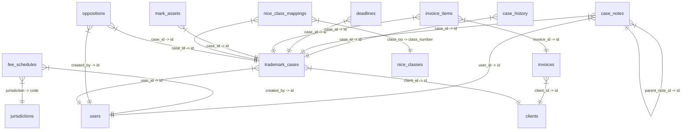

# Database Schema and Data Export

## ER Diagram



## Table: case_history

### Schema

```sql
CREATE TABLE `case_history` (
  `id` char(36) NOT NULL,
  `case_id` char(36) NOT NULL,
  `user_id` char(36) DEFAULT NULL,
  `action` varchar(100) NOT NULL,
  `old_data` longtext CHARACTER SET utf8mb4 COLLATE utf8mb4_bin DEFAULT NULL CHECK (json_valid(`old_data`)),
  `new_data` longtext CHARACTER SET utf8mb4 COLLATE utf8mb4_bin DEFAULT NULL CHECK (json_valid(`new_data`)),
  `created_at` timestamp NOT NULL DEFAULT current_timestamp(),
  `deleted_at` timestamp NULL DEFAULT NULL,
  PRIMARY KEY (`id`),
  KEY `case_id` (`case_id`),
  CONSTRAINT `case_history_ibfk_1` FOREIGN KEY (`case_id`) REFERENCES `trademark_cases` (`id`) ON DELETE CASCADE
) ENGINE=InnoDB DEFAULT CHARSET=utf8mb4 COLLATE=utf8mb4_unicode_ci;
```

### Data

*This table is empty.*

## Table: case_notes

### Schema

```sql
CREATE TABLE `case_notes` (
  `id` char(36) NOT NULL DEFAULT uuid(),
  `case_id` char(36) NOT NULL,
  `user_id` char(36) DEFAULT NULL,
  `note_type` varchar(30) DEFAULT 'GENERAL',
  `content` text NOT NULL,
  `is_private` tinyint(1) DEFAULT 0,
  `is_pinned` tinyint(1) DEFAULT 0,
  `parent_note_id` char(36) DEFAULT NULL,
  `deleted_at` timestamp NULL DEFAULT NULL,
  `created_at` timestamp NOT NULL DEFAULT current_timestamp(),
  `updated_at` timestamp NULL DEFAULT NULL,
  PRIMARY KEY (`id`),
  KEY `user_id` (`user_id`),
  KEY `parent_note_id` (`parent_note_id`),
  KEY `idx_case_notes_case` (`case_id`,`created_at`),
  CONSTRAINT `case_notes_ibfk_1` FOREIGN KEY (`case_id`) REFERENCES `trademark_cases` (`id`) ON DELETE CASCADE,
  CONSTRAINT `case_notes_ibfk_2` FOREIGN KEY (`user_id`) REFERENCES `users` (`id`) ON DELETE SET NULL,
  CONSTRAINT `case_notes_ibfk_3` FOREIGN KEY (`parent_note_id`) REFERENCES `case_notes` (`id`) ON DELETE CASCADE
) ENGINE=InnoDB DEFAULT CHARSET=utf8mb4 COLLATE=utf8mb4_unicode_ci;
```

### Data

*This table is empty.*

## Table: clients

### Schema

```sql
CREATE TABLE `clients` (
  `id` char(36) NOT NULL,
  `name` varchar(255) NOT NULL,
  `local_name` varchar(255) DEFAULT NULL,
  `type` enum('INDIVIDUAL','COMPANY','PARTNERSHIP') NOT NULL,
  `nationality` varchar(100) DEFAULT NULL,
  `email` varchar(255) DEFAULT NULL,
  `address_street` text DEFAULT NULL,
  `city` varchar(100) DEFAULT NULL,
  `zip_code` varchar(20) DEFAULT NULL,
  `created_at` timestamp NOT NULL DEFAULT current_timestamp(),
  `updated_at` timestamp NOT NULL DEFAULT current_timestamp() ON UPDATE current_timestamp(),
  `deleted_at` timestamp NULL DEFAULT NULL,
  `address_zone` varchar(100) DEFAULT NULL,
  `wereda` varchar(100) DEFAULT NULL,
  `house_no` varchar(50) DEFAULT NULL,
  `po_box` varchar(50) DEFAULT NULL,
  `telephone` varchar(50) DEFAULT NULL,
  `fax` varchar(50) DEFAULT NULL,
  PRIMARY KEY (`id`),
  KEY `idx_clients_deleted` (`deleted_at`)
) ENGINE=InnoDB DEFAULT CHARSET=utf8mb4 COLLATE=utf8mb4_unicode_ci;
```

### Data

*This table is empty.*

## Table: deadlines

### Schema

```sql
CREATE TABLE `deadlines` (
  `id` char(36) NOT NULL,
  `case_id` char(36) NOT NULL,
  `type` varchar(100) NOT NULL,
  `due_date` date NOT NULL,
  `is_completed` tinyint(1) DEFAULT 0,
  `created_at` timestamp NOT NULL DEFAULT current_timestamp(),
  `deleted_at` timestamp NULL DEFAULT NULL,
  PRIMARY KEY (`id`),
  KEY `case_id` (`case_id`),
  CONSTRAINT `deadlines_ibfk_1` FOREIGN KEY (`case_id`) REFERENCES `trademark_cases` (`id`) ON DELETE CASCADE
) ENGINE=InnoDB DEFAULT CHARSET=utf8mb4 COLLATE=utf8mb4_unicode_ci;
```

### Data

*This table is empty.*

## Table: fee_schedules

### Schema

```sql
CREATE TABLE `fee_schedules` (
  `id` char(36) NOT NULL DEFAULT uuid(),
  `jurisdiction` varchar(10) NOT NULL,
  `stage` varchar(50) NOT NULL,
  `category` varchar(20) NOT NULL,
  `amount` decimal(10,2) NOT NULL,
  `currency` varchar(3) DEFAULT 'USD',
  `effective_date` date NOT NULL,
  `expiry_date` date DEFAULT NULL,
  `description` text DEFAULT NULL,
  `is_active` tinyint(1) DEFAULT 1,
  `created_at` timestamp NOT NULL DEFAULT current_timestamp(),
  `updated_at` timestamp NULL DEFAULT NULL,
  `created_by` char(36) DEFAULT NULL,
  `deleted_at` timestamp NULL DEFAULT NULL,
  PRIMARY KEY (`id`),
  UNIQUE KEY `unique_fee_version` (`jurisdiction`,`stage`,`category`,`effective_date`),
  KEY `created_by` (`created_by`),
  CONSTRAINT `fee_schedules_ibfk_1` FOREIGN KEY (`jurisdiction`) REFERENCES `jurisdictions` (`code`) ON DELETE CASCADE,
  CONSTRAINT `fee_schedules_ibfk_2` FOREIGN KEY (`created_by`) REFERENCES `users` (`id`) ON DELETE SET NULL
) ENGINE=InnoDB DEFAULT CHARSET=utf8mb4 COLLATE=utf8mb4_unicode_ci;
```

### Data

| id | jurisdiction | stage | category | amount | currency | effective_date | expiry_date | description | is_active | created_at | updated_at | created_by | deleted_at |
| --- | --- | --- | --- | --- | --- | --- | --- | --- | --- | --- | --- | --- | --- |
| cbc0d1fd-0f18-11f1-acd5-0cc47a92e2f0 | ET | FILING | OFFICIAL_FEE | 2500.00 | ETB | 2023-12-31 21:00:00 | *NULL* | EIPO filing fee per class | 1 | 2026-02-21 03:30:59 | *NULL* | *NULL* | *NULL* |
| cbc0d598-0f18-11f1-acd5-0cc47a92e2f0 | ET | FILING | PROFESSIONAL_FEE | 15000.00 | ETB | 2023-12-31 21:00:00 | *NULL* | Professional fee for application preparation | 1 | 2026-02-21 03:30:59 | *NULL* | *NULL* | *NULL* |
| cbc0d636-0f18-11f1-acd5-0cc47a92e2f0 | ET | SEARCH | OFFICIAL_FEE | 500.00 | ETB | 2023-12-31 21:00:00 | *NULL* | Trademark availability search | 1 | 2026-02-21 03:30:59 | *NULL* | *NULL* | *NULL* |
| cbc0d6a0-0f18-11f1-acd5-0cc47a92e2f0 | ET | SEARCH | PROFESSIONAL_FEE | 5000.00 | ETB | 2023-12-31 21:00:00 | *NULL* | Professional search analysis | 1 | 2026-02-21 03:30:59 | *NULL* | *NULL* | *NULL* |
| cbc0d7e3-0f18-11f1-acd5-0cc47a92e2f0 | ET | FORMAL_EXAM | OFFICIAL_FEE | 1000.00 | ETB | 2023-12-31 21:00:00 | *NULL* | Formal examination fee | 1 | 2026-02-21 03:30:59 | *NULL* | *NULL* | *NULL* |
| cbc0d843-0f18-11f1-acd5-0cc47a92e2f0 | ET | SUBSTANTIVE_EXAM | OFFICIAL_FEE | 1500.00 | ETB | 2023-12-31 21:00:00 | *NULL* | Substantive examination fee | 1 | 2026-02-21 03:30:59 | *NULL* | *NULL* | *NULL* |
| cbc0d89b-0f18-11f1-acd5-0cc47a92e2f0 | ET | PUBLICATION | OFFICIAL_FEE | 1500.00 | ETB | 2023-12-31 21:00:00 | *NULL* | Publication/advertisement fee | 1 | 2026-02-21 03:30:59 | *NULL* | *NULL* | *NULL* |
| cbc0d8ed-0f18-11f1-acd5-0cc47a92e2f0 | ET | REGISTRATION | OFFICIAL_FEE | 2000.00 | ETB | 2023-12-31 21:00:00 | *NULL* | Certificate/registration fee | 1 | 2026-02-21 03:30:59 | *NULL* | *NULL* | *NULL* |
| cbc0d947-0f18-11f1-acd5-0cc47a92e2f0 | ET | REGISTRATION | PROFESSIONAL_FEE | 5000.00 | ETB | 2023-12-31 21:00:00 | *NULL* | Professional fee for registration completion | 1 | 2026-02-21 03:30:59 | *NULL* | *NULL* | *NULL* |
| cbc0d99e-0f18-11f1-acd5-0cc47a92e2f0 | ET | RENEWAL | OFFICIAL_FEE | 3000.00 | ETB | 2023-12-31 21:00:00 | *NULL* | 7-year renewal fee per class | 1 | 2026-02-21 03:30:59 | *NULL* | *NULL* | *NULL* |
| cbc0d9f3-0f18-11f1-acd5-0cc47a92e2f0 | ET | RENEWAL | PROFESSIONAL_FEE | 8000.00 | ETB | 2023-12-31 21:00:00 | *NULL* | Professional fee for renewal | 1 | 2026-02-21 03:30:59 | *NULL* | *NULL* | *NULL* |
| cbc0da47-0f18-11f1-acd5-0cc47a92e2f0 | ET | OPPOSITION | OFFICIAL_FEE | 2000.00 | ETB | 2023-12-31 21:00:00 | *NULL* | Opposition filing fee | 1 | 2026-02-21 03:30:59 | *NULL* | *NULL* | *NULL* |
| cbc0da9f-0f18-11f1-acd5-0cc47a92e2f0 | ET | OPPOSITION | PROFESSIONAL_FEE | 15000.00 | ETB | 2023-12-31 21:00:00 | *NULL* | Professional opposition handling fee | 1 | 2026-02-21 03:30:59 | *NULL* | *NULL* | *NULL* |
| cbc1df4d-0f18-11f1-acd5-0cc47a92e2f0 | KE | FILING | OFFICIAL_FEE | 6000.00 | KES | 2023-12-31 21:00:00 | *NULL* | KIPI filing fee per class (TM2) | 1 | 2026-02-21 03:30:59 | *NULL* | *NULL* | *NULL* |
| cbc1e104-0f18-11f1-acd5-0cc47a92e2f0 | KE | FILING | PROFESSIONAL_FEE | 20000.00 | KES | 2023-12-31 21:00:00 | *NULL* | Professional fee for application preparation | 1 | 2026-02-21 03:30:59 | *NULL* | *NULL* | *NULL* |
| cbc1e245-0f18-11f1-acd5-0cc47a92e2f0 | KE | SEARCH | OFFICIAL_FEE | 1000.00 | KES | 2023-12-31 21:00:00 | *NULL* | TM27 trademark search per class | 1 | 2026-02-21 03:30:59 | *NULL* | *NULL* | *NULL* |
| cbc1e377-0f18-11f1-acd5-0cc47a92e2f0 | KE | SEARCH | PROFESSIONAL_FEE | 8000.00 | KES | 2023-12-31 21:00:00 | *NULL* | Professional search analysis | 1 | 2026-02-21 03:30:59 | *NULL* | *NULL* | *NULL* |
| cbc1e3dc-0f18-11f1-acd5-0cc47a92e2f0 | KE | FORMAL_EXAM | OFFICIAL_FEE | 3000.00 | KES | 2023-12-31 21:00:00 | *NULL* | Formality examination | 1 | 2026-02-21 03:30:59 | *NULL* | *NULL* | *NULL* |
| cbc1e43d-0f18-11f1-acd5-0cc47a92e2f0 | KE | SUBSTANTIVE_EXAM | OFFICIAL_FEE | 5000.00 | KES | 2023-12-31 21:00:00 | *NULL* | Substantive examination | 1 | 2026-02-21 03:30:59 | *NULL* | *NULL* | *NULL* |
| cbc1e53b-0f18-11f1-acd5-0cc47a92e2f0 | KE | PUBLICATION | OFFICIAL_FEE | 4000.00 | KES | 2023-12-31 21:00:00 | *NULL* | Advertisement/publication fee | 1 | 2026-02-21 03:30:59 | *NULL* | *NULL* | *NULL* |
| cbc1e592-0f18-11f1-acd5-0cc47a92e2f0 | KE | REGISTRATION | OFFICIAL_FEE | 5000.00 | KES | 2023-12-31 21:00:00 | *NULL* | Certificate/registration fee | 1 | 2026-02-21 03:30:59 | *NULL* | *NULL* | *NULL* |
| cbc1e685-0f18-11f1-acd5-0cc47a92e2f0 | KE | REGISTRATION | PROFESSIONAL_FEE | 10000.00 | KES | 2023-12-31 21:00:00 | *NULL* | Professional fee for registration completion | 1 | 2026-02-21 03:30:59 | *NULL* | *NULL* | *NULL* |
| cbc1e6e3-0f18-11f1-acd5-0cc47a92e2f0 | KE | RENEWAL | OFFICIAL_FEE | 6000.00 | KES | 2023-12-31 21:00:00 | *NULL* | 10-year renewal fee per class | 1 | 2026-02-21 03:30:59 | *NULL* | *NULL* | *NULL* |
| cbc1e738-0f18-11f1-acd5-0cc47a92e2f0 | KE | RENEWAL | PROFESSIONAL_FEE | 12000.00 | KES | 2023-12-31 21:00:00 | *NULL* | Professional fee for renewal | 1 | 2026-02-21 03:30:59 | *NULL* | *NULL* | *NULL* |
| cbc1e78e-0f18-11f1-acd5-0cc47a92e2f0 | KE | OPPOSITION | OFFICIAL_FEE | 5000.00 | KES | 2023-12-31 21:00:00 | *NULL* | Opposition filing fee | 1 | 2026-02-21 03:30:59 | *NULL* | *NULL* | *NULL* |
| cbc1e7e2-0f18-11f1-acd5-0cc47a92e2f0 | KE | OPPOSITION | PROFESSIONAL_FEE | 30000.00 | KES | 2023-12-31 21:00:00 | *NULL* | Professional opposition handling | 1 | 2026-02-21 03:30:59 | *NULL* | *NULL* | *NULL* |
| cbc2bcfa-0f18-11f1-acd5-0cc47a92e2f0 | EAC | FILING | OFFICIAL_FEE | 350.00 | USD | 2023-12-31 21:00:00 | *NULL* | EAC regional filing fee per class | 1 | 2026-02-21 03:30:59 | *NULL* | *NULL* | *NULL* |
| cbc2be55-0f18-11f1-acd5-0cc47a92e2f0 | EAC | FILING | PROFESSIONAL_FEE | 800.00 | USD | 2023-12-31 21:00:00 | *NULL* | Professional fee for EAC application | 1 | 2026-02-21 03:30:59 | *NULL* | *NULL* | *NULL* |
| cbc2beed-0f18-11f1-acd5-0cc47a92e2f0 | EAC | SEARCH | OFFICIAL_FEE | 100.00 | USD | 2023-12-31 21:00:00 | *NULL* | Regional availability search | 1 | 2026-02-21 03:30:59 | *NULL* | *NULL* | *NULL* |
| cbc2bf5c-0f18-11f1-acd5-0cc47a92e2f0 | EAC | REGISTRATION | OFFICIAL_FEE | 400.00 | USD | 2023-12-31 21:00:00 | *NULL* | Registration certificate fee | 1 | 2026-02-21 03:30:59 | *NULL* | *NULL* | *NULL* |
| cbc2bfbf-0f18-11f1-acd5-0cc47a92e2f0 | EAC | RENEWAL | OFFICIAL_FEE | 450.00 | USD | 2023-12-31 21:00:00 | *NULL* | 10-year renewal fee per class | 1 | 2026-02-21 03:30:59 | *NULL* | *NULL* | *NULL* |
| cbc38fc2-0f18-11f1-acd5-0cc47a92e2f0 | ARIPO | FILING | OFFICIAL_FEE | 250.00 | USD | 2023-12-31 21:00:00 | *NULL* | ARIPO filing fee (1st class) | 1 | 2026-02-21 03:30:59 | *NULL* | *NULL* | *NULL* |
| cbc39104-0f18-11f1-acd5-0cc47a92e2f0 | ARIPO | FILING | OFFICIAL_FEE_ADDL_CL | 50.00 | USD | 2023-12-31 21:00:00 | *NULL* | Additional class fee | 1 | 2026-02-21 03:30:59 | *NULL* | *NULL* | *NULL* |
| cbc391a4-0f18-11f1-acd5-0cc47a92e2f0 | ARIPO | FILING | PROFESSIONAL_FEE | 600.00 | USD | 2023-12-31 21:00:00 | *NULL* | Professional fee for ARIPO application | 1 | 2026-02-21 03:30:59 | *NULL* | *NULL* | *NULL* |
| cbc3920b-0f18-11f1-acd5-0cc47a92e2f0 | ARIPO | SEARCH | OFFICIAL_FEE | 100.00 | USD | 2023-12-31 21:00:00 | *NULL* | ARIPO search fee | 1 | 2026-02-21 03:30:59 | *NULL* | *NULL* | *NULL* |
| cbc39262-0f18-11f1-acd5-0cc47a92e2f0 | ARIPO | REGISTRATION | OFFICIAL_FEE | 300.00 | USD | 2023-12-31 21:00:00 | *NULL* | Registration fee | 1 | 2026-02-21 03:30:59 | *NULL* | *NULL* | *NULL* |
| cbc392bc-0f18-11f1-acd5-0cc47a92e2f0 | ARIPO | RENEWAL | OFFICIAL_FEE | 350.00 | USD | 2023-12-31 21:00:00 | *NULL* | 10-year renewal fee | 1 | 2026-02-21 03:30:59 | *NULL* | *NULL* | *NULL* |
| cbc47a95-0f18-11f1-acd5-0cc47a92e2f0 | WIPO | FILING | OFFICIAL_FEE_BASIC_B | 730.00 | USD | 2023-12-31 21:00:00 | *NULL* | WIPO basic fee - black & white (653 CHF) | 1 | 2026-02-21 03:30:59 | *NULL* | *NULL* | *NULL* |
| cbc47c13-0f18-11f1-acd5-0cc47a92e2f0 | WIPO | FILING | OFFICIAL_FEE_BASIC_C | 1010.00 | USD | 2023-12-31 21:00:00 | *NULL* | WIPO basic fee - color (903 CHF) | 1 | 2026-02-21 03:30:59 | *NULL* | *NULL* | *NULL* |
| cbc47cab-0f18-11f1-acd5-0cc47a92e2f0 | WIPO | FILING | OFFICIAL_FEE_SUPPLEM | 112.00 | USD | 2023-12-31 21:00:00 | *NULL* | Supplementary fee per class after 3rd class (100 CHF) | 1 | 2026-02-21 03:30:59 | *NULL* | *NULL* | *NULL* |
| cbc47d28-0f18-11f1-acd5-0cc47a92e2f0 | WIPO | FILING | PROFESSIONAL_FEE | 1000.00 | USD | 2023-12-31 21:00:00 | *NULL* | Professional fee for Madrid application | 1 | 2026-02-21 03:30:59 | *NULL* | *NULL* | *NULL* |
| cbc47d8b-0f18-11f1-acd5-0cc47a92e2f0 | WIPO | RENEWAL | OFFICIAL_FEE | 730.00 | USD | 2023-12-31 21:00:00 | *NULL* | Renewal basic fee | 1 | 2026-02-21 03:30:59 | *NULL* | *NULL* | *NULL* |
| cbc47df7-0f18-11f1-acd5-0cc47a92e2f0 | WIPO | INDIVIDUAL_FEE | OFFICIAL_FEE_ET | 72.00 | USD | 2023-12-31 21:00:00 | *NULL* | Individual fee for Ethiopia designation | 1 | 2026-02-21 03:30:59 | *NULL* | *NULL* | *NULL* |
| cbc47e69-0f18-11f1-acd5-0cc47a92e2f0 | WIPO | INDIVIDUAL_FEE | OFFICIAL_FEE_KE | 145.00 | USD | 2023-12-31 21:00:00 | *NULL* | Individual fee for Kenya designation | 1 | 2026-02-21 03:30:59 | *NULL* | *NULL* | *NULL* |

## Table: invoice_items

### Schema

```sql
CREATE TABLE `invoice_items` (
  `id` char(36) NOT NULL,
  `invoice_id` char(36) NOT NULL,
  `case_id` char(36) DEFAULT NULL,
  `description` varchar(255) NOT NULL,
  `category` enum('OFFICIAL_FEE','PROFESSIONAL_FEE','DISBURSEMENT') NOT NULL,
  `amount` decimal(15,2) NOT NULL,
  `deleted_at` timestamp NULL DEFAULT NULL,
  PRIMARY KEY (`id`),
  KEY `invoice_id` (`invoice_id`),
  KEY `case_id` (`case_id`),
  CONSTRAINT `invoice_items_ibfk_1` FOREIGN KEY (`invoice_id`) REFERENCES `invoices` (`id`) ON DELETE CASCADE,
  CONSTRAINT `invoice_items_ibfk_2` FOREIGN KEY (`case_id`) REFERENCES `trademark_cases` (`id`) ON DELETE SET NULL
) ENGINE=InnoDB DEFAULT CHARSET=utf8mb4 COLLATE=utf8mb4_unicode_ci;
```

### Data

*This table is empty.*

## Table: invoices

### Schema

```sql
CREATE TABLE `invoices` (
  `id` char(36) NOT NULL,
  `client_id` char(36) NOT NULL,
  `invoice_number` varchar(50) NOT NULL,
  `status` enum('DRAFT','SENT','PAID','OVERDUE') DEFAULT 'DRAFT',
  `issue_date` date NOT NULL,
  `due_date` date NOT NULL,
  `currency` enum('USD','ETB','KES') DEFAULT 'USD',
  `exchange_rate` decimal(10,4) DEFAULT 1.0000,
  `total_amount` decimal(15,2) NOT NULL,
  `notes` text DEFAULT NULL,
  `created_at` timestamp NOT NULL DEFAULT current_timestamp(),
  `deleted_at` timestamp NULL DEFAULT NULL,
  PRIMARY KEY (`id`),
  UNIQUE KEY `invoice_number` (`invoice_number`),
  KEY `client_id` (`client_id`),
  KEY `idx_invoices_deleted` (`deleted_at`),
  CONSTRAINT `invoices_ibfk_1` FOREIGN KEY (`client_id`) REFERENCES `clients` (`id`)
) ENGINE=InnoDB DEFAULT CHARSET=utf8mb4 COLLATE=utf8mb4_unicode_ci;
```

### Data

*This table is empty.*

## Table: jurisdictions

### Schema

```sql
CREATE TABLE `jurisdictions` (
  `code` varchar(10) NOT NULL,
  `name` varchar(100) NOT NULL,
  `country_code` varchar(2) DEFAULT NULL,
  `opposition_period_days` int(11) NOT NULL DEFAULT 60,
  `renewal_period_years` int(11) NOT NULL DEFAULT 10,
  `grace_period_months` int(11) DEFAULT 6,
  `currency_code` varchar(3) NOT NULL DEFAULT 'USD',
  `is_active` tinyint(1) DEFAULT 1,
  `requires_power_of_attorney` tinyint(1) DEFAULT 1,
  `requires_notarization` tinyint(1) DEFAULT 0,
  `multi_class_filing_allowed` tinyint(1) DEFAULT 1,
  `rules_summary` text DEFAULT NULL,
  `official_language` varchar(50) DEFAULT NULL,
  `created_at` timestamp NOT NULL DEFAULT current_timestamp(),
  `updated_at` timestamp NULL DEFAULT NULL,
  `cert_request_window_days` int(11) DEFAULT 20,
  `cert_issuance_expected_days` int(11) DEFAULT 30,
  PRIMARY KEY (`code`)
) ENGINE=InnoDB DEFAULT CHARSET=utf8mb4 COLLATE=utf8mb4_unicode_ci;
```

### Data

| code | name | country_code | opposition_period_days | renewal_period_years | grace_period_months | currency_code | is_active | requires_power_of_attorney | requires_notarization | multi_class_filing_allowed | rules_summary | official_language | created_at | updated_at | cert_request_window_days | cert_issuance_expected_days |
| --- | --- | --- | --- | --- | --- | --- | --- | --- | --- | --- | --- | --- | --- | --- | --- | --- |
| ARIPO | African Regional IP Office | *NULL* | 60 | 10 | 6 | USD | 1 | 1 | 0 | 1 | Regional registration for 20 member states. | *NULL* | 2026-02-21 03:19:20 | *NULL* | 20 | 30 |
| EAC | East African Community | *NULL* | 60 | 10 | 6 | USD | 1 | 1 | 0 | 1 | Regional registration covering 7 countries. | *NULL* | 2026-02-21 03:19:20 | *NULL* | 20 | 30 |
| ET | Ethiopia | ET | 60 | 7 | 6 | ETB | 1 | 1 | 0 | 1 | Local filing only. 60-day opposition window. 7-year renewal. Requires Power of Attorney. | *NULL* | 2026-02-21 03:19:20 | *NULL* | 20 | 30 |
| KE | Kenya | KE | 60 | 10 | 6 | KES | 1 | 1 | 0 | 1 | KIPO registration. 60-day opposition window. 10-year renewal. | *NULL* | 2026-02-21 03:19:20 | *NULL* | 20 | 30 |
| WIPO | Madrid Protocol | *NULL* | 60 | 10 | 6 | USD | 1 | 1 | 0 | 1 | International registration via Madrid System. | *NULL* | 2026-02-21 03:19:20 | *NULL* | 20 | 30 |

## Table: mark_assets

### Schema

```sql
CREATE TABLE `mark_assets` (
  `id` char(36) NOT NULL,
  `case_id` char(36) NOT NULL,
  `type` enum('LOGO','POA','PRIORITY','OFFICE_ACTION_RESPONSE','REGISTRATION_CERTIFICATE') NOT NULL,
  `file_path` text NOT NULL,
  `is_active` tinyint(1) DEFAULT 1,
  `created_at` timestamp NOT NULL DEFAULT current_timestamp(),
  `deleted_at` timestamp NULL DEFAULT NULL,
  PRIMARY KEY (`id`),
  KEY `case_id` (`case_id`),
  CONSTRAINT `mark_assets_ibfk_1` FOREIGN KEY (`case_id`) REFERENCES `trademark_cases` (`id`) ON DELETE CASCADE
) ENGINE=InnoDB DEFAULT CHARSET=utf8mb4 COLLATE=utf8mb4_unicode_ci;
```

### Data

*This table is empty.*

## Table: nice_class_mappings

### Schema

```sql
CREATE TABLE `nice_class_mappings` (
  `id` int(11) NOT NULL AUTO_INCREMENT,
  `case_id` char(36) NOT NULL,
  `class_no` int(11) NOT NULL,
  `description` text NOT NULL,
  `deleted_at` timestamp NULL DEFAULT NULL,
  PRIMARY KEY (`id`),
  KEY `case_id` (`case_id`),
  KEY `class_no` (`class_no`),
  CONSTRAINT `nice_class_mappings_ibfk_1` FOREIGN KEY (`case_id`) REFERENCES `trademark_cases` (`id`) ON DELETE CASCADE,
  CONSTRAINT `nice_class_mappings_ibfk_2` FOREIGN KEY (`class_no`) REFERENCES `nice_classes` (`class_number`)
) ENGINE=InnoDB AUTO_INCREMENT=44 DEFAULT CHARSET=utf8mb4 COLLATE=utf8mb4_unicode_ci;
```

### Data

*This table is empty.*

## Table: nice_classes

### Schema

```sql
CREATE TABLE `nice_classes` (
  `class_number` int(11) NOT NULL,
  `general_description` text DEFAULT NULL,
  PRIMARY KEY (`class_number`)
) ENGINE=InnoDB DEFAULT CHARSET=utf8mb4 COLLATE=utf8mb4_unicode_ci;
```

### Data

| class_number | general_description |
| --- | --- |
| 1 | Chemicals used in industry, science and photography, as well as in agriculture, horticulture and forestry; unprocessed artificial resins, unprocessed plastics; manures; fire extinguishing compositions; tempering and soldering preparations; chemical substances for preserving foodstuffs; tanning substances; adhesives used in industry |
| 2 | Paints, varnishes, lacquers; preservatives against rust and against deterioration of wood; colorants; mordants; raw natural resins; metals in foil and powder form for painters, decorators, printers and artists |
| 3 | Bleaching preparations and other substances for laundry use; cleaning, polishing, scouring and abrasive preparations; soaps; perfumery, essential oils, cosmetics, hair lotions; dentifrices |
| 4 | Industrial oils and greases; lubricants; dust absorbing, wetting and binding compositions; fuels (including motor spirit) and illuminants; candles and wicks for lighting |
| 5 | Pharmaceutical and veterinary preparations; sanitary preparations for medical purposes; dietetic substances adapted for medical use, food for babies; plasters, materials for dressings; material for stopping teeth, dental wax; disinfectants; preparations for destroying vermin; fungicides, herbicides |
| 6 | Common metals and their alloys; metal building materials; transportable buildings of metal; materials of metal for railway tracks; non-electric cables and wires of common metal; ironmongery, small items of metal hardware; pipes and tubes of metal; safes; goods of common metal not included in other classes; ores |
| 7 | Machines and machine tools; motors and engines (except for land vehicles); machine coupling and transmission components (except for land vehicles); agricultural implements other than hand-operated; incubators for eggs |
| 8 | Hand tools and implements (hand-operated); cutlery; side arms; razors |
| 9 | Scientific, nautical, surveying, photographic, cinematographic, optical, weighing, measuring, signalling, checking (supervision), life-saving and teaching apparatus and instruments; apparatus and instruments for conducting, switching, transforming, accumulating, regulating or controlling electricity; apparatus for recording, transmission or reproduction of sound or images; magnetic data carriers, recording discs; automatic vending machines and mechanisms for coin-operated apparatus; cash registers, calculating machines, data processing equipment and computers; fire-extinguishing apparatus |
| 10 | Surgical, medical, dental and veterinary apparatus and instruments, artificial limbs, eyes and teeth; orthopaedic articles; suture materials |
| 11 | Apparatus for lighting, heating, steam generating, cooking, refrigerating, drying, ventilating, water supply and sanitary purposes |
| 12 | Vehicles; apparatus for locomotion by land, air or water |
| 13 | Firearms; ammunition and projectiles; explosives; fireworks |
| 14 | Precious metals and their alloys and goods in precious metals or coated therewith, not included in other classes; jewellery, precious stones; horological and chronometric instruments |
| 15 | Musical instruments |
| 16 | Paper, cardboard and goods made from these materials, not included in other classes; printed matter; bookbinding material; photographs; stationery; adhesives for stationery or household purposes; artists' materials; paint brushes; typewriters and office requisites (except furniture); instructional and teaching material (except apparatus); plastic materials for packaging (not included in other classes); printers' type; printing blocks |
| 17 | Rubber, gutta-percha, gum, asbestos, mica and goods made from these materials and not included in other classes; plastics in extruded form for use in manufacture; packing, stopping and insulating materials; flexible pipes, not of metal |
| 18 | Leather and imitations of leather, and goods made of these materials and not included in other classes; animal skins, hides; trunks and travelling bags; umbrellas, parasols and walking sticks; whips, harness and saddlery |
| 19 | Building materials (non-metallic); non-metallic rigid pipes for building; asphalt, pitch and bitumen; non-metallic transportable buildings; monuments, not of metal |
| 20 | Furniture, mirrors, picture frames; goods (not included in other classes) of wood, cork, reed, cane, wicker, horn, bone, ivory, whalebone, shell, amber, mother-of-pearl, meerschaum and substitutes for all these materials, or of plastics |
| 21 | Household or kitchen utensils and containers; combs and sponges; brushes (except paint brushes); brush-making materials; articles for cleaning purposes; steelwool; unworked or semi-worked glass (except glass used in building); glassware, porcelain and earthenware not included in other classes |
| 22 | Ropes, string, nets, tents, awnings, tarpaulins, sails, sacks and bags (not included in other classes); padding and stuffing materials (except of rubber or plastics); raw fibrous textile materials |
| 23 | Yarns and threads, for textile use |
| 24 | Textiles and textile goods, not included in other classes; bed and table covers |
| 25 | Clothing, footwear, headgear |
| 26 | Lace and embroidery, ribbons and braid; buttons, hooks and eyes, pins and needles; artificial flowers |
| 27 | Carpets, rugs, mats and matting, linoleum and other materials for covering existing floors; wall hangings (non-textile) |
| 28 | Games and playthings; gymnastic and sporting articles not included in other classes; decorations for Christmas trees |
| 29 | Meat, fish, poultry and game; meat extracts; preserved, frozen, dried and cooked fruits and vegetables; jellies, jams, compotes; eggs, milk and milk products; edible oils and fats |
| 30 | Coffee, tea, cocoa, sugar, rice, tapioca, sago, artificial coffee; flour and preparations made from cereals, bread, pastry and confectionery, ices; honey, treacle; yeast, baking-powder; salt, mustard; vinegar, sauces (condiments); spices; ice |
| 31 | Grains and agricultural, horticultural and forestry products and grains not included in other classes; live animals; fresh fruits and vegetables; seeds, natural plants and flowers; foodstuffs for animals; malt |
| 32 | Beers; mineral and aerated waters and other non-alcoholic drinks; fruit drinks and fruit juices; syrups and other preparations for making beverages |
| 33 | Alcoholic beverages (except beers) |
| 34 | Tobacco; smokers' articles; matches |
| 35 | Advertising; business management; business administration; office functions |
| 36 | Insurance; financial affairs; monetary affairs; real estate affairs |
| 37 | Building construction; repair; installation services |
| 38 | Telecommunications |
| 39 | Transport; packaging and storage of goods; travel arrangement |
| 40 | Treatment of materials |
| 41 | Education; providing of training; entertainment; sporting and cultural activities |
| 42 | Scientific and technological services and research and design relating thereto; industrial analysis and research services; design and development of computer hardware and software |
| 43 | Services for providing food and drink; temporary accommodation |
| 44 | Medical services; veterinary services; hygienic and beauty care for human beings or animals; agriculture, horticulture and forestry services |
| 45 | Legal services; security services for the protection of property and individuals; personal and social services rendered by others to meet the needs of individuals |

## Table: oppositions

### Schema

```sql
CREATE TABLE `oppositions` (
  `id` char(36) NOT NULL DEFAULT uuid(),
  `case_id` char(36) NOT NULL,
  `opponent_name` varchar(255) NOT NULL,
  `opponent_address` text DEFAULT NULL,
  `opponent_representative` varchar(255) DEFAULT NULL,
  `grounds` text NOT NULL,
  `opposition_date` date NOT NULL,
  `deadline_date` date NOT NULL,
  `status` varchar(20) DEFAULT 'PENDING',
  `response_filed_date` date DEFAULT NULL,
  `response_document_path` varchar(500) DEFAULT NULL,
  `outcome` varchar(50) DEFAULT NULL,
  `notes` text DEFAULT NULL,
  `deleted_at` timestamp NULL DEFAULT NULL,
  `created_at` timestamp NOT NULL DEFAULT current_timestamp(),
  `updated_at` timestamp NULL DEFAULT NULL,
  `created_by` char(36) DEFAULT NULL,
  PRIMARY KEY (`id`),
  KEY `created_by` (`created_by`),
  KEY `idx_oppositions_case` (`case_id`),
  KEY `idx_oppositions_status` (`status`),
  KEY `idx_oppositions_deadline` (`deadline_date`),
  CONSTRAINT `oppositions_ibfk_1` FOREIGN KEY (`case_id`) REFERENCES `trademark_cases` (`id`) ON DELETE CASCADE,
  CONSTRAINT `oppositions_ibfk_2` FOREIGN KEY (`created_by`) REFERENCES `users` (`id`) ON DELETE SET NULL
) ENGINE=InnoDB DEFAULT CHARSET=utf8mb4 COLLATE=utf8mb4_unicode_ci;
```

### Data

*This table is empty.*

## Table: trademark_cases

### Schema

```sql
CREATE TABLE `trademark_cases` (
  `id` char(36) NOT NULL,
  `client_id` char(36) NOT NULL,
  `jurisdiction` enum('ER','DJ','SO','SL','KE','TZ','UG','RW','BI','SD','ET') NOT NULL,
  `mark_name` varchar(255) NOT NULL,
  `translation` text DEFAULT NULL,
  `transliteration` text DEFAULT NULL,
  `transliteration_lang` varchar(100) DEFAULT NULL,
  `mark_type` enum('WORD','LOGO','COMBINED','MIXED','THREE_DIMENSION','OTHER') NOT NULL,
  `is_three_dimensional` tinyint(1) DEFAULT 0,
  `disclaimer` text DEFAULT NULL,
  `mark_image` text DEFAULT NULL,
  `mark_description` text DEFAULT NULL,
  `color_indication` varchar(255) DEFAULT NULL,
  `status` enum('DRAFT','FILED','FORMAL_EXAM','SUBSTANTIVE_EXAM','PUBLISHED','REGISTERED','EXPIRING','RENEWAL','AMENDMENT_PENDING','OPPOSED','ABANDONED','WITHDRAWN') DEFAULT 'DRAFT',
  `filing_number` varchar(100) DEFAULT NULL,
  `certificate_number` varchar(100) DEFAULT NULL,
  `filing_date` date DEFAULT NULL,
  `registration_dt` date DEFAULT NULL,
  `client_expiry_date` date DEFAULT NULL,
  `expiry_date` date DEFAULT NULL,
  `next_action_date` date DEFAULT NULL,
  `priority` enum('YES','NO') DEFAULT 'NO',
  `created_at` timestamp NOT NULL DEFAULT current_timestamp(),
  `updated_at` timestamp NOT NULL DEFAULT current_timestamp() ON UPDATE current_timestamp(),
  `user_id` char(36) DEFAULT NULL,
  `representative_name` varchar(255) DEFAULT NULL,
  `flow_stage` varchar(50) DEFAULT 'DATA_COLLECTION',
  `deleted_at` timestamp NULL DEFAULT NULL,
  PRIMARY KEY (`id`),
  KEY `client_id` (`client_id`),
  KEY `fk_case_user` (`user_id`),
  KEY `idx_cases_deleted` (`deleted_at`),
  CONSTRAINT `fk_case_user` FOREIGN KEY (`user_id`) REFERENCES `users` (`id`),
  CONSTRAINT `trademark_cases_ibfk_1` FOREIGN KEY (`client_id`) REFERENCES `clients` (`id`) ON DELETE CASCADE
) ENGINE=InnoDB DEFAULT CHARSET=utf8mb4 COLLATE=utf8mb4_unicode_ci;
```

### Data

*This table is empty.*

## Table: users

### Schema

```sql
CREATE TABLE `users` (
  `id` char(36) NOT NULL,
  `full_name` varchar(255) NOT NULL,
  `email` varchar(255) NOT NULL,
  `phone` varchar(50) DEFAULT NULL,
  `firm_name` varchar(255) DEFAULT NULL,
  `password_hash` varchar(255) NOT NULL,
  `role` enum('ADMIN','LAWYER','PARTNER') DEFAULT 'LAWYER',
  `is_active` tinyint(1) DEFAULT 1,
  `is_verified` tinyint(1) DEFAULT 0,
  `verification_code` varchar(6) DEFAULT NULL,
  `last_login` datetime DEFAULT NULL,
  `created_at` timestamp NOT NULL DEFAULT current_timestamp(),
  `updated_at` timestamp NOT NULL DEFAULT current_timestamp() ON UPDATE current_timestamp(),
  `deleted_at` timestamp NULL DEFAULT NULL,
  PRIMARY KEY (`id`),
  UNIQUE KEY `email` (`email`),
  KEY `idx_users_deleted` (`deleted_at`)
) ENGINE=InnoDB DEFAULT CHARSET=utf8mb4 COLLATE=utf8mb4_unicode_ci;
```

### Data

| id | full_name | email | phone | firm_name | password_hash | role | is_active | is_verified | verification_code | last_login | created_at | updated_at | deleted_at |
| --- | --- | --- | --- | --- | --- | --- | --- | --- | --- | --- | --- | --- | --- |
| 76bdc2a3-270f-4321-a75b-708f826da333 | Israel Seleshi | israelseleshi09@gmail.com | 0920190438 | Israel Law Firm | $2b$10$pafQXZqXU9UfSyZW7YSdS.JVGCSEgNovW0YrrnYyEdXXGIArqMrtC | LAWYER | 1 | 1 | *NULL* | 2026-03-08 11:56:46 | 2026-02-17 11:42:30 | 2026-03-08 11:56:46 | *NULL* |

