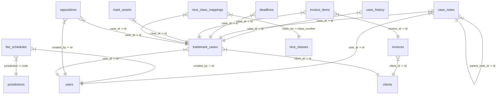

# Database Schema and Data Export

## ER Diagram



## Table: agents

### Schema

```sql
CREATE TABLE `agents` (
  `id` char(36) NOT NULL,
  `name` varchar(255) NOT NULL,
  `country` varchar(100) NOT NULL,
  `city` varchar(100) NOT NULL,
  `subcity` varchar(100) DEFAULT NULL,
  `woreda` varchar(100) DEFAULT NULL,
  `house_no` varchar(50) DEFAULT NULL,
  `telephone` varchar(50) DEFAULT NULL,
  `email` varchar(255) DEFAULT NULL,
  `po_box` varchar(50) DEFAULT NULL,
  `fax` varchar(50) DEFAULT NULL,
  `created_at` timestamp NOT NULL DEFAULT current_timestamp(),
  PRIMARY KEY (`id`)
) ENGINE=InnoDB DEFAULT CHARSET=utf8mb4 COLLATE=utf8mb4_unicode_ci;
```

### Data

*This table is empty.*

## Table: case_history

### Schema

```sql
CREATE TABLE `case_history` (
  `id` char(36) NOT NULL,
  `case_id` char(36) NOT NULL,
  `user_id` char(36) DEFAULT NULL,
  `action` varchar(100) NOT NULL,
  `old_data` longtext CHARACTER SET utf8mb4 COLLATE utf8mb4_bin DEFAULT NULL CHECK (json_valid(`old_data`)),
  `new_data` longtext CHARACTER SET utf8mb4 COLLATE utf8mb4_bin DEFAULT NULL CHECK (json_valid(`new_data`)),
  `created_at` timestamp NOT NULL DEFAULT current_timestamp(),
  `deleted_at` timestamp NULL DEFAULT NULL,
  PRIMARY KEY (`id`),
  KEY `case_id` (`case_id`),
  CONSTRAINT `case_history_ibfk_1` FOREIGN KEY (`case_id`) REFERENCES `trademark_cases` (`id`) ON DELETE CASCADE
) ENGINE=InnoDB DEFAULT CHARSET=utf8mb4 COLLATE=utf8mb4_unicode_ci;
```

### Data

| id | case_id | user_id | action | old_data | new_data | created_at | deleted_at |
| --- | --- | --- | --- | --- | --- | --- | --- |
| 0c1920ea-a0bb-449e-a89c-1b3edb3cb629 | d1bf977e-f396-4399-8749-de604dc226d4 | 76bdc2a3-270f-4321-a75b-708f826da333 | STAGE_CHANGE: PUBLISHED -> CERTIFICATE_REQUEST | {"flow_stage":"PUBLISHED"} | {"flow_stage":"CERTIFICATE_REQUEST","deadlines":{"flow_stage":"CERTIFICATE_REQUEST","next_action_date":"2026-04-03T00:00:00.000Z","status":"PUBLISHED"}} | 2026-03-09 11:23:47 | *NULL* |
| 5bf0dd23-71b0-420a-84e0-a704c343764f | d1bf977e-f396-4399-8749-de604dc226d4 | 76bdc2a3-270f-4321-a75b-708f826da333 | STAGE_CHANGE: FORMAL_EXAM -> SUBSTANTIVE_EXAM | {"flow_stage":"FORMAL_EXAM"} | {"flow_stage":"SUBSTANTIVE_EXAM","deadlines":{"flow_stage":"SUBSTANTIVE_EXAM","next_action_date":"2026-03-30T00:00:00.000Z","status":"SUBSTANTIVE_EXAM"}} | 2026-03-09 11:23:30 | *NULL* |
| 777d4369-4f0b-4301-9724-e1251b424dbc | d1bf977e-f396-4399-8749-de604dc226d4 | 76bdc2a3-270f-4321-a75b-708f826da333 | STAGE_CHANGE: READY_TO_FILE -> FILED | {"flow_stage":"READY_TO_FILE"} | {"flow_stage":"FILED","deadlines":{"flow_stage":"FILED","filing_number":"ET/TM/2026/1234","filing_date":"2026-03-10T00:00:00.000Z","next_action_date":"2026-03-30T00:00:00.000Z","status":"FILED"},"notes":"SUBSTANTIATIVE test"} | 2026-03-08 12:41:35 | *NULL* |
| a4017711-b21b-4311-931e-25385f8f4a0b | d1bf977e-f396-4399-8749-de604dc226d4 | 76bdc2a3-270f-4321-a75b-708f826da333 | STAGE_CHANGE: DATA_COLLECTION -> READY_TO_FILE | {"flow_stage":"DATA_COLLECTION"} | {"flow_stage":"READY_TO_FILE","deadlines":{"flow_stage":"READY_TO_FILE","status":"DRAFT"},"notes":"filing note"} | 2026-03-08 12:39:56 | *NULL* |
| a5021ef4-bc69-4614-8ad5-2ed27f2fa5ed | d1bf977e-f396-4399-8749-de604dc226d4 | 76bdc2a3-270f-4321-a75b-708f826da333 | STAGE_CHANGE: FILED -> FORMAL_EXAM | {"flow_stage":"FILED"} | {"flow_stage":"FORMAL_EXAM","deadlines":{"flow_stage":"FORMAL_EXAM","next_action_date":"2026-04-08T00:00:00.000Z","status":"FORMAL_EXAM"}} | 2026-03-08 12:42:16 | *NULL* |
| afd054d3-4289-4dd3-a106-c0b78e4bf9e5 | d1bf977e-f396-4399-8749-de604dc226d4 | 76bdc2a3-270f-4321-a75b-708f826da333 | STAGE_CHANGE: SUBSTANTIVE_EXAM -> PUBLISHED | {"flow_stage":"SUBSTANTIVE_EXAM"} | {"flow_stage":"PUBLISHED","deadlines":{"flow_stage":"PUBLISHED","next_action_date":"2026-05-12T00:00:00.000Z","status":"PUBLISHED"}} | 2026-03-09 11:23:37 | *NULL* |
| b50c9007-38b3-4fbb-95e2-5cde733bd7e6 | d1bf977e-f396-4399-8749-de604dc226d4 | 76bdc2a3-270f-4321-a75b-708f826da333 | FORM_SUBMITTED | {"status":"NEW"} | {"status":"DRAFT","formPath":null,"applicantName":"Ethio Telecom Corporation","markName":"ETHIO-CONNECT 5G Mixed Mark","hasPdf":false} | 2026-03-08 12:39:04 | *NULL* |

## Table: case_notes

### Schema

```sql
CREATE TABLE `case_notes` (
  `id` char(36) NOT NULL DEFAULT uuid(),
  `case_id` char(36) NOT NULL,
  `user_id` char(36) DEFAULT NULL,
  `note_type` varchar(30) DEFAULT 'GENERAL',
  `content` text NOT NULL,
  `is_private` tinyint(1) DEFAULT 0,
  `is_pinned` tinyint(1) DEFAULT 0,
  `parent_note_id` char(36) DEFAULT NULL,
  `deleted_at` timestamp NULL DEFAULT NULL,
  `created_at` timestamp NOT NULL DEFAULT current_timestamp(),
  `updated_at` timestamp NULL DEFAULT NULL,
  PRIMARY KEY (`id`),
  KEY `user_id` (`user_id`),
  KEY `parent_note_id` (`parent_note_id`),
  KEY `idx_case_notes_case` (`case_id`,`created_at`),
  CONSTRAINT `case_notes_ibfk_1` FOREIGN KEY (`case_id`) REFERENCES `trademark_cases` (`id`) ON DELETE CASCADE,
  CONSTRAINT `case_notes_ibfk_2` FOREIGN KEY (`user_id`) REFERENCES `users` (`id`) ON DELETE SET NULL,
  CONSTRAINT `case_notes_ibfk_3` FOREIGN KEY (`parent_note_id`) REFERENCES `case_notes` (`id`) ON DELETE CASCADE
) ENGINE=InnoDB DEFAULT CHARSET=utf8mb4 COLLATE=utf8mb4_unicode_ci;
```

### Data

| id | case_id | user_id | note_type | content | is_private | is_pinned | parent_note_id | deleted_at | created_at | updated_at |
| --- | --- | --- | --- | --- | --- | --- | --- | --- | --- | --- |
| cb9ba07f-6a89-42ea-ba33-206bb7bc330c | d1bf977e-f396-4399-8749-de604dc226d4 | 76bdc2a3-270f-4321-a75b-708f826da333 | INTERNAL | SUBSTANTIATIVE test | 1 | 0 | *NULL* | *NULL* | 2026-03-08 12:41:35 | *NULL* |
| d2e634ae-93b9-4fb0-8cbc-0de8ca53f9ee | d1bf977e-f396-4399-8749-de604dc226d4 | 76bdc2a3-270f-4321-a75b-708f826da333 | INTERNAL | filing note | 1 | 1 | *NULL* | *NULL* | 2026-03-08 12:39:56 | *NULL* |

## Table: clients

### Schema

```sql
CREATE TABLE `clients` (
  `id` char(36) NOT NULL,
  `name` varchar(255) NOT NULL,
  `local_name` varchar(255) DEFAULT NULL,
  `type` enum('INDIVIDUAL','COMPANY','PARTNERSHIP') NOT NULL,
  `gender` enum('MALE','FEMALE','OTHER') DEFAULT NULL,
  `nationality` varchar(100) DEFAULT NULL,
  `residence_country` varchar(100) DEFAULT NULL,
  `email` varchar(255) DEFAULT NULL,
  `address_street` text DEFAULT NULL,
  `city` varchar(100) DEFAULT NULL,
  `state_name` varchar(100) DEFAULT NULL,
  `city_code` varchar(20) DEFAULT NULL,
  `state_code` varchar(20) DEFAULT NULL,
  `zip_code` varchar(20) DEFAULT NULL,
  `created_at` timestamp NOT NULL DEFAULT current_timestamp(),
  `updated_at` timestamp NOT NULL DEFAULT current_timestamp() ON UPDATE current_timestamp(),
  `deleted_at` timestamp NULL DEFAULT NULL,
  `address_zone` varchar(100) DEFAULT NULL,
  `wereda` varchar(100) DEFAULT NULL,
  `house_no` varchar(50) DEFAULT NULL,
  `po_box` varchar(50) DEFAULT NULL,
  `telephone` varchar(50) DEFAULT NULL,
  `fax` varchar(50) DEFAULT NULL,
  PRIMARY KEY (`id`),
  KEY `idx_clients_deleted` (`deleted_at`)
) ENGINE=InnoDB DEFAULT CHARSET=utf8mb4 COLLATE=utf8mb4_unicode_ci;
```

### Data

| id | name | local_name | type | gender | nationality | residence_country | email | address_street | city | state_name | city_code | state_code | zip_code | created_at | updated_at | deleted_at | address_zone | wereda | house_no | po_box | telephone | fax |
| --- | --- | --- | --- | --- | --- | --- | --- | --- | --- | --- | --- | --- | --- | --- | --- | --- | --- | --- | --- | --- | --- | --- |
| 58509e7c-1d98-4ea1-9804-29302073437a | Ethio Telecom Corporation | የኢትዮጵያ ቴሌኮሙኒኬሽን ኮርፖሬሽን | COMPANY | *NULL* | Ethiopia | Ethiopia | info@ethiotelecom.et | Churchill Road | Addis Ababa | Addis Ababa | 1000 | 1082 | 1000 | 2026-03-08 12:32:43 | 2026-03-10 11:52:25 | *NULL* | Arada | 01 | 456 | 1047 | +251111234567 | +251111234568 |

## Table: deadlines

### Schema

```sql
CREATE TABLE `deadlines` (
  `id` char(36) NOT NULL,
  `case_id` char(36) NOT NULL,
  `type` varchar(100) NOT NULL,
  `due_date` date NOT NULL,
  `is_completed` tinyint(1) DEFAULT 0,
  `created_at` timestamp NOT NULL DEFAULT current_timestamp(),
  `deleted_at` timestamp NULL DEFAULT NULL,
  `status` enum('PENDING','COMPLETED','MISSED','SUPERSEDED') DEFAULT 'PENDING',
  PRIMARY KEY (`id`),
  KEY `case_id` (`case_id`),
  CONSTRAINT `deadlines_ibfk_1` FOREIGN KEY (`case_id`) REFERENCES `trademark_cases` (`id`) ON DELETE CASCADE
) ENGINE=InnoDB DEFAULT CHARSET=utf8mb4 COLLATE=utf8mb4_unicode_ci;
```

### Data

| id | case_id | type | due_date | is_completed | created_at | deleted_at | status |
| --- | --- | --- | --- | --- | --- | --- | --- |
| 45826116-9324-4761-969d-7d112ec8d0a5 | d1bf977e-f396-4399-8749-de604dc226d4 | CERTIFICATE_REQUEST_DEADLINE | 2026-04-02 21:00:00 | 0 | 2026-03-09 11:23:47 | *NULL* | PENDING |

## Table: fee_schedules

### Schema

```sql
CREATE TABLE `fee_schedules` (
  `id` char(36) NOT NULL DEFAULT uuid(),
  `jurisdiction` varchar(10) NOT NULL,
  `stage` varchar(50) NOT NULL,
  `category` varchar(20) NOT NULL,
  `amount` decimal(10,2) NOT NULL,
  `currency` varchar(3) DEFAULT 'USD',
  `effective_date` date NOT NULL,
  `expiry_date` date DEFAULT NULL,
  `description` text DEFAULT NULL,
  `is_active` tinyint(1) DEFAULT 1,
  `created_at` timestamp NOT NULL DEFAULT current_timestamp(),
  `updated_at` timestamp NULL DEFAULT NULL,
  `created_by` char(36) DEFAULT NULL,
  `deleted_at` timestamp NULL DEFAULT NULL,
  PRIMARY KEY (`id`),
  UNIQUE KEY `unique_fee_version` (`jurisdiction`,`stage`,`category`,`effective_date`),
  KEY `created_by` (`created_by`),
  CONSTRAINT `fee_schedules_ibfk_1` FOREIGN KEY (`jurisdiction`) REFERENCES `jurisdictions` (`code`) ON DELETE CASCADE,
  CONSTRAINT `fee_schedules_ibfk_2` FOREIGN KEY (`created_by`) REFERENCES `users` (`id`) ON DELETE SET NULL
) ENGINE=InnoDB DEFAULT CHARSET=utf8mb4 COLLATE=utf8mb4_unicode_ci;
```

### Data

| id | jurisdiction | stage | category | amount | currency | effective_date | expiry_date | description | is_active | created_at | updated_at | created_by | deleted_at |
| --- | --- | --- | --- | --- | --- | --- | --- | --- | --- | --- | --- | --- | --- |
| cbc0d1fd-0f18-11f1-acd5-0cc47a92e2f0 | ET | FILING | OFFICIAL_FEE | 2500.00 | ETB | 2023-12-31 21:00:00 | *NULL* | EIPO filing fee per class | 1 | 2026-02-21 03:30:59 | *NULL* | *NULL* | *NULL* |
| cbc0d598-0f18-11f1-acd5-0cc47a92e2f0 | ET | FILING | PROFESSIONAL_FEE | 15000.00 | ETB | 2023-12-31 21:00:00 | *NULL* | Professional fee for application preparation | 1 | 2026-02-21 03:30:59 | *NULL* | *NULL* | *NULL* |
| cbc0d636-0f18-11f1-acd5-0cc47a92e2f0 | ET | SEARCH | OFFICIAL_FEE | 500.00 | ETB | 2023-12-31 21:00:00 | *NULL* | Trademark availability search | 1 | 2026-02-21 03:30:59 | *NULL* | *NULL* | *NULL* |
| cbc0d6a0-0f18-11f1-acd5-0cc47a92e2f0 | ET | SEARCH | PROFESSIONAL_FEE | 5000.00 | ETB | 2023-12-31 21:00:00 | *NULL* | Professional search analysis | 1 | 2026-02-21 03:30:59 | *NULL* | *NULL* | *NULL* |
| cbc0d7e3-0f18-11f1-acd5-0cc47a92e2f0 | ET | FORMAL_EXAM | OFFICIAL_FEE | 1000.00 | ETB | 2023-12-31 21:00:00 | *NULL* | Formal examination fee | 1 | 2026-02-21 03:30:59 | *NULL* | *NULL* | *NULL* |
| cbc0d843-0f18-11f1-acd5-0cc47a92e2f0 | ET | SUBSTANTIVE_EXAM | OFFICIAL_FEE | 1500.00 | ETB | 2023-12-31 21:00:00 | *NULL* | Substantive examination fee | 1 | 2026-02-21 03:30:59 | *NULL* | *NULL* | *NULL* |
| cbc0d89b-0f18-11f1-acd5-0cc47a92e2f0 | ET | PUBLICATION | OFFICIAL_FEE | 1500.00 | ETB | 2023-12-31 21:00:00 | *NULL* | Publication/advertisement fee | 1 | 2026-02-21 03:30:59 | *NULL* | *NULL* | *NULL* |
| cbc0d8ed-0f18-11f1-acd5-0cc47a92e2f0 | ET | REGISTRATION | OFFICIAL_FEE | 2000.00 | ETB | 2023-12-31 21:00:00 | *NULL* | Certificate/registration fee | 1 | 2026-02-21 03:30:59 | *NULL* | *NULL* | *NULL* |
| cbc0d947-0f18-11f1-acd5-0cc47a92e2f0 | ET | REGISTRATION | PROFESSIONAL_FEE | 5000.00 | ETB | 2023-12-31 21:00:00 | *NULL* | Professional fee for registration completion | 1 | 2026-02-21 03:30:59 | *NULL* | *NULL* | *NULL* |
| cbc0d99e-0f18-11f1-acd5-0cc47a92e2f0 | ET | RENEWAL | OFFICIAL_FEE | 3000.00 | ETB | 2023-12-31 21:00:00 | *NULL* | 7-year renewal fee per class | 1 | 2026-02-21 03:30:59 | *NULL* | *NULL* | *NULL* |
| cbc0d9f3-0f18-11f1-acd5-0cc47a92e2f0 | ET | RENEWAL | PROFESSIONAL_FEE | 8000.00 | ETB | 2023-12-31 21:00:00 | *NULL* | Professional fee for renewal | 1 | 2026-02-21 03:30:59 | *NULL* | *NULL* | *NULL* |
| cbc0da47-0f18-11f1-acd5-0cc47a92e2f0 | ET | OPPOSITION | OFFICIAL_FEE | 2000.00 | ETB | 2023-12-31 21:00:00 | *NULL* | Opposition filing fee | 1 | 2026-02-21 03:30:59 | *NULL* | *NULL* | *NULL* |
| cbc0da9f-0f18-11f1-acd5-0cc47a92e2f0 | ET | OPPOSITION | PROFESSIONAL_FEE | 15000.00 | ETB | 2023-12-31 21:00:00 | *NULL* | Professional opposition handling fee | 1 | 2026-02-21 03:30:59 | *NULL* | *NULL* | *NULL* |
| cbc1df4d-0f18-11f1-acd5-0cc47a92e2f0 | KE | FILING | OFFICIAL_FEE | 6000.00 | KES | 2023-12-31 21:00:00 | *NULL* | KIPI filing fee per class (TM2) | 1 | 2026-02-21 03:30:59 | *NULL* | *NULL* | *NULL* |
| cbc1e104-0f18-11f1-acd5-0cc47a92e2f0 | KE | FILING | PROFESSIONAL_FEE | 20000.00 | KES | 2023-12-31 21:00:00 | *NULL* | Professional fee for application preparation | 1 | 2026-02-21 03:30:59 | *NULL* | *NULL* | *NULL* |
| cbc1e245-0f18-11f1-acd5-0cc47a92e2f0 | KE | SEARCH | OFFICIAL_FEE | 1000.00 | KES | 2023-12-31 21:00:00 | *NULL* | TM27 trademark search per class | 1 | 2026-02-21 03:30:59 | *NULL* | *NULL* | *NULL* |
| cbc1e377-0f18-11f1-acd5-0cc47a92e2f0 | KE | SEARCH | PROFESSIONAL_FEE | 8000.00 | KES | 2023-12-31 21:00:00 | *NULL* | Professional search analysis | 1 | 2026-02-21 03:30:59 | *NULL* | *NULL* | *NULL* |
| cbc1e3dc-0f18-11f1-acd5-0cc47a92e2f0 | KE | FORMAL_EXAM | OFFICIAL_FEE | 3000.00 | KES | 2023-12-31 21:00:00 | *NULL* | Formality examination | 1 | 2026-02-21 03:30:59 | *NULL* | *NULL* | *NULL* |
| cbc1e43d-0f18-11f1-acd5-0cc47a92e2f0 | KE | SUBSTANTIVE_EXAM | OFFICIAL_FEE | 5000.00 | KES | 2023-12-31 21:00:00 | *NULL* | Substantive examination | 1 | 2026-02-21 03:30:59 | *NULL* | *NULL* | *NULL* |
| cbc1e53b-0f18-11f1-acd5-0cc47a92e2f0 | KE | PUBLICATION | OFFICIAL_FEE | 4000.00 | KES | 2023-12-31 21:00:00 | *NULL* | Advertisement/publication fee | 1 | 2026-02-21 03:30:59 | *NULL* | *NULL* | *NULL* |
| cbc1e592-0f18-11f1-acd5-0cc47a92e2f0 | KE | REGISTRATION | OFFICIAL_FEE | 5000.00 | KES | 2023-12-31 21:00:00 | *NULL* | Certificate/registration fee | 1 | 2026-02-21 03:30:59 | *NULL* | *NULL* | *NULL* |
| cbc1e685-0f18-11f1-acd5-0cc47a92e2f0 | KE | REGISTRATION | PROFESSIONAL_FEE | 10000.00 | KES | 2023-12-31 21:00:00 | *NULL* | Professional fee for registration completion | 1 | 2026-02-21 03:30:59 | *NULL* | *NULL* | *NULL* |
| cbc1e6e3-0f18-11f1-acd5-0cc47a92e2f0 | KE | RENEWAL | OFFICIAL_FEE | 6000.00 | KES | 2023-12-31 21:00:00 | *NULL* | 10-year renewal fee per class | 1 | 2026-02-21 03:30:59 | *NULL* | *NULL* | *NULL* |
| cbc1e738-0f18-11f1-acd5-0cc47a92e2f0 | KE | RENEWAL | PROFESSIONAL_FEE | 12000.00 | KES | 2023-12-31 21:00:00 | *NULL* | Professional fee for renewal | 1 | 2026-02-21 03:30:59 | *NULL* | *NULL* | *NULL* |
| cbc1e78e-0f18-11f1-acd5-0cc47a92e2f0 | KE | OPPOSITION | OFFICIAL_FEE | 5000.00 | KES | 2023-12-31 21:00:00 | *NULL* | Opposition filing fee | 1 | 2026-02-21 03:30:59 | *NULL* | *NULL* | *NULL* |
| cbc1e7e2-0f18-11f1-acd5-0cc47a92e2f0 | KE | OPPOSITION | PROFESSIONAL_FEE | 30000.00 | KES | 2023-12-31 21:00:00 | *NULL* | Professional opposition handling | 1 | 2026-02-21 03:30:59 | *NULL* | *NULL* | *NULL* |
| cbc2bcfa-0f18-11f1-acd5-0cc47a92e2f0 | EAC | FILING | OFFICIAL_FEE | 350.00 | USD | 2023-12-31 21:00:00 | *NULL* | EAC regional filing fee per class | 1 | 2026-02-21 03:30:59 | *NULL* | *NULL* | *NULL* |
| cbc2be55-0f18-11f1-acd5-0cc47a92e2f0 | EAC | FILING | PROFESSIONAL_FEE | 800.00 | USD | 2023-12-31 21:00:00 | *NULL* | Professional fee for EAC application | 1 | 2026-02-21 03:30:59 | *NULL* | *NULL* | *NULL* |
| cbc2beed-0f18-11f1-acd5-0cc47a92e2f0 | EAC | SEARCH | OFFICIAL_FEE | 100.00 | USD | 2023-12-31 21:00:00 | *NULL* | Regional availability search | 1 | 2026-02-21 03:30:59 | *NULL* | *NULL* | *NULL* |
| cbc2bf5c-0f18-11f1-acd5-0cc47a92e2f0 | EAC | REGISTRATION | OFFICIAL_FEE | 400.00 | USD | 2023-12-31 21:00:00 | *NULL* | Registration certificate fee | 1 | 2026-02-21 03:30:59 | *NULL* | *NULL* | *NULL* |
| cbc2bfbf-0f18-11f1-acd5-0cc47a92e2f0 | EAC | RENEWAL | OFFICIAL_FEE | 450.00 | USD | 2023-12-31 21:00:00 | *NULL* | 10-year renewal fee per class | 1 | 2026-02-21 03:30:59 | *NULL* | *NULL* | *NULL* |
| cbc38fc2-0f18-11f1-acd5-0cc47a92e2f0 | ARIPO | FILING | OFFICIAL_FEE | 250.00 | USD | 2023-12-31 21:00:00 | *NULL* | ARIPO filing fee (1st class) | 1 | 2026-02-21 03:30:59 | *NULL* | *NULL* | *NULL* |
| cbc39104-0f18-11f1-acd5-0cc47a92e2f0 | ARIPO | FILING | OFFICIAL_FEE_ADDL_CL | 50.00 | USD | 2023-12-31 21:00:00 | *NULL* | Additional class fee | 1 | 2026-02-21 03:30:59 | *NULL* | *NULL* | *NULL* |
| cbc391a4-0f18-11f1-acd5-0cc47a92e2f0 | ARIPO | FILING | PROFESSIONAL_FEE | 600.00 | USD | 2023-12-31 21:00:00 | *NULL* | Professional fee for ARIPO application | 1 | 2026-02-21 03:30:59 | *NULL* | *NULL* | *NULL* |
| cbc3920b-0f18-11f1-acd5-0cc47a92e2f0 | ARIPO | SEARCH | OFFICIAL_FEE | 100.00 | USD | 2023-12-31 21:00:00 | *NULL* | ARIPO search fee | 1 | 2026-02-21 03:30:59 | *NULL* | *NULL* | *NULL* |
| cbc39262-0f18-11f1-acd5-0cc47a92e2f0 | ARIPO | REGISTRATION | OFFICIAL_FEE | 300.00 | USD | 2023-12-31 21:00:00 | *NULL* | Registration fee | 1 | 2026-02-21 03:30:59 | *NULL* | *NULL* | *NULL* |
| cbc392bc-0f18-11f1-acd5-0cc47a92e2f0 | ARIPO | RENEWAL | OFFICIAL_FEE | 350.00 | USD | 2023-12-31 21:00:00 | *NULL* | 10-year renewal fee | 1 | 2026-02-21 03:30:59 | *NULL* | *NULL* | *NULL* |
| cbc47a95-0f18-11f1-acd5-0cc47a92e2f0 | WIPO | FILING | OFFICIAL_FEE_BASIC_B | 730.00 | USD | 2023-12-31 21:00:00 | *NULL* | WIPO basic fee - black & white (653 CHF) | 1 | 2026-02-21 03:30:59 | *NULL* | *NULL* | *NULL* |
| cbc47c13-0f18-11f1-acd5-0cc47a92e2f0 | WIPO | FILING | OFFICIAL_FEE_BASIC_C | 1010.00 | USD | 2023-12-31 21:00:00 | *NULL* | WIPO basic fee - color (903 CHF) | 1 | 2026-02-21 03:30:59 | *NULL* | *NULL* | *NULL* |
| cbc47cab-0f18-11f1-acd5-0cc47a92e2f0 | WIPO | FILING | OFFICIAL_FEE_SUPPLEM | 112.00 | USD | 2023-12-31 21:00:00 | *NULL* | Supplementary fee per class after 3rd class (100 CHF) | 1 | 2026-02-21 03:30:59 | *NULL* | *NULL* | *NULL* |
| cbc47d28-0f18-11f1-acd5-0cc47a92e2f0 | WIPO | FILING | PROFESSIONAL_FEE | 1000.00 | USD | 2023-12-31 21:00:00 | *NULL* | Professional fee for Madrid application | 1 | 2026-02-21 03:30:59 | *NULL* | *NULL* | *NULL* |
| cbc47d8b-0f18-11f1-acd5-0cc47a92e2f0 | WIPO | RENEWAL | OFFICIAL_FEE | 730.00 | USD | 2023-12-31 21:00:00 | *NULL* | Renewal basic fee | 1 | 2026-02-21 03:30:59 | *NULL* | *NULL* | *NULL* |
| cbc47df7-0f18-11f1-acd5-0cc47a92e2f0 | WIPO | INDIVIDUAL_FEE | OFFICIAL_FEE_ET | 72.00 | USD | 2023-12-31 21:00:00 | *NULL* | Individual fee for Ethiopia designation | 1 | 2026-02-21 03:30:59 | *NULL* | *NULL* | *NULL* |
| cbc47e69-0f18-11f1-acd5-0cc47a92e2f0 | WIPO | INDIVIDUAL_FEE | OFFICIAL_FEE_KE | 145.00 | USD | 2023-12-31 21:00:00 | *NULL* | Individual fee for Kenya designation | 1 | 2026-02-21 03:30:59 | *NULL* | *NULL* | *NULL* |

## Table: invoice_items

### Schema

```sql
CREATE TABLE `invoice_items` (
  `id` char(36) NOT NULL,
  `invoice_id` char(36) NOT NULL,
  `case_id` char(36) DEFAULT NULL,
  `description` varchar(255) NOT NULL,
  `category` enum('OFFICIAL_FEE','PROFESSIONAL_FEE','DISBURSEMENT') NOT NULL,
  `amount` decimal(15,2) NOT NULL,
  `deleted_at` timestamp NULL DEFAULT NULL,
  PRIMARY KEY (`id`),
  KEY `invoice_id` (`invoice_id`),
  KEY `case_id` (`case_id`),
  CONSTRAINT `invoice_items_ibfk_1` FOREIGN KEY (`invoice_id`) REFERENCES `invoices` (`id`) ON DELETE CASCADE,
  CONSTRAINT `invoice_items_ibfk_2` FOREIGN KEY (`case_id`) REFERENCES `trademark_cases` (`id`) ON DELETE SET NULL
) ENGINE=InnoDB DEFAULT CHARSET=utf8mb4 COLLATE=utf8mb4_unicode_ci;
```

### Data

| id | invoice_id | case_id | description | category | amount | deleted_at |
| --- | --- | --- | --- | --- | --- | --- |
| a0055be5-6534-4c8d-b8ca-22cae12fdfb6 | 0951dbca-f285-408c-bb05-45f93720132c | d1bf977e-f396-4399-8749-de604dc226d4 | Filing Fee (Official) | OFFICIAL_FEE | 1500.00 | *NULL* |
| dd402a02-d067-4bd9-9405-ee6e05d85af2 | 23940be3-3ffa-41fc-b968-d9eaa18f38dd | d1bf977e-f396-4399-8749-de604dc226d4 | Publication Fee | OFFICIAL_FEE | 500.00 | *NULL* |

## Table: invoices

### Schema

```sql
CREATE TABLE `invoices` (
  `id` char(36) NOT NULL,
  `client_id` char(36) NOT NULL,
  `invoice_number` varchar(50) NOT NULL,
  `status` enum('DRAFT','SENT','PAID','OVERDUE') DEFAULT 'DRAFT',
  `issue_date` date NOT NULL,
  `due_date` date NOT NULL,
  `currency` enum('USD','ETB','KES') DEFAULT 'USD',
  `exchange_rate` decimal(10,4) DEFAULT 1.0000,
  `total_amount` decimal(15,2) NOT NULL,
  `notes` text DEFAULT NULL,
  `created_at` timestamp NOT NULL DEFAULT current_timestamp(),
  `deleted_at` timestamp NULL DEFAULT NULL,
  PRIMARY KEY (`id`),
  UNIQUE KEY `invoice_number` (`invoice_number`),
  KEY `client_id` (`client_id`),
  KEY `idx_invoices_deleted` (`deleted_at`),
  CONSTRAINT `invoices_ibfk_1` FOREIGN KEY (`client_id`) REFERENCES `clients` (`id`)
) ENGINE=InnoDB DEFAULT CHARSET=utf8mb4 COLLATE=utf8mb4_unicode_ci;
```

### Data

| id | client_id | invoice_number | status | issue_date | due_date | currency | exchange_rate | total_amount | notes | created_at | deleted_at |
| --- | --- | --- | --- | --- | --- | --- | --- | --- | --- | --- | --- |
| 0951dbca-f285-408c-bb05-45f93720132c | 58509e7c-1d98-4ea1-9804-29302073437a | INV-895074 | DRAFT | 2026-03-07 21:00:00 | 2026-04-06 21:00:00 | ETB | 1.0000 | 1500.00 | Auto-generated for FILED | 2026-03-08 12:41:35 | *NULL* |
| 23940be3-3ffa-41fc-b968-d9eaa18f38dd | 58509e7c-1d98-4ea1-9804-29302073437a | INV-617309 | DRAFT | 2026-03-08 21:00:00 | 2026-04-07 21:00:00 | ETB | 1.0000 | 500.00 | Auto-generated for PUBLISHED | 2026-03-09 11:23:37 | *NULL* |

## Table: jurisdictions

### Schema

```sql
CREATE TABLE `jurisdictions` (
  `code` varchar(10) NOT NULL,
  `name` varchar(100) NOT NULL,
  `country_code` varchar(2) DEFAULT NULL,
  `opposition_period_days` int(11) NOT NULL DEFAULT 60,
  `renewal_period_years` int(11) NOT NULL DEFAULT 10,
  `grace_period_months` int(11) DEFAULT 6,
  `currency_code` varchar(3) NOT NULL DEFAULT 'USD',
  `is_active` tinyint(1) DEFAULT 1,
  `requires_power_of_attorney` tinyint(1) DEFAULT 1,
  `requires_notarization` tinyint(1) DEFAULT 0,
  `multi_class_filing_allowed` tinyint(1) DEFAULT 1,
  `rules_summary` text DEFAULT NULL,
  `official_language` varchar(50) DEFAULT NULL,
  `created_at` timestamp NOT NULL DEFAULT current_timestamp(),
  `updated_at` timestamp NULL DEFAULT NULL,
  `cert_request_window_days` int(11) DEFAULT 20,
  `cert_issuance_expected_days` int(11) DEFAULT 30,
  PRIMARY KEY (`code`)
) ENGINE=InnoDB DEFAULT CHARSET=utf8mb4 COLLATE=utf8mb4_unicode_ci;
```

### Data

| code | name | country_code | opposition_period_days | renewal_period_years | grace_period_months | currency_code | is_active | requires_power_of_attorney | requires_notarization | multi_class_filing_allowed | rules_summary | official_language | created_at | updated_at | cert_request_window_days | cert_issuance_expected_days |
| --- | --- | --- | --- | --- | --- | --- | --- | --- | --- | --- | --- | --- | --- | --- | --- | --- |
| ARIPO | African Regional IP Office | *NULL* | 60 | 10 | 6 | USD | 1 | 1 | 0 | 1 | Regional registration for 20 member states. | *NULL* | 2026-02-21 03:19:20 | *NULL* | 20 | 30 |
| EAC | East African Community | *NULL* | 60 | 10 | 6 | USD | 1 | 1 | 0 | 1 | Regional registration covering 7 countries. | *NULL* | 2026-02-21 03:19:20 | *NULL* | 20 | 30 |
| ET | Ethiopia | ET | 60 | 7 | 6 | ETB | 1 | 1 | 0 | 1 | Local filing only. 60-day opposition window. 7-year renewal. Requires Power of Attorney. | *NULL* | 2026-02-21 03:19:20 | *NULL* | 20 | 30 |
| KE | Kenya | KE | 60 | 10 | 6 | KES | 1 | 1 | 0 | 1 | KIPO registration. 60-day opposition window. 10-year renewal. | *NULL* | 2026-02-21 03:19:20 | *NULL* | 20 | 30 |
| WIPO | Madrid Protocol | *NULL* | 60 | 10 | 6 | USD | 1 | 1 | 0 | 1 | International registration via Madrid System. | *NULL* | 2026-02-21 03:19:20 | *NULL* | 20 | 30 |

## Table: mark_assets

### Schema

```sql
CREATE TABLE `mark_assets` (
  `id` char(36) NOT NULL,
  `case_id` char(36) NOT NULL,
  `type` enum('LOGO','POA','PRIORITY','OFFICE_ACTION_RESPONSE','REGISTRATION_CERTIFICATE') NOT NULL,
  `file_path` text NOT NULL,
  `is_active` tinyint(1) DEFAULT 1,
  `created_at` timestamp NOT NULL DEFAULT current_timestamp(),
  `deleted_at` timestamp NULL DEFAULT NULL,
  PRIMARY KEY (`id`),
  KEY `case_id` (`case_id`),
  CONSTRAINT `mark_assets_ibfk_1` FOREIGN KEY (`case_id`) REFERENCES `trademark_cases` (`id`) ON DELETE CASCADE
) ENGINE=InnoDB DEFAULT CHARSET=utf8mb4 COLLATE=utf8mb4_unicode_ci;
```

### Data

| id | case_id | type | file_path | is_active | created_at | deleted_at |
| --- | --- | --- | --- | --- | --- | --- |
| c4055d3e-4b64-44da-b28a-07738dc6fc66 | d1bf977e-f396-4399-8749-de604dc226d4 | LOGO | /forms-download/mark_ethio_telecom_corporation_ethio_connect_5g_mixed_mark_d1bf977e.png | 1 | 2026-03-08 12:39:04 | *NULL* |

## Table: nice_class_mappings

### Schema

```sql
CREATE TABLE `nice_class_mappings` (
  `id` int(11) NOT NULL AUTO_INCREMENT,
  `case_id` char(36) NOT NULL,
  `class_no` int(11) NOT NULL,
  `description` text NOT NULL,
  `deleted_at` timestamp NULL DEFAULT NULL,
  PRIMARY KEY (`id`),
  KEY `case_id` (`case_id`),
  KEY `class_no` (`class_no`),
  CONSTRAINT `nice_class_mappings_ibfk_1` FOREIGN KEY (`case_id`) REFERENCES `trademark_cases` (`id`) ON DELETE CASCADE,
  CONSTRAINT `nice_class_mappings_ibfk_2` FOREIGN KEY (`class_no`) REFERENCES `nice_classes` (`class_number`)
) ENGINE=InnoDB AUTO_INCREMENT=48 DEFAULT CHARSET=utf8mb4 COLLATE=utf8mb4_unicode_ci;
```

### Data

| id | case_id | class_no | description | deleted_at |
| --- | --- | --- | --- | --- |
| 46 | d1bf977e-f396-4399-8749-de604dc226d4 | 9 | Telecommunications services, internet service provider, and networking hardware for 5G connectivity. | *NULL* |
| 47 | d1bf977e-f396-4399-8749-de604dc226d4 | 38 | Telecommunications services, internet service provider, and networking hardware for 5G connectivity. | *NULL* |

## Table: nice_classes

### Schema

```sql
CREATE TABLE `nice_classes` (
  `class_number` int(11) NOT NULL,
  `general_description` text DEFAULT NULL,
  PRIMARY KEY (`class_number`)
) ENGINE=InnoDB DEFAULT CHARSET=utf8mb4 COLLATE=utf8mb4_unicode_ci;
```

### Data

| class_number | general_description |
| --- | --- |
| 1 | Chemicals used in industry, science and photography, as well as in agriculture, horticulture and forestry; unprocessed artificial resins, unprocessed plastics; manures; fire extinguishing compositions; tempering and soldering preparations; chemical substances for preserving foodstuffs; tanning substances; adhesives used in industry |
| 2 | Paints, varnishes, lacquers; preservatives against rust and against deterioration of wood; colorants; mordants; raw natural resins; metals in foil and powder form for painters, decorators, printers and artists |
| 3 | Bleaching preparations and other substances for laundry use; cleaning, polishing, scouring and abrasive preparations; soaps; perfumery, essential oils, cosmetics, hair lotions; dentifrices |
| 4 | Industrial oils and greases; lubricants; dust absorbing, wetting and binding compositions; fuels (including motor spirit) and illuminants; candles and wicks for lighting |
| 5 | Pharmaceutical and veterinary preparations; sanitary preparations for medical purposes; dietetic substances adapted for medical use, food for babies; plasters, materials for dressings; material for stopping teeth, dental wax; disinfectants; preparations for destroying vermin; fungicides, herbicides |
| 6 | Common metals and their alloys; metal building materials; transportable buildings of metal; materials of metal for railway tracks; non-electric cables and wires of common metal; ironmongery, small items of metal hardware; pipes and tubes of metal; safes; goods of common metal not included in other classes; ores |
| 7 | Machines and machine tools; motors and engines (except for land vehicles); machine coupling and transmission components (except for land vehicles); agricultural implements other than hand-operated; incubators for eggs |
| 8 | Hand tools and implements (hand-operated); cutlery; side arms; razors |
| 9 | Scientific, nautical, surveying, photographic, cinematographic, optical, weighing, measuring, signalling, checking (supervision), life-saving and teaching apparatus and instruments; apparatus and instruments for conducting, switching, transforming, accumulating, regulating or controlling electricity; apparatus for recording, transmission or reproduction of sound or images; magnetic data carriers, recording discs; automatic vending machines and mechanisms for coin-operated apparatus; cash registers, calculating machines, data processing equipment and computers; fire-extinguishing apparatus |
| 10 | Surgical, medical, dental and veterinary apparatus and instruments, artificial limbs, eyes and teeth; orthopaedic articles; suture materials |
| 11 | Apparatus for lighting, heating, steam generating, cooking, refrigerating, drying, ventilating, water supply and sanitary purposes |
| 12 | Vehicles; apparatus for locomotion by land, air or water |
| 13 | Firearms; ammunition and projectiles; explosives; fireworks |
| 14 | Precious metals and their alloys and goods in precious metals or coated therewith, not included in other classes; jewellery, precious stones; horological and chronometric instruments |
| 15 | Musical instruments |
| 16 | Paper, cardboard and goods made from these materials, not included in other classes; printed matter; bookbinding material; photographs; stationery; adhesives for stationery or household purposes; artists' materials; paint brushes; typewriters and office requisites (except furniture); instructional and teaching material (except apparatus); plastic materials for packaging (not included in other classes); printers' type; printing blocks |
| 17 | Rubber, gutta-percha, gum, asbestos, mica and goods made from these materials and not included in other classes; plastics in extruded form for use in manufacture; packing, stopping and insulating materials; flexible pipes, not of metal |
| 18 | Leather and imitations of leather, and goods made of these materials and not included in other classes; animal skins, hides; trunks and travelling bags; umbrellas, parasols and walking sticks; whips, harness and saddlery |
| 19 | Building materials (non-metallic); non-metallic rigid pipes for building; asphalt, pitch and bitumen; non-metallic transportable buildings; monuments, not of metal |
| 20 | Furniture, mirrors, picture frames; goods (not included in other classes) of wood, cork, reed, cane, wicker, horn, bone, ivory, whalebone, shell, amber, mother-of-pearl, meerschaum and substitutes for all these materials, or of plastics |
| 21 | Household or kitchen utensils and containers; combs and sponges; brushes (except paint brushes); brush-making materials; articles for cleaning purposes; steelwool; unworked or semi-worked glass (except glass used in building); glassware, porcelain and earthenware not included in other classes |
| 22 | Ropes, string, nets, tents, awnings, tarpaulins, sails, sacks and bags (not included in other classes); padding and stuffing materials (except of rubber or plastics); raw fibrous textile materials |
| 23 | Yarns and threads, for textile use |
| 24 | Textiles and textile goods, not included in other classes; bed and table covers |
| 25 | Clothing, footwear, headgear |
| 26 | Lace and embroidery, ribbons and braid; buttons, hooks and eyes, pins and needles; artificial flowers |
| 27 | Carpets, rugs, mats and matting, linoleum and other materials for covering existing floors; wall hangings (non-textile) |
| 28 | Games and playthings; gymnastic and sporting articles not included in other classes; decorations for Christmas trees |
| 29 | Meat, fish, poultry and game; meat extracts; preserved, frozen, dried and cooked fruits and vegetables; jellies, jams, compotes; eggs, milk and milk products; edible oils and fats |
| 30 | Coffee, tea, cocoa, sugar, rice, tapioca, sago, artificial coffee; flour and preparations made from cereals, bread, pastry and confectionery, ices; honey, treacle; yeast, baking-powder; salt, mustard; vinegar, sauces (condiments); spices; ice |
| 31 | Grains and agricultural, horticultural and forestry products and grains not included in other classes; live animals; fresh fruits and vegetables; seeds, natural plants and flowers; foodstuffs for animals; malt |
| 32 | Beers; mineral and aerated waters and other non-alcoholic drinks; fruit drinks and fruit juices; syrups and other preparations for making beverages |
| 33 | Alcoholic beverages (except beers) |
| 34 | Tobacco; smokers' articles; matches |
| 35 | Advertising; business management; business administration; office functions |
| 36 | Insurance; financial affairs; monetary affairs; real estate affairs |
| 37 | Building construction; repair; installation services |
| 38 | Telecommunications |
| 39 | Transport; packaging and storage of goods; travel arrangement |
| 40 | Treatment of materials |
| 41 | Education; providing of training; entertainment; sporting and cultural activities |
| 42 | Scientific and technological services and research and design relating thereto; industrial analysis and research services; design and development of computer hardware and software |
| 43 | Services for providing food and drink; temporary accommodation |
| 44 | Medical services; veterinary services; hygienic and beauty care for human beings or animals; agriculture, horticulture and forestry services |
| 45 | Legal services; security services for the protection of property and individuals; personal and social services rendered by others to meet the needs of individuals |

## Table: oppositions

### Schema

```sql
CREATE TABLE `oppositions` (
  `id` char(36) NOT NULL DEFAULT uuid(),
  `case_id` char(36) NOT NULL,
  `opponent_name` varchar(255) NOT NULL,
  `opponent_address` text DEFAULT NULL,
  `opponent_representative` varchar(255) DEFAULT NULL,
  `grounds` text NOT NULL,
  `opposition_date` date NOT NULL,
  `deadline_date` date NOT NULL,
  `status` varchar(20) DEFAULT 'PENDING',
  `response_filed_date` date DEFAULT NULL,
  `response_document_path` varchar(500) DEFAULT NULL,
  `outcome` varchar(50) DEFAULT NULL,
  `notes` text DEFAULT NULL,
  `deleted_at` timestamp NULL DEFAULT NULL,
  `created_at` timestamp NOT NULL DEFAULT current_timestamp(),
  `updated_at` timestamp NULL DEFAULT NULL,
  `created_by` char(36) DEFAULT NULL,
  PRIMARY KEY (`id`),
  KEY `created_by` (`created_by`),
  KEY `idx_oppositions_case` (`case_id`),
  KEY `idx_oppositions_status` (`status`),
  KEY `idx_oppositions_deadline` (`deadline_date`),
  CONSTRAINT `oppositions_ibfk_1` FOREIGN KEY (`case_id`) REFERENCES `trademark_cases` (`id`) ON DELETE CASCADE,
  CONSTRAINT `oppositions_ibfk_2` FOREIGN KEY (`created_by`) REFERENCES `users` (`id`) ON DELETE SET NULL
) ENGINE=InnoDB DEFAULT CHARSET=utf8mb4 COLLATE=utf8mb4_unicode_ci;
```

### Data

*This table is empty.*

## Table: payments

### Schema

```sql
CREATE TABLE `payments` (
  `id` varchar(36) NOT NULL,
  `invoice_id` varchar(36) NOT NULL,
  `amount` decimal(15,2) NOT NULL,
  `payment_date` date NOT NULL,
  `payment_method` enum('BANK_TRANSFER','CASH','CHECK','MOBILE_MONEY') NOT NULL,
  `reference_number` varchar(100) DEFAULT NULL,
  `notes` text DEFAULT NULL,
  PRIMARY KEY (`id`),
  KEY `invoice_id` (`invoice_id`),
  CONSTRAINT `payments_ibfk_1` FOREIGN KEY (`invoice_id`) REFERENCES `invoices` (`id`)
) ENGINE=InnoDB DEFAULT CHARSET=utf8mb4 COLLATE=utf8mb4_unicode_ci;
```

### Data

*This table is empty.*

## Table: trademark_cases

### Schema

```sql
CREATE TABLE `trademark_cases` (
  `id` char(36) NOT NULL,
  `client_id` char(36) NOT NULL,
  `agent_id` char(36) DEFAULT NULL,
  `jurisdiction` enum('ER','DJ','SO','SL','KE','TZ','UG','RW','BI','SD','ET') NOT NULL,
  `mark_name` varchar(255) NOT NULL,
  `translation` text DEFAULT NULL,
  `mark_transliteration` text DEFAULT NULL,
  `mark_language_requiring_traslation` varchar(100) DEFAULT NULL,
  `transliteration` text DEFAULT NULL,
  `transliteration_lang` varchar(100) DEFAULT NULL,
  `mark_type` enum('WORD','LOGO','COMBINED','MIXED','THREE_DIMENSION','OTHER') NOT NULL,
  `is_three_dimensional` tinyint(1) DEFAULT 0,
  `mark_has_three_dim_features` text DEFAULT NULL,
  `disclaimer` text DEFAULT NULL,
  `mark_image` text DEFAULT NULL,
  `mark_description` text DEFAULT NULL,
  `color_indication` varchar(255) DEFAULT NULL,
  `status` enum('DRAFT','FILED','FORMAL_EXAM','SUBSTANTIVE_EXAM','PUBLISHED','REGISTERED','EXPIRING','RENEWAL','AMENDMENT_PENDING','OPPOSED','ABANDONED','WITHDRAWN') DEFAULT 'DRAFT',
  `filing_number` varchar(100) DEFAULT NULL,
  `certificate_number` varchar(100) DEFAULT NULL,
  `filing_date` date DEFAULT NULL,
  `registration_dt` date DEFAULT NULL,
  `client_expiry_date` date DEFAULT NULL,
  `expiry_date` date DEFAULT NULL,
  `next_action_date` date DEFAULT NULL,
  `priority` enum('YES','NO') DEFAULT 'NO',
  `priority_country` varchar(100) DEFAULT NULL,
  `priority_filing_date` date DEFAULT NULL,
  `goods_prev_application` text DEFAULT NULL,
  `priority_declaration` text DEFAULT NULL,
  `client_instructions` text DEFAULT NULL,
  `remark` text DEFAULT NULL,
  `eipa_form_json` longtext CHARACTER SET utf8mb4 COLLATE utf8mb4_bin DEFAULT NULL CHECK (json_valid(`eipa_form_json`)),
  `created_at` timestamp NOT NULL DEFAULT current_timestamp(),
  `updated_at` timestamp NOT NULL DEFAULT current_timestamp() ON UPDATE current_timestamp(),
  `user_id` char(36) DEFAULT NULL,
  `representative_name` varchar(255) DEFAULT NULL,
  `flow_stage` varchar(50) DEFAULT 'DATA_COLLECTION',
  `deleted_at` timestamp NULL DEFAULT NULL,
  `chk_list_copies` tinyint(1) DEFAULT 0,
  `chk_list_status` tinyint(1) DEFAULT 0,
  `chk_list_poa` tinyint(1) DEFAULT 0,
  `chk_list_priority_docs` tinyint(1) DEFAULT 0,
  `chk_list_drawing` tinyint(1) DEFAULT 0,
  `chk_list_payment` tinyint(1) DEFAULT 0,
  `chk_list_other` tinyint(1) DEFAULT 0,
  PRIMARY KEY (`id`),
  KEY `client_id` (`client_id`),
  KEY `fk_case_user` (`user_id`),
  KEY `idx_cases_deleted` (`deleted_at`),
  KEY `fk_cases_agent` (`agent_id`),
  CONSTRAINT `fk_case_user` FOREIGN KEY (`user_id`) REFERENCES `users` (`id`),
  CONSTRAINT `fk_cases_agent` FOREIGN KEY (`agent_id`) REFERENCES `agents` (`id`),
  CONSTRAINT `trademark_cases_ibfk_1` FOREIGN KEY (`client_id`) REFERENCES `clients` (`id`) ON DELETE CASCADE
) ENGINE=InnoDB DEFAULT CHARSET=utf8mb4 COLLATE=utf8mb4_unicode_ci;
```

### Data

| id | client_id | agent_id | jurisdiction | mark_name | translation | mark_transliteration | mark_language_requiring_traslation | transliteration | transliteration_lang | mark_type | is_three_dimensional | mark_has_three_dim_features | disclaimer | mark_image | mark_description | color_indication | status | filing_number | certificate_number | filing_date | registration_dt | client_expiry_date | expiry_date | next_action_date | priority | priority_country | priority_filing_date | goods_prev_application | priority_declaration | client_instructions | remark | eipa_form_json | created_at | updated_at | user_id | representative_name | flow_stage | deleted_at | chk_list_copies | chk_list_status | chk_list_poa | chk_list_priority_docs | chk_list_drawing | chk_list_payment | chk_list_other |
| --- | --- | --- | --- | --- | --- | --- | --- | --- | --- | --- | --- | --- | --- | --- | --- | --- | --- | --- | --- | --- | --- | --- | --- | --- | --- | --- | --- | --- | --- | --- | --- | --- | --- | --- | --- | --- | --- | --- | --- | --- | --- | --- | --- | --- | --- |
| d1bf977e-f396-4399-8749-de604dc226d4 | 58509e7c-1d98-4ea1-9804-29302073437a | *NULL* | ET | ETHIO-CONNECT 5G Mixed Mark | *NULL* | *NULL* | *NULL* | *NULL* | *NULL* | MIXED | 0 | *NULL* | *NULL* | /api/forms-download/mark_ethio_telecom_corporation_ethio_connect_5g_mixed_mark_d1bf977e.png | ETHIO-CONNECT 5G Mixed Mark | Blue, Orange, and White | PUBLISHED | ET/TM/2026/1234 | *NULL* | 2026-03-09 21:00:00 | *NULL* | *NULL* | *NULL* | 2026-04-02 21:00:00 | YES | *NULL* | *NULL* | *NULL* | *NULL* | *NULL* | *NULL* | {"applicant_name":"Ethio Telecom Corporation","applicant_name_amharic":"የኢትዮጵያ ቴሌኮሙኒኬሽን ኮርፖሬሽን","address_street":"Churchill Road","address_zone":"Arada","city_name":"Addis Ababa","city_code":"","state_name":"","state_code":"","zip_code":"1000","wereda":"01","house_no":"456","telephone":"+251111234567","email":"info@ethiotelecom.et","fax":"+251111234568","nationality":"Ethiopia","po_box":"1047","residence_country":"Ethiopia","chk_female":false,"chk_male":false,"chk_company":true,"chk_goods":false,"chk_services":true,"chk_collective":false,"type_figur":false,"type_word":false,"k_type_mi":true,"type_thre":false,"mark_description":"ETHIO-CONNECT 5G Mixed Mark","mark_translation":"Ethio Connect 5G","mark_transliteration":"Ye-Ethio Telecom Corporation","mark_language_requiring_translation":"Amharic","mark_has_three_dim_features":"","mark_color_indication":"Blue, Orange, and White","mark_image":"data:image/png;base64,iVBORw0KGgoAAAANSUhEUgAAAfQAAAD6CAIAAADYySIZAAAABGdBTUEAALGPC/xhBQAAACBjSFJNAAB6JgAAgIQAAPoAAACA6AAAdTAAAOpgAAA6mAAAF3CculE8AAAABmJLR0QA/wD/AP+gvaeTAAAAB3RJTUUH6gEfBSoXpGJ3OQAALulJREFUeNrt3XdcU9ffB/BzMwiEKSAqIFNBQLaAWhX3Vhy1Wmu12jpa28cu66rWLmettXVbrdqfdlhtcaOionWgyN5btjJkhSRk3OePWBqSQEESCOTzfvkH3iQ3l5vDJycn33sOxdnqQwAAoGth4BQAACDcAQAA4Q4AAAh3AABAuAMAAMIdAADhDgAACHcAAEC4AwAAwh0AABDuAAAIdwAAQLgDAADCHQAAEO4AAIBwBwAAhDsAAMIdAAAQ7gAAgHAHAACEOwAAINwBABDuAACAcAcAAIQ7AAAg3AEAAOEOAAAIdwAAhDsAACDcAQAA4Q4AAAh3AABAuAMAINwBAADhDgAACHcAAEC4AwAAwh0AABDuAAAIdwAA6KRYOAXQJVFiDhFxKbE+ERkQQgjNoCR6hBCaWU8oKSGEsPk0S0DYdTRLiNMFCHcArQtxiteDqu1OCbpRfDOGwIwSmBGxAZG2+FMpQ0pYfFq/UqpfSRtU0vrPpIZPidFThD4g3AHaMc0lelSNNaPSjqq2ZtT2oARmbd2jlEHqDal6Q2a1jfxmWr9SavSENimUmuXRJkU0Q4STDwh3ALWiGYyq3ozyvowKR0ZtT0K3x3dFlMCMKTAjZa6EEEJJpcbF0m45UotMqWn+84EdAG3uBnG2+uAsgLZ20jmMMhdGqRujwokSc7TljYYtkHbLlnZPkVqm08x6vEyAnjtAy0hZzDJXxhMPRnlfSqp1TZQS6TOfujOfutMMsdQyQ2qVKLFMJwwxXjdAuAM0kZt1lsxib1aRHxFxO8HRSlnMp27Mp24stkBqlSSxeSg1eoIXEbSlfWJYBrShHTLLXJh5gxiV9p37I4fZY4ndPYllOiE0XlRAzx10ONSlLEaxNytvEMW36AK/DqPSnlFpz+KWiXvfl/SKJQwJXmJAzx10DM1kFvmwcoMpoXHX/AX1eOLe98W97yHiAeEOOhLrDGaxDyt3GCUw7fq/q36V2DFC0jOWUBioAYQ7dF2MZ46sjHGM2h669XZmWCbqc1lqkYUGAO2GyRrTE2cB2qMfwe/GTpnGzh5F1Rvp3O8u4jKfeFG1PWjTQsISoDFAO8AXqtAOHVcGqyCAmT1SNnWX7vakSt0Y5X0ljhFiuzsYpQH03KFzY9T2YMfPZRb7UjQTZ4OiGYxnTozyvrRpIa3HwwkBhDt0xg47xSoIYifOooQmOBmNIr7emFnsR2iGtNtjnA3QEAzLgGbyS2DKTglhPHPEqVBNymDlBDMq7UTuf9GcapwPQM8dOgFGeV+92HmMuu5adVTmhrUGevV8kRaN+1OCbqwSH6lRCc19hmYDCHfQYjTFyhvCTplKSdnadmgzAu726VGUUOCgZV14NvOpJ5GypOa5aD6gRhiWAfX1Q0X67OQZjPK+2nl4U3wf0DQ5eW+4Nr4jPh5C8bqL3f/E8k+AcActS3ahCTturtZenWTE4Q91SaIoYmLAr+YbaOOH6DJXKnqRyOskrV+F5gRtx8ApADU0o9oeelFvavN1pxO8o/XZIg5LNLZ/tBafRitO1FuMml5oUYBwBy1oQ+XO7EeLtLzecYrvA4UftFS9ETv6DUaFE9oVINyhQxtQmYtewqtafumpgZ5wRL8E2c+j3OO5HK2eAICS6OnFzWWWuqF1AcIdOgbziYde4mwi1fZLT8f2j20IdAM94WiPOG0/szSTnTiLWeyNNgYId2j/ZPdkJ88k0k7QhBSGYqb4POgE55em2KkhzCf90dIA4Q7tmOyl/djJ0whNdYqjdbfOb9SR94zVZ4s6R76nTGeWuaK9AcId2qXRlDuzE18mdKdpPFeSfOT/a8ThB7sldI5DlzLYibPw/Sog3EHzLaamFzvxFdKppng8FxOosGVqpxiZeZ7vTHb8HEa1DdoeINxBUyiBmV7ca22vjaEoesnwMNdehZo+YDZTwmRIo3OdCyos5bdP8IrSY4o1/eyuvQqXDA+j2jx1OyVl68XP0YVVCUGNMLcMtDhixBx2zOuUoFsb92PG5R15a9fSkZcHOqf9cj9YrMlimxFuiT1Mn+WXd7ezKB3gmNmwXZ8tisx2zSnV4FVX+mzRqeVbXh10y9suJzzZR9DGCcskeowKJ2mPRKL59yRAzx10K9vZSTMZPDWkoUCk19u8nBDiYZu3YfpJjR70FN9IWanMWaWRmSk+kRp96s+mn/SwzSOE2HcvFYrVMM8Hg2fFTplOCIW2CAh3UBtWznB1zQgmELHfOvKurCe7JPjKBK9HmvpYypCO93o0xfchRdEPslxLqszkb53kG8ViSDT01KM94hYHX5H9skuOvMuv56jnz7XMhZU7FK0REO6gplZS5sLKUWempBXbbjj9GiGEoujd8/fbmpdp4rAH9Unpblzdy7TC3yFLSlMX4wbI32phWDOwT6omnreXacXeN/bKhtrXn349qcBOne+y2cMZ5X3QJgHhDm1FCUzZydPUPhpw+NaYvx4NJISYcXn7FuxjMqRqP/J/55PxeUBU1cxoYp4ZBkXvfWO/hWENIeRCXMCRW6PV/oLoJc/AyoWAcIe2Rgk7JYQSa2SO3I9+eTO/wpIQMrhvyoqxZ9UespO9o2Q/T/WLpCj6ToZ7Wa2xQrgz2lzKouCD8aHDXBMJIUWV5u//b7FGXhORATtpBgbfAeEObRgEePyS5tZBrawzXHb0HYmUQQhZNfl0oFO6Gnce4JTR0+z52nV2FqWeto8lUkZYvL/8fXqYVA1wzFDjk/raZ6+ceJoQIqWpd469XcEz0tTfbaU9K28g2icg3OGFGkdtD1b2cI0+xf3MfjsuTyOEsBiSH9/8wYzLU9eeFSaQkY3AaHRkxsSAf/jN79lMCSFk+8UZt9M8NPu+mz1SLcVLgHAHHUNTrNSp7XAl6vYLM+9kuBNCbLqV75z7o1r2SVH0JJ+H8lvG9Y8mhNxM9aysM5TfPtnnIaWmkZntc47YWz4lhERmuX57aZrGXyApi5U8tbNM7wMId9AWrPxBjGrrdngiKU0t++mdZzxDQshUv8jXBt9s+z597HLsLErltyQW2hNCRBLmlURf+e12FqXedjltf8Z5g2+8HHCHEFJVx1129B1xu0yDzKixZhUEoa0Cwh1a3PPld2NqeEBGXlGl+fsnlsh+3jLruEvPojbuUHmwpWFARsXITJvnmXHqXvL1rP/Jfv74lzfzyru326ljZo/AtASAcIcWd9szxlFSdns+4/nYgGN/jySEcDmCI2/tauOUvBP/qZOR4Qn1b6R4yn6+nuxdKzRo/p2gVTgs0ZHF3xtx+ISQo3+POvNoULu+DUv0WJnj0GJBxV/xzwOLcBZAXmqu647rHTCH+NpTCwIcM91t8tys89eH/Lruj9dfbD/uNnl9ezRq1VcT/53aRSBihyd5hfj9O/eAs1WJm3V+SlHvF3u6z6b/4mmbSwhJLbH99I957X/emE/dVvY0dXNIQdOFRuE+w7YGZwEaSKSMb4/O6pCnlk1LcH31p/rs+qUjLt9Od7/cuHKxhVSMycQ2Goo5FxMoH+6yh7xYuI/2iFsyPIwQIhSrc5qB1gq7NWP14LWauBAMOi8My0AjJ+4Gv3Aftu3Sim03/jmXEEJR9K55BxsK1VslpHG4C0Tsa4mNFiO9kuirMEdjiO+LTCJmZVL1w+v7ZcU2G07PU+80A62SVGD3W+QwtF5AuINq9RLWzrBpHXsMh26OvRTvTwixNKo5tHB3a3ujfayKXXsVyG9RHmSXH4KX6Wdd0NpvcRkUvf+NvVYmVYSQq0k+h9U/zUDrbLswo17CQhsGhDuocOz2yPas9GjKu8eXFfwzLcF7Y863rtvur9gHVy6PUblxcitrZlaMPRvcL4EQUlxlvvzo23RH15vnV1ievBeMNgwId1AkEOl9dyVEG46kss5w2bG3ZdMSrJlyKqA1MwQoDLgrF7bLXE7wV+jntqpmxtc++5PJz6cZePvo2+U8Y204bzsuTheI2GjJgHCHRk7eG1ZS2U1LDuZehtvOKyGEEBZDsn/hHhMDfkseZWdR2t/msfyWiNT+CpekylTVcW+nuctv8eqd62D5tCXPYsgRHFi4W7ZK347L0zU9zUDLFVWa/x45BC0ZEO7wLylNHbo5XqsOafv5GZFZLoQQB8un3712sCUPkc3+KL9F5ZjMPzcpXtupMGNBkx3kVw87W5UQQqJznXdcnK5VJ21v+CQpJiQAhDv8O0wR759eYq1VhySWMhcfeU82LUGIX+SrAyP+8yEK15pKpIzL8QOauvPF2AEKkwS0ZGRm7qCbswKfTzPw5uH/E0mYWnXSMp5YX03wRXsGhDv80+O7PkELj6rwmcUHJ59Pib5t9rHmC1pkKy7Jb1GewF1eOc/4XkY/+S0DHDJtupU38xRO3Us2v/Kz7OeVvy7Shi+fle0Jn4j2DAh3IISQ9BLr+5n9tPPYzsUE/nxnBCGEyxEcWLibw2pyWoKpvg9bPiaj8g4URU9qPG+BPDZTcmDhHtk0A8f/HnE6arB2nrE7Ge5pxTZo1YBwB3L8zkhaiwdq15yaL0srr965n4b81tTdFAZVpDR18b8ucD0fG6gwQt3MyMxn037xc8gihGQ97fnp6de1+QX9BTWRgHCHegnrVORQbT5Cfj1n0eEVsmtK3x55aZxXtPJ9rEyqAp3T5Lc8zHb5z+KfJ9WmD7P7ym8Z2Ce1h0mV8j1HuccvG3mJECIUsxcdXsET6mvzGTt5L1goRk0kwh1028XYAc0MTGuJ1CLbL/58lRBCUfT38w70NK1UuMMk7yiFa1nP/teYjIzCtDMMip7gpTgy0924+of5+2RjPhvPzE3Mt9fy01XOM76a6IO2jXAHnXYmalCnOM6DEf9OS3Bw0W6Fha0VhlNomjofG9CS3YY+Gkg3OzLDoOj9b+yRdeevJXkfihjbKU7Xn48GoW0j3EF31QoNwpO9O8Wh0jTVMC3BS32T3x3977QEZlze4L7J8neOeewku+d/Kqo0j81rtAL4Sy7J3Qz/Xcr1vTHnhrs9n2bgnaPv0J2kijwswVfLx44A4Q4adCnOT2F+RG1WWWe4/PhS2Vegrw+50VA5M9H7oWxZ6gbnWjYmo/LObKZkvOfzkRkOSzTvpZvk+VqA2jLNQEvw6zkq510AhDvohAtxAZ3rgP9O9/guLORCXMDYbV82fGeoXOLSwjEZmdDogQpbGnYoFLNHbv7qdNTgnZdD/k736FznqlUnAboezBGqu8RSZkSqZ6c77M3nZsnXLxpx+MNck+TvkJhvn13as+U7zC2zSi60c7fJa9gy3C3RWL+uRsAlhNQIuEuOvKswxN8p3EzxFEuZLIYETR09d9AtD7JcqvkGne6wFSrTJ3hHKyy42qoxGZUP4bBE4zxjmnnSTqGyzjA61xntHOEOOqezfJXaPBWL6sW1OtzPRgf+5247o+tJXmjnOgvDMrrrZmr/1j7ExID//rhQM26t9vwWI93i5f+bXmKdVmzDYYm+nnW8VWMp9RKWbBZfmVHu8d/O/bEdjr+Kb7jz8jTZR6iR7vFNrRlSWWf0XVhIaz9p3Uj1Wj3lDzR1hDvokDqh/gtcjFPNNzgcMebgwj0D+6Rq5+91NjaIEDLcLXHh0PC27MdAT7hgyHVNH210rvPiI+9V8w1YDMmHE/5aOfGMyjekRzl9lvz07guMocXlOfLrOQZ6QjR4HYRhGR31KNdZYcLbFip8ZjH1u0+3XpgpWylJ28hGz7V/UEVKUwdujpu4Y2NumZWdRen5j75YNem0crLL7jbp289yy6xe4FlEEmbsYye0dvTcQYdE5ri88GMlUsa2CzOvJ3sfXLjbvmWrF7WPx2VWifn28oXq2qmo0nzpT8vvZrgRQkL8InfOPWTKrVN5tyU/Lb+X4daW57qf7TKobwoaPMIddEXb6yiicvoM37z527k/Tve/pyW/VGhMECFkiGuS/CWm2uZSvP///by0gmdkxOFvm3N0dtDt5u/W1o9oOX3Q2hHuoEOSCuzavpNqvsFbh9+7l9Hvk8l/sBrP29UOjPQFCkXcsst2hrsmqlw3tcOJpYxt518+fGsMIcTHPvvgwt2y5foUCETsL/569eDNcWqZ6iClqDdau26ixFkGOAu6pppv4PTxj3RnXmyTzZSkbFkm30MvqjT3WveD9v9SFEUvGR62ccZJ+eKcBmnFNot/ek8tb70NT5ezY7Gxfh2aPXru0PUlF9rTnXwZ5aFKYy9no4O0/5fqbly9e/6+0R5xKm/9LXLox78urFPrhF80TaUW2wQ4ZqDZI9yh60vT2FrYw1wTd772oxmXp+rjAvfjX94MT1bPZTVTfCIVtpxt/YWpyvwdM39fvrVR4D4Ysvb3BWo55tEecbvn7+tuXK180zOe4fsnlmhoNpi0YluEuw5CKaQuyiu30tCeb6X1n7pzfUqhnRmXp/DPzqL0t+VbN71yrJl1UFuIyZBO8H4kv+VptWlUTt+2H39MrrNAxJY/7JcD7rZ9ehY2U/LJpNO/vLNNZbJH5fQZtfVrzc3zpZ0LeQPCHdTvcZkG/9oLn1mE7Fr3xV9zRBLFOnqKopcOD7u88rM+VsVteYpBfVIUUvJ8bIBa6u6lNHWp8cqrFoY1gc7pbdmnveXT8x9+rrKMXSJl7LoydfK3nz0us9LcK4JwR7iDzvTcKzT71958Znn1zo1Yt2bpiMsvvH8V88moY0ymqV215ZKo2UG3bq9bPcAxs1Xvgp3ovRwQ7qBFClu2SlEbyQrhVS7jp8+u3zTr+E9v7VI5Ot88iqInNh6TqeAZ3W3blT7y7qS7KywqO8X34QtM+WvE4e97Y+/eBfsNOQLlWy/GDQjetOWe+g67GfnllmjzCHfo+miaKm+vFbGr+QaLj7z3zrFlKitApvpF3ly7JqiVgx4BjhnWZhWNgzLgxaZSUEksZYY1HpnpZVrh75DZqp342mffWLvulcC/lW8SiNhrT81//cCHz3jtVIxfXmvS2YujAOEOLQpcTY8DKPgtctjobV+qrN3ubV529oMvP1E1Ht0UjY7JNLXDlo/MUBS9dMTlix9vdOqu4gKl1BLbMdu+PHBjfHue/3oJi1eP9VQR7tDVVdR1wEKgacU2Y7d/eUDVVZcshmTVpNN/rtjU0+xZS3Y10TtK4b3qVqqaF8C7meqpcI3rFN8HVAvefrobV/+2fOumWcdVXqD0W+TQ0Vu+TC6064AXvdYILR/hDl1cJa9jLs0XiNhrf1/w+oEPVc6XMsQl6da61QrrHynztstxaDxV2eUE/3qJmi/XEEmYVxN95LfYWZR69c5t/lHD3RIi1q0a5R6v8tPSW4ffe+fY2/x6Toec/Gc8hDvCHbq6jsoXmUvx/sFfb1H5/aeFYc2JZd80XwjfDmMyTe22mZEZDku0Ydqvp97d0sOkSvnWuxluL325/c9HgzrwtAtEemj5CHfo4oQidsceQFGlech3n649Nb+pQvgba9b1sy5Q+dhJ3g8V3qhupGhkje/wZG9e4y+Bp/pGqrxn3x5FYZ98tmLsWZVl7FsvzJy2a11RpXkHv+hiNlo+wh26uPr2/TZVJSlNHbgxXrZUhfKtrr0Kwld9qlwI72ad79KzSH5LWIKvhj6ICER615IarTHrbFWi/JYzO+hW+OpPPW1zlfdQUGE59btPt2nHqiZCMSYaQbhDVyeSaMvfeXSu8/BNm05HDVa+SVYIf3Txd/KF8CrGZGIDNXd4yiMz8p13Y/26/W/saaqM/UJcwPDNm+9n9tOWd3T03BHuAO2pRsBdcuTdpgrhp/g+iJArhM8p7SnfTxeI2NcSvTV3bFcSfRWGqkP+CXdZGfuswDuquvzstafmzz/wwTOeIV5fQLhD+2GrqtLrWL9FDhu19SuVC3bb/lMIz2RITz14aeSWrxvudj3Zu1aowdUIeEL9m40H9PtZF7j2Klw64vKljz9ztHyi/JDUEtvRW79q5zL2ltBr82Rt0OkwN6zA5zXdkl9u9fuDIdp2VOW1xr9GBhsZ8P3ts6nGpfAMih7ikjKoT1pESv/H5VYNd9t5eVqShmvG2UzxJJ9GZfUh/ven+D5kMhS/O6Vp6seIsYsOvV9S1U0LX/TXBkdo1Wq3gJ47qB+HraWdOFkh/Kw9q55WmyrfOsQlKeLTNeO8ohvq5cMS/TR9SJcTBigU0Vsa1ah4Z+IZzzvw4erf3xCItLSrxEHPHeEOXZ6BnlCbD+9Gslfwpi3XVa3pYWFYc3LZN3sX7DPQE16K96+q42r6YKrquLfT3Ju/z50M9+CvNl9uPB2NttFn16PlI9yhi+tmWKvlR/i02vSVPatUFsITQmYH3Q5ftd7NOr99DuZcTFBTN4mlzK0XZk7ftba4ylzLT6m5qg8cgHCHLsXcsBP8ndP/FMLnlPVQvtW1V8G1VevbMiN8y12MHaByysmCCsupO7WljL0FL3otWj7CHbo4EwO+nvYVzKgUnes8aovq9edkhfCH3/zelFuniac25dYdXLTbwrCmnGd8L0OxXP18bMCwTVsis1w7xWnksEQqi/EB4Q5drvNupI39OAZFBzhmfDHjxIZpvzZsrKrj3klvctR7mv/9W2tXBzmnqfdI/Byywlevmzng7gTvKELIeaVLpf5O95Af8d8w7dcvZpwIcMx4gTU98FkNNAQXJesiG/OykiozLcp0p/QQ//tTfR/2Mq2QBfqWcy83lKk0P5e6rXnZ2Q++2nFp2o5L09s+QkJR9JLhYZ/POMFmSmRP/b+7I87FBG5+5ah8cE/xfXDo5ljZz2ymZMGQcDMub/noC2W1xuFJPqExQdeTvEVaMM2DTG+LMrR5hDvoBHvz0kc5fTr2GNhMyRDXpCk+DyZ6Rymsds3lCPv3fhyd60wIsTKp+s+OuWxG+CEuKct+eqctU3RZmVTtnb9vhNycvcH9Es24vCfVpg+z+8qvGDWoT0oPk6on1aaEEM/euQ2DHpZGNbODbs8Oul1aY3IxbsC52MC/0zw6POXtLUvR5nUQLmLSRXH5Tvc7aLyYwxINcUleOvLyD68fWDg03Mcux5DzvDRTIGKHJ3vvDZ/84cnFWU97yTa+HHB3glejFVNDo4Msjau5eoq1fXYWpXMG3sp4Yp35xPoFDmy816M/3tvsbtOoCIfJoNOKbZMK7U24dSPlQp+iSNbTXnF5joSQ4krzQxHj4/IcBSI9p+5P2SwxIcSQI/Sxy3kl8O+3hl/p16uQxZTmV1h21Kw+Ez0fDXVNRrNHzx26PjuL9r5YUZ9dH+yWGOIbOcErysSAL3+TQKQXkeoRGh10MW5AjUCxdF1hol2apj4785pQzN49f5/yshjmhrUnlu34LXLoR78savlskfps0ecz/vfmsGsq11pyt84nhJyNDvpyxgn5O0zxeXDs75Gyn6vquKHRQaHRQR/9smhYv6QQ38hJPlFGHD4hxIzLk/Xl+fWcW2nuodFBF2IDNDprgophGUsMy+giSpxlgLOgayKzXCfu+KwdnshAT6gQdg0awu58bCBPqHqFT1NuXerWZfK1PdG5zmO2fUn+GRzfOOOkysqf1BLbxYffbcmCdi49iw4t/KF/78fKN4mlTPmh/GurPvW1z264VSRhuq3e39TsYPpsUbBbQhNvZuyI1P6h0UGX4gOq+e3x1xe2csMAx0w0e/Tcoetzt8mnKFp5OVN1MePyxnk+GucZM8Yjjtu4CK+yzjAswS80Juhmsud/riAx0euhQnY3TMMrK4R/kO1ycNFu5aWo+/UsuPrJ+i/+erX5ObxmB936Zs5RrqoywfwKy6U/vRuZ5SL/1PLhzmZKxnk++vX+MJV7FojYYfF+YfF+TIZ0gGNGiP/96X73rUyqZLk/zjNmnGeMUHz4fma/sATfM1GDS2tMNNV9o+h+1oVo8+i5g67wXb8rr7y7evdpblg7pn90iF/kCPcEhVCu4BldTfQNjQm6keTV8iVPT769XWFV1aCNOzL/GY6XMdav2z7nJ5Wz7xJCLsQFrPjfEuX+tYkBf8erP84YcE/lo87FBL5/YrHCGtlO3Usefv5hox5xvN/c/R+38HdpSPkQ38ieppXyN0mkjKicPqHRA0OjB6q9isnR8knUFx+gwSPcQVe8tv8jdU2HYmlUM8ojJsQvcpRHPIshkb+pqNL8aqJPWKJfeKK3yus8m2HE4adtW6YvN81ZUoHdsE1bmuqDb59zVOWlOoXPLJb8tFx+3Qx/x8yDC3c7qJolUSDS++KvOU3192+vW+1uk9fwX6GY7frJPuXvCZonK/0c5xkz1S9SYd5gKU09zO4bGj3wbHSguqY0mOgd9fPSb9HgMSwDusLPPquN4W5rXjbJOyrE736Ak+LFO/kVlhfj/UMfDXyQ7fLCgz/jPGP0G09geb7pdZd+ixwWndvn0Ju7lVe8s+lW/vXM/03euZ5fz2FQ9GK5MnYFacW2iw7/X2qRbVPPci4mUD7cOSzR2P6xKleSaoaUpiKzXCOzXL/4a45rr4IQv8iZAXf7WBXLcj/IOT3IOX3TrOOpJbahj4LOPBys8EmltTDajp476JY7Ge5Td376Ag+0t3w63jM6xO9+oFOGQnnJ4zKry4m+bcz0BseW7Jzs02g57Je+2JZaYtvMQ9hMyQfj/1o58UzDmw1NUwcjxn5+Zq5QzLY2qzi4cM+gvinKD5S/WzP7d+1VcHf9Jwpx/8ah99v+cshSPsQ/sl9PxWVaZSkfGj0wrdjmBfZ88aPP1X4FLyDcQXsJRHqOH/5Y38rK6z3z988ZeEthY3Kh3bmYwNCYwLRiW3UdnoGeMH3r2/JfdWY8sR74+TcteWxwv4S9C/b1NK0s5xm/d3xZWIIvIWSC16PvXz+gcv4s+bv9p7vrV7r2+vf7SX49x2XVvromqn1eMOV9H0zxfSD/EUHm1/vDlh9f1qq9cVii7B1v6bMxmTuGZUBn6LPrPWzzYh47tepR8fkODeEu61H+9WhQeom12g9vtFKZzdnolq6FHZHqOWrLpvfGnPvh2uSSym76bNGG6SeXBF9RWcZ+O81j2bF3SipbunzS+dgA+XA30BOOdEtQObXZi0krtt1WbLvt4gw7i9IJXo/kPyHF5zm2dm9evXOR7Ah30DnD+yW0NtzPxwaE+N0/Fxt4PiYwv8JSc8emPJ/M2diglj+8pMps3R+vE0JcexUeWviDh22e8n1kZezfXJwhbc0I0rmYwI8m/KVwqGoM9wZ55d0P3Bh/4Mb43uZlk30fTPF5cD5uQGt3MsItAe0c4Q46Z5R7/M6wkFY9pPCZxcQdGzV9YLIvKuW3PC6zUrl8dvOaKWMnhIgljKo6Q2krvxtIKHDIKeshX+Uy3itany3S3AJ7+RWW+8In7guf+AKPHekRh3auszDlr+4KcE7X0GTobf1I4Z5grF/XuNse2Ko9mBjwDy36Ye+C/dym5zHXZ4s2zTr+89JvW7uQxYWYRv10Iw4/uF+iFp5GMy7Pzz4L7RzhDrr3qY0hCe6njR/bp/oojsk0XJjaEgMcM2+uWdPUBUoKJnpH3Vy7RmUJTVPOKb3TND8pcUcZ4RbPZEjRzhHuoIsUag21geyyfvktRZXmsul//xOTIf1k0umLH220V3WBUny+Q3y+g/J2m27loSu+/mTS6RZG4aNc54LG3zcoT5OgDbTzLQcQ7tAeJnhGc7VsAbahrkndDHkK3faWVM3LMnqVqoymaerAzXHjt38+ZuuXWy/MVB5nZzKkqyadvvTRRpWXrSrv7ULj679MuXWDXVK06jQa6AnHYMAd4Q46i8sRKE+c28H9TZ9IhS1nWzAmM9E7KmLtapWjK2W1xnP3rVz7+wKhmC2WMrddmPnyD6tVTuHi75h5Y82aGf7/PZ6jPEykbd1kLXzbBoQ7tKvp/ve052CYDOkE70ZjMk+rTR9muzTzEH22aNMrx35e+q1Cf1/mVlr/4E1briT6yG+MSPUcvmnL1SQf5fubGPAPvfnD3gX7mk/GyMx+Cm8PE72itGqAe9qA+2jbCHfQaRO8H1kaacsCygOdUxWW3LsQN6CZlVFlU/suHR6mfJNYytx6YebM79eovECptMbk1b0r156ar/Ia3dlBt8NXfaqyOl5GSlOXExqNzLRkOcB2Y2FYM9ojFm0b4Q46TY8pnhV0W0sORnlwo5k6mdlBt66tXq98mT4hJK+8+5Rv12+TG153t8lbMfbsirFnG+4vmxF+wjcbs572VN6DS8+iKyvXLx1xWeV1rUS7R2ZeG3yTw8KFqQh30HnzX7reVIS1J4qiJzYek6ngGd1Jd1e+p4kB/8c3f9i7YL+BnlD51tDooOGbNz9oPJjj75C1YdqvG6b96u/QqPQ79rHTyM1f/xY5VHk/zRfC/53mXs4zbhzuD7XhNBJClOf/AYQ76CKXnkWD+qR2+GEEOGbYdCuX33IpboDyLPCD+6bcWb9S5VcFtUKDD0++tejHFVV1rZhjvVZo8M6xt5t61ASvR3fWrxyh9LWzWMoMa1wz08u0QuGdo0MMcUmSn/0GEO6g05aPutjhx/CfYzIshuSTSaf/WvG1tVmF8sPj8hxHbv66YdHq1pL19x/m9FW+ycqk6tTyrZteOaYwC7yKkRmfjh+ZWT76AtozINzhuXGe0R3e3ZvoHaXQob6d7tHwX1vzstD3/6OMXeXoecvllXefvGODykJ4iqKXDg+72LgQPiLVQ2GF66l+kR07MuPSs2g0ytsB4Q7y4bVkxOUOPABvuxyFC4guxfk1zMY1yfvhzTVrBqoaOyqrNX5178q1vy9o7dz0KskK4Wd+v0ZlIbyfQ9bNtWtnDrgr+69QzL6S6Cd/BzuL0v42jzvwNL47+jxDO8b9AeEO2mJO0K1ephUd9exNjcnos+s3vXLs+NKdTZaxf71VZcV6W8h2q1AdL2OsX3dw0e6GQvh1p+YrPHsH1szYmpe93MRC4YBwB92lzxZ9MCG0o559knejWW749ZzrKV6EkDP/t1llGXu9hPXZn3NnNNHFbjvZda0bzrzWVCH81VUb3G3ynn9ukKuXD/GP7Khz+NH4P1EBCQh3UGH+S9ftWzC5itq5Wee79CyS33Il0Ydfz3GwfKryyqC88u5Tv12/++rktq/U2gyapvZcmzR+++cql6ju17Pg2qr1S0dcJoQcuDG+YcS/j1Wxa6+C9j+HdhalcwbdRhsGhDuowGZKPhzfAZ33psZkQvxUXEPfTFmLJsTlOQZ/vfnAzXHKN3FYok2zjp9avtXKpEq+ViekI0ZmVk06rYUzUwLCHbTFqwMjmrnsXkNCfBsNZQjF7GtJ3sqh33xBuuYIRHprf1+wsInnHeEeH7F29Uj3+IYq+2GuSe18Aj1tc18JQrcdGmHxwvVwFkDeBqdfZhesarenc7Yq6WfdaBzjRrJXjYBr063cxy6nYWPsY6fFR97NLu3ZUaflbHRQTK7zwUW7A53SFW6yMqn6ffnWgxFjPzs9LzQ6KCHfXqML76l4yZx/4V9no+lCo3B/stoQZwHkOZG8EX1ib3TzaZ+nm+qrPMdvAJGrGadp6mDE2I2nX1NLsWNb5FdYTvl2/YcT/lo58YxCxaGsED7AIXNJu78DjS1/5PBNwROCP2RoBMMyoMIH+Wf0pcL2eS6FsReRhBmW4E/+udqztMZkzt5P1FXG3nayQvgZ369VOdmkn0PWjbXrXg5ov3pErkTwfwV/osUCwh1apJew/O3C8+3wRHYWpV69c+W33ErzqKwz7GlaGeCUcS3Je+hX22Tj71rldprH8M2bVR6YsX7dgYV7ds07pHJSM7V7p+Bcj/pnaLGAcIeWmvPkhldtTjt02xWu1z8XE0QIGecZvf3ijFf3flJaY6Kd5+f5R4pT84ViFYPd8wbfWDg0XNPH0J+X+3IpJoAEhDu0qmXQ9JrHv7ClEk2Hu/x/JVLG5Xh/QsgfDwdvUzXHi1aRzQjfVCG8pi9V1ZOK1+ecYNJStFVAuEPr9KkrfLvorOb238u0wt8hU37LvUw3WVedJ9TvLGcpPt9BZSF8gGOGytkr1WV5QagTvwitFBDu8CJeKwkPqNbU6nGTfaPka05qBNzvrkzpjGdJVgj/xqH3K+v+LVlRXntEjYKqU199cgPtExDu8KLtg6Y/zzluKuZpYufyRZAxj51Gbv7qRrJX5z1X52ICh2/aHJn17wpQGhqZ6Saq3Zh9jCKY/REQ7tAG3esrN2UdUfvYroVhTaBzOvlnNvaJ32zswAuU1CW/wnLqzvVbL8yULeo9qE+Kwnrfanq7PWYpqkbLBIQ7tFVgdepbRWpeqmmy70MWQ1JaYzJ7zyrtKWNvu38K4dcUV5kzGdIJ6h6Zebvw7KCqZLRJQLiDerxZdHnEs1g17nCKz4ObKZ7BX28N78xDMU35O90j+KvNYfF+U3zUOQPwsMr4BcVX0RqhJVg4BdASFKE35vxcwOmewbVp+94M9IQX4wf8dHsUrd3Fjm1RzjN+7cBHC4eGG+gJ+fWctu/QmV/0OYbaAT13UDuuRLArY69VfWXbd8Wv5xy5NboLJ7sMTVNHbo1WS7Jbiqp2pe81kgjQDgHhDurXvb7y28z9Bu017Qz8+7aavhfTDADCHTTIlZe/I+MAh8a6EO2ELZVsyTrsUleAUwEId9CsgOq0TZmHWbjwXfNYtHRr1kGUxwDCHdrJsMr4L7KPYmITjWLS0i+zjwytTMSpAIQ7tJ8xFY++zP4J/XfN9dm/yj4yuiIGpwIQ7tD++R69PXM/xt/VTk8q3pL5I5IdEO7QYYZUJu1I34f6GTXiSgS70vcEV8bhVADCHTpSUHXqTynfoFBPLSxFVQfTvhtQk45TAQh36HjOdUVHk7e78vJxKnAaAeEOXa3LeSBt19DKBJyKFxNcGXckdQc+AAHCHbSOoYS/I+PAuwWhKJFsFSYtXVJ0cVvmIS5mFwA1tqv3DIxxFkBdKEJ8arPceY/vmXoIGXrac2Cm3DoDvfq0YtubqZ555Vbac2DdRLXbMg9OLbtHofWAev8Y082tcRZA7cpZJl84zbtr6oFT0YzA6tTPs49biqpwKgDhDp0GTajfegz/wXZaPQMzSyvSk4qXFF14veQqg8YUvoBwh04oi2v9pcO8JEN7nIoGnrW563JPOPOLcCoA4Q6dmJSiQi1f+q739Dqmvo6fCn1p/VtFl+aVXMN3zoBwhy6imGP+Xe8Z17v56uhfGqFHV8SsyD+DYkdAuEMXFG3Sd0fvl9O5tjr1W7vy8j/KP+1bk4EGAAh36LIkFOOiRdAh6wnFHIsu/8vaCMsWF16cUPEAX5wCwh10gphiXDEPOGAzsYhj2SV/wR71z+aVhM8ova0nxayZgHAHHVPPYF20CDrRc1Sufo8u80s58YvnPrk+ofwBYh0Q7qDTpBR1x7T/iZ6joo370KSzXqpJEdq/JmNuSfiQyiSKYBAGEO4A/8jTtzprOehc90EVrM40K4aJuG7Us+jZTyOc61C6Dgh3gCaIGMy/TT2vmvvfNusv0KYJahToS4VDKxPHVkS/VJXAlkrwwgHCHaBFBAzObbP+N7r5RJr0q2ZxtaefHlSdMuJZ7NDKRH1pPV4mQLgDvCAJxUg0dLhn6vHQxDWFaydiMNv5ANhSiVtdXmB16qCqJA/eY1xfCgh3ADUTMtjJhg5xRk6JRvaZBjZFHAtNfAdLEdpaWN6HX9i/9rFPbZZbbS7WAQeEO0D7qWPqZxr0yjGwLuJYFOmZF3MsCjmWVUzDlvfu9aRiEwnPRlhuLSzvVV9hLSxz4hc580uwdAYg3AG0MfSrWIaVTMM6JkdCMcUUo47JIYRwJUIWLWURCVcsMJXwzEQ8A6kQpwsQ7gAA0AlgDVUAAIQ7AAAg3AEAAOEOAAAIdwAAQLgDACDcAQAA4Q4AAAh3AABAuAMAAMIdAADhjlMAAIBwBwAAhDsAACDcAQAA4Q4AAAh3AACEOwAAINwBAADhDgAACHcAAEC4AwAg3AEAAOEOAAAIdwAAQLgDAADCHQAAEO4AAAh3AABAuAMAAMIdAAAQ7gAAgHAHAEC4AwAAwh0AABDuAACAcAcAAIQ7AAAg3AEAEO4AANBZ/T93tDdVYGwSDQAAACV0RVh0ZGF0ZTpjcmVhdGUAMjAyNi0wMS0zMVQwNTo0MjoyMyswMDowMI6ze3MAAAAldEVYdGRhdGU6bW9kaWZ5ADIwMjYtMDEtMzFUMDU6NDI6MjMrMDA6MDD/7sPPAAAAAElFTkSuQmCC","goods_services_list":"Telecommunications services, internet service provider, and networking hardware for 5G connectivity.","disclaimer_text_amharic":"የቃላት መብት ገደብ ይመለከታል።","disclaimer_text_english":"No claim is made to exclusive right of use of descriptive elements apart from the mark as shown.","priority_application_filing_date":"2026-03-08","priority_filing_date":"","priority_goods_services":"Telecommunications services covered by the priority filing.","priority_country":"Kenya","chk_priority_accompanies":true,"chk_priority_submitted_later":false,"registration_no":"","registration_date":"","application_no":"","chk_list_copies":true,"chk_list_statutes":true,"chk_list_poa":true,"chk_list_priority_docs":false,"chk_list_drawing":false,"chk_list_payment":true,"chk_list_other":false,"other_documents_text":"","applicant_signature":"Ethio Telecom Corporation","applicant_sign_day_en":"08","applicant_sign_month_en":"03","applicant_sign_year_en":"2026","renewal_auth_app_no":"","renewal_auth_filing_date":"","renewal_auth_receipt_date":"","renewal_auth_approved_by":"","renewal_applicant_name":"Ethio Telecom Corporation","renewal_address_street":"Churchill Road","renewal_address_zone":"Arada","renewal_city_name":"Addis Ababa","renewal_state_name":"","renewal_zip_code":"1000","renewal_wereda":"01","renewal_house_no":"456","renewal_telephone":"+251111234567","renewal_email":"info@ethiotelecom.et","renewal_fax":"+251111234568","renewal_po_box":"","renewal_nationality":"Ethiopia","renewal_residence_country":"Ethiopia","renewal_chk_female":false,"renewal_chk_male":false,"renewal_chk_company":true,"renewal_agent_name":"","renewal_agent_address":"","renewal_agent_tel":"","renewal_chk_goods":false,"renewal_chk_services":false,"renewal_chk_collective":false,"renewal_mark_logo":"","renewal_app_no":"","renewal_reg_no":"","renewal_reg_date":"","renewal_goods_services":"","renewal_nice_classes":"","renewal_signature":"","renewal_sign_day":"","renewal_sign_month":"","renewal_sign_year":"","agent_name":"East African IP","agent_subcity":"Yeka","agent_wereda":"02","agent_telephone":"0939423012","agent_email":"info@eastafricanip.com","nice_classes_selected":[9,38],"nice_classes_mapped":[{"classNo":9,"description":"Telecommunications services, internet service provider, and networking hardware for 5G connectivity."},{"classNo":38,"description":"Telecommunications services, internet service provider, and networking hardware for 5G connectivity."}]} | 2026-03-08 12:39:04 | 2026-03-09 11:23:47 | 76bdc2a3-270f-4321-a75b-708f826da333 | *NULL* | CERTIFICATE_REQUEST | *NULL* | 0 | 0 | 0 | 0 | 0 | 0 | 0 |

## Table: user_refresh_tokens

### Schema

```sql
CREATE TABLE `user_refresh_tokens` (
  `id` char(36) NOT NULL,
  `user_id` char(36) NOT NULL,
  `token_hash` char(64) NOT NULL,
  `expires_at` datetime NOT NULL,
  `revoked_at` datetime DEFAULT NULL,
  `created_at` datetime NOT NULL DEFAULT current_timestamp(),
  PRIMARY KEY (`id`),
  KEY `idx_user_refresh_user` (`user_id`),
  CONSTRAINT `fk_user_refresh_user` FOREIGN KEY (`user_id`) REFERENCES `users` (`id`) ON DELETE CASCADE
) ENGINE=InnoDB DEFAULT CHARSET=utf8mb4 COLLATE=utf8mb4_unicode_ci;
```

### Data

| id | user_id | token_hash | expires_at | revoked_at | created_at |
| --- | --- | --- | --- | --- | --- |
| 11adda08-46ff-44d2-8aa8-a395419b7d76 | 76bdc2a3-270f-4321-a75b-708f826da333 | eff2b8d4861aa13c0c8d9dc84e4f15740ebf37d83c684222eafaee6f15122f50 | 2026-03-17 03:18:50 | *NULL* | 2026-03-10 03:18:50 |
| 43d9f54b-77b0-477e-9835-f71b6386b54f | 76bdc2a3-270f-4321-a75b-708f826da333 | d4bafa2f024f3e036d323ee0bad3b0913f6a96f7e65785749dbc5192991cc4d5 | 2026-04-09 12:06:10 | *NULL* | 2026-03-10 12:06:10 |
| 628033bb-bdb2-42c1-8428-66e98f62662f | 76bdc2a3-270f-4321-a75b-708f826da333 | bf97140b33fc732169874858d12fe6f2848a5df86e56c059b4f30503c7ad4c00 | 2026-03-17 02:55:59 | *NULL* | 2026-03-10 02:55:59 |
| 7479cee8-9e43-415c-9d02-567731343ab6 | 76bdc2a3-270f-4321-a75b-708f826da333 | 91ce03f28808afd5ed7f0f11354017307c1b651966a93d5f3f7d438626a99627 | 2026-04-09 10:27:09 | *NULL* | 2026-03-10 10:27:09 |
| a54f0dff-1ffa-4d81-90bc-e4a9c6d34d09 | 76bdc2a3-270f-4321-a75b-708f826da333 | daccded57c6113d5e4af5395191b66b751bfd682951a4e6bd2ce639d92c3993a | 2026-04-09 04:31:30 | *NULL* | 2026-03-10 04:31:30 |
| cf433f47-4fbf-4413-9860-e4520e9409f9 | 76bdc2a3-270f-4321-a75b-708f826da333 | 7bfc826b48a1e6700de3b0f26c7264082ca4f8085dc9e4277da0b6bf0264aefa | 2026-04-09 09:13:41 | *NULL* | 2026-03-10 09:13:41 |
| e88f7e5f-319a-4a7c-a609-ed8fd115c21e | 76bdc2a3-270f-4321-a75b-708f826da333 | 891f1821da2a621854a7fcec5d39b1e49647babeede9722e90404df393d6f270 | 2026-04-09 10:14:48 | *NULL* | 2026-03-10 10:14:48 |
| f3f96fe3-8c1a-4b66-87da-23d1ace599f8 | 76bdc2a3-270f-4321-a75b-708f826da333 | 0a8a3423454f1fb3d864595fe3fd662d3ac20be63bc4dd4e25d0c3d48d3c18f7 | 2026-04-09 04:22:10 | *NULL* | 2026-03-10 04:22:10 |

## Table: users

### Schema

```sql
CREATE TABLE `users` (
  `id` char(36) NOT NULL,
  `full_name` varchar(255) NOT NULL,
  `email` varchar(255) NOT NULL,
  `phone` varchar(50) DEFAULT NULL,
  `firm_name` varchar(255) DEFAULT NULL,
  `password_hash` varchar(255) NOT NULL,
  `role` enum('ADMIN','LAWYER','PARTNER') DEFAULT 'LAWYER',
  `is_active` tinyint(1) DEFAULT 1,
  `is_verified` tinyint(1) DEFAULT 0,
  `verification_code` varchar(6) DEFAULT NULL,
  `last_login` datetime DEFAULT NULL,
  `created_at` timestamp NOT NULL DEFAULT current_timestamp(),
  `updated_at` timestamp NOT NULL DEFAULT current_timestamp() ON UPDATE current_timestamp(),
  `deleted_at` timestamp NULL DEFAULT NULL,
  PRIMARY KEY (`id`),
  UNIQUE KEY `email` (`email`),
  KEY `idx_users_deleted` (`deleted_at`)
) ENGINE=InnoDB DEFAULT CHARSET=utf8mb4 COLLATE=utf8mb4_unicode_ci;
```

### Data

| id | full_name | email | phone | firm_name | password_hash | role | is_active | is_verified | verification_code | last_login | created_at | updated_at | deleted_at |
| --- | --- | --- | --- | --- | --- | --- | --- | --- | --- | --- | --- | --- | --- |
| 76bdc2a3-270f-4321-a75b-708f826da333 | Israel Seleshi | israelseleshi09@gmail.com | 0920190438 | Israel Law Firm | $2b$10$pafQXZqXU9UfSyZW7YSdS.JVGCSEgNovW0YrrnYyEdXXGIArqMrtC | LAWYER | 1 | 1 | *NULL* | 2026-03-10 12:06:10 | 2026-02-17 11:42:30 | 2026-03-10 12:06:10 | *NULL* |

